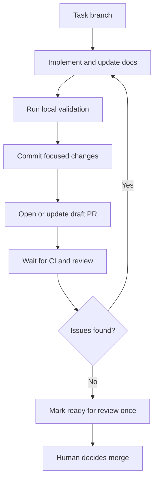

## Git And PRs

- **Default: one PR targeting `main`, one source issue.** Keep updating that PR. Do not invent extra PRs because the work has steps. Follow-up **issues** under `## Follow-ups` remain encouraged for out-of-scope work.
  - **One source issue per PR.** The PR implements exactly one source issue and `Closes` it. Additional `Closes` are allowed only for (1) the accepted `Plan:` issue when this PR completes that plan, (2) supersession hits this PR fully resolves, and (3) milestone-completion siblings this PR actually fully resolves. `Refs` / `Part of` / `issue-audit: keep-open` stay for work this PR does not finish. Do not bundle unrelated issues. Do not slice one issue across PRs.
  - **Split before it ships, once a PR would exceed ~5k added lines or ~20k deleted lines.** A single PR that large should not ship whole — split it. The larger deletion allowance keeps a coherent surface retirement reviewable without forcing arbitrary slices; it does not exempt added or rewritten code from the ~5k review limit. **Dependency decides the split's form, not size on its own**: if the parts cannot compile, test, or land independently, the split is a **stack** (next bullet); if they can land in any order, it is **separate PRs targeting `main`** (below), not a stack. A size-driven split does not manufacture a dependency that doesn't exist — cutting along an arbitrary line count and stacking anyway forces artificial serial ordering, which is slower and is what stalled two prior stacks end-to-end (#11376, #10710).
  - **Stack only when all of these are true:** two or more already-distinct source issues (a size-driven split under the bullet above counts, once it identifies genuinely distinct, dependent pieces); later issues cannot compile, test, or land without the earlier unmerged work; and each layer is independently reviewable — `git diff --name-only <parent>...HEAD` matches the one source issue (see [stacked-prs](../stacked-prs/SKILL.md)). Review cost and the 150-file CodeRabbit cap alone are still not stack reasons — size only matters through the ~5k-added-line/~20k-deleted-line split triggers above, and only when that split also has a real dependency.
  - **When a stack is warranted, use native GitHub stacks only.** Mechanics: [stacked-prs](../stacked-prs/SKILL.md). Never Graphite/`gt` (doc-only; the hook does not parse `gt`). Never `gh pr create --base <unmerged-branch>` or `gh pr edit --base <unmerged-branch>` (hook-enforced, including `-B` and `branch.<current>.gh-merge-base`). Never install or follow the generic `github/gh-stack` agent skill (doc-only).
  - **Do not stack** for review-response commits, same-issue follow-ups, independent work that can merge in any order, or "the PR got large" without a dependency cut.
  - **Independent multi-issue work** (no dependency) is separate PRs targeting `main`, not a stack. Open those only when the user named multiple issues, explicitly directed the split, or the size-driven split above identified independent pieces.
- Use conventional commit format for every commit and PR title.
- **Quote `gh api` path/query arguments and YAML scalars that carry `?`, `&`, or `:`.** In a shell `run:` step or script, an unquoted `&` backgrounds the command and drops every argument after it — the truncated call still returns exit code 0, so CI reports success on a silently short-circuited query. An unquoted `?` aborts the line under zsh glob-nomatch but passes through unexpanded under bash, so the failure mode differs by shell. A YAML scalar containing `: ` unquoted is a parse error `actionlint` already catches (see [github-actions.md](../../../docs/checklists/github-actions.md)) — this bullet does not restate that check. The shell-quoting half is enforced for `gh api` invocations by `static-code-analysis/repo-file-policy/gh-api-shell-quoting.test.mts`.
- Do not amend commits. Add new commits for follow-up work.
- Before rebasing, run `git fetch origin` and inspect `git diff --name-only origin/main...HEAD`. If the file list is unexpectedly large for the PR scope, investigate before rebasing. On a stacked PR, also inspect `git diff --name-only <parent>...HEAD` for this layer's review scope (see [stacked-prs](../stacked-prs/SKILL.md)).
- For an unstacked PR, rebase only with `git fetch origin` followed by `git rebase origin/main`. For a stacked PR, rebase with `gh stack rebase` or `gh stack sync` (prefer `sync` when there are no local stack commits) — do not `git rebase origin/main` on a mid-stack branch. Do not use `git pull --rebase`, `git pull -r`, merge commits, or any rebase target other than `origin/main` (unstacked) or the `gh stack` cascade (stacked).
- Never use `-X ours`, `-X theirs`, `--strategy-option=ours`, `--strategy-option=theirs`, `git checkout --ours`, or `git checkout --theirs` when resolving conflicts. Resolve conflicted files manually, keeping only hunks that belong to the PR.
- After resolving and staging rebase conflicts, continue noninteractively with `GIT_EDITOR=true git rebase --continue`. Do not run plain `git rebase --continue`; it can open an editor and hang agent sessions.
- Never `cd` then run git with repo-relative paths. Use `git -C <worktree-root>` so the invocation is cwd-independent. Path arguments stay relative to that root.
- Push with `git push --force-with-lease` after rebasing. When another agent or automation may also be pushing to the PR branch, capture the expected remote tip **before** the `git fetch origin` above (`git rev-parse refs/remotes/origin/<branch>`) and push with `git push --force-with-lease=<branch>:<sha>`. The bare form leases against `refs/remotes/origin/<branch>`, which that same `git fetch origin` silently refreshes — so it will overwrite a concurrent push instead of rejecting it.
- Open new PRs as **draft** first; agents must not create new PRs as ready-for-review. Run the cheap before-push commands, push, wait for CI to finish, resolve inline review comments, then mark the existing draft PR ready for review (`gh pr ready <pr>`) once the PR is genuinely shippable. When pushing commits to an existing PR, update the PR title and description so they match the current changes, validation, screenshots, and follow-ups.
- **`gh pr ready` starts a second, fully independent CI run, and that is expected.** [`ci.yml`](../../../.github/workflows/ci.yml) disables `cancel-in-progress` for the `ready_for_review` event, so marking a draft ready does not cancel the in-flight draft run: the ready run queues behind it and then runs the same full job set again from scratch, with no cross-run reuse. A fresh run appearing seconds after `gh pr ready` is the designed path — not a restart, not a cancellation, and not something to wait out before marking ready. See [CI Reference](../../../docs/development/ci.md).
- Agent-authored PR bodies must include a `Workspace setup:` line under validation or notes.
- Every PR body created or updated through `dev/pr-description.mts create`/`update` also carries `Agent:`, `Device:`, and `Worktree:` provenance lines, spliced in automatically right after `Workspace setup:`. These are tool-injected, not hand-authored — do not add them by hand. `validate <pr>` (a live GitHub-hosted body) enforces their presence the same way it enforces `Workspace setup:`; `validate --body-file`/`validate -` (a local draft) injects them first, so a pre-flight check never fails on lines only the tool can write.
- At accepted-plan completion or merge, run one retrospective. Planned work is substantive work and cannot use the trivial/no-work retrospective skip.
- Always reference the relevant issue or PR numbers in commits, PR descriptions, and follow-up notes where applicable.
- Every agent-authored PR description must include a `## Related issues` section with at least one GitHub closing keyword (`Closes #N` by default); a PR containing only `Refs #N` or `Part of #N` entries is not valid. Two exceptions exist: a scheduled prompt run with no source issue uses the exact visible sentence, validation marker, and workspace line from `docs/prompts/automation/scheduled-prompt.md`; a Fix Main interim transient-retry classifier that can only link its root-cause issue as a non-closing `Refs #N` (see `docs/prompts/automation/fix-main.md`) uses the exact visible sentence and validation marker from that file instead, and the `Refs #N` itself must still be present in the section. Every closing reference is validated: the issue must be open and contain no unchecked rendered GitHub task (`- [ ]`, including nested, ordered, or blockquoted forms). Use a closing keyword **only** when this PR fully resolves every checklist item and acceptance criterion. For an intentional exception, use the exact reference-specific form `<!-- related-issues-validation: allow #N because <reason> -->`. During `validate <pr>` only, a merged PR may validate an issue it closed itself, but unchecked tasks still fail. For every non-closing `Refs` or `Part of` entry, explain why it stays open and what remains, then comment on the issue. `Plan:` issues fully implemented by the PR must appear under `Closes`, not `Refs`.
- **Who ticks a referenced issue's acceptance-criteria checkboxes depends on how the session doing the work was started.** `dev/pr-description.mts create` rejects a body without a closing keyword (`validate.mts`'s related-issues check), and separately rejects a closing reference to an issue that still has any unchecked task (`closing-refs.mts`'s `hasUncheckedGitHubTask` check) — since `CLOSING_ISSUE_RE` matches only close/fix/resolve and never `Refs`/`Part of`, there is no "open with `Refs`, swap to `Closes` once review lands" path; the boxes must already be ticked with `gh issue edit` before `create` runs. In a **standalone run** (no dispatching session, e.g. a harness-triggered workflow), the implementing agent ticks its own boxes with `gh issue edit` before running `create`, checking each one strictly against evidence its own PR produced. If a criterion remains unmet, leave it unchecked and stop before `create` unless the genuine intentional-exception rule below applies; a `Refs`-only body cannot satisfy the closing-keyword requirement. In an **orchestrated run** (an agent dispatched by another session), the implementing agent does not tick and does not create the PR: it commits, pushes the branch, and reports per-criterion evidence to the dispatching session, which verifies that evidence against the issue, ticks the boxes itself, and only then has the agent run `create` — the tick is a verification step performed by the party that did not do the work, not self-certification by the party that did.
- `<!-- related-issues-validation: allow #N because <reason> -->` is for genuine exceptions only — a criterion that can only be verified after merge, or one the PR deliberately does not meet with a stated reason. In that case, retain `Closes #N` alongside the reference-specific marker; `Refs` alone remains invalid. The marker is **not** a substitute for "my session could not run `gh issue edit`"; a tool call blocked or refused by the session's own permission layer is general agent conduct covered by [Feedback And Decision Hierarchy](SKILL.md#feedback-and-decision-hierarchy) in the shared skill root, not a reason to reach for this marker or to route the edit through a nested agent that never saw the refusal.
- `node dev/pr-description.mts validate <pr>` also audits issue supersession, milestone completion, and project completion before a PR is considered ready; `create`/`update` only print non-blocking advisory hints for the same searches. **Supersession**: when the PR's diff deletes a file, exported symbol, route, or `package.json` script, the validator searches open issues for that removed-surface vocabulary. Every hit must be dispositioned: add `Closes #N` if this PR resolves it, or add `<!-- issue-audit: keep-open #N because <classification>: <reason> -->` if it should stay open, where `<classification>` is one of `locally-actionable`, `live-credential-required`, `evidence-gated`, or `unrelated`. The keep-open marker's issue reference may also be qualified as `owner/repo#N` to disposition a foreign-repo hit (e.g. `<!-- issue-audit: keep-open other/repo#5 because unrelated: different issue, another repo -->`); an unqualified `#N` always means the audited repo. **Milestone completion**: when an issue this PR closes carries a milestone and that milestone has 3 or fewer other open issues once this PR's closes are subtracted, every remaining sibling needs the same disposition (`Closes #N`, a `Refs`/`Part of #N` entry per the reason-and-comment rule above, or the `issue-audit: keep-open` marker) — this bounded-remainder trigger stays silent on ordinary work against a large milestone. Milestone completion is audited **in the repo the closed issue actually lives in**, not always the PR's own repo: a `Closes owner/other-repo#N` whose issue carries a milestone audits that milestone against `other-repo`, and any remaining siblings are reported qualified as `owner/repo#N` (dispositioned the same way, with a matching qualified `Closes`/`Refs`/`Part of`/`issue-audit: keep-open` reference). A per-repo query failure (e.g. no access to a foreign repo) degrades to no siblings reported for that repo rather than failing `validate` outright. Editing an already-merged PR's body to add a closing reference records provenance only (`validate` reports it as `#N remains OPEN after merge`); it never closes the issue — close it explicitly with `gh issue close <n> --comment "Superseded by #<pr>"`. This audit runs only inside `validate <pr>`; it is not enforced by a hard hook gate, so it only protects workflows that actually invoke `validate <pr>` before marking a PR ready. **Project completion**: when an issue this PR closes belongs to an open org project and, once this PR's closes are subtracted, 3 or fewer other open items remain in that project across every repo it spans, `validate` prints each remaining item as an advisory notice on stderr — purely informational, never a blocking error, and no disposition marker (`Closes`, `Refs`/`Part of`, or `issue-audit: keep-open`) is recognized for it, unlike the two audits above. An issue can belong to more than one open project; each one is audited independently rather than picking one arbitrarily. If the token lacks the `project` scope, or the GraphQL lookup fails with a scope error, a single skipped-audit notice replaces the report instead of failing the command.
- Include a compact Mermaid diagram in the PR description when it makes architecture, request or data flow, lifecycle or state transitions, queue or subsystem handoffs, decision flows, or multi-component interactions easier to verify. Do not add decorative diagrams that merely restate prose or tables, and do not require a fixed heading for relevant diagrams.
- Prefer `node dev/pr-description.mts create --title <t> --body-file <f>` and `node dev/pr-description.mts update <pr> --body-file <f>` over raw `gh`: reviewed body files avoid shell interpolation and the helper validates sections, issue state/body, and workspace setup before GitHub mutation. Validate an existing PR with `node dev/pr-description.mts validate <pr>`; this is the only flow that accepts an already-closed issue when that exact merged PR is its latest closer. See the [pr-description skill](../pr-description/SKILL.md) for the full required-content checklist (summary, root cause, rollout, deploy-safety, hand-off context) these mechanics feed into.
- When a PR is created (or replaced by a new PR), run `./dev/tmux-name <name>-pr<number>` with sandbox mode disabled so both the window name and pane title carry the `-pr<number>` suffix.
- **Committing and opening/updating PRs need no per-action approval.** Creating branches, committing, pushing, and opening or updating draft PRs are normal autonomous workflow steps — do them as the task warrants without asking first. Only merging requires explicit human approval (as detailed below).
- **Never merge a PR** without explicit per-PR human approval. Marking a PR ready-for-review is the terminal agent step; the human decides whether and when to merge. Exception: human-authorized batch triage workflows where the operator has explicitly configured `automerge: true` — that configuration is the per-batch human approval, and it does **not** apply to stacked PRs (GitHub does not support auto-merge on stacks; see [stacked-prs](../stacked-prs/SKILL.md)). In Claude Code, the merge-authority hook lets an interactive `gh pr merge`/`gh stack merge` proceed immediately (`disposition: 'confirm'` → `permissionDecision: 'allow'`) instead of forcing its own prompt — the human already made the merge decision by asking for it in their own message, so a redundant tool-level confirmation would add nothing. Automation (GitHub Actions) still hard-blocks both commands unconditionally. See [merge-authority.md](../../../docs/development/merge-authority.md).
- **Stack layers merge under the same rule as above — there is no standing drain grant.** A human decision is required for **each layer individually**, at the moment it is ready, not once at the start of a drain. There is no exception here that lets an agent merge a second or third layer on the strength of an authorization given for the first. Shepherding every owned layer toward ready needs no per-layer re-ask (see [stacked-prs](../stacked-prs/SKILL.md#b-shepherd-the-owned-prs)); merging each one does, exactly like any other PR. Interactive sessions only — automation still hard-blocks unconditionally, same as above — and `automerge: true` never authorizes a stack merge; GitHub does not support auto-merge on stacks.
- GitHub freezes `autoMergeRequest.commitHeadline` and `autoMergeRequest.commitBody` at `enabledAt`. A later PR title or body edit, including `pr-description update` and Shepherd Journal splices, does not change the squash commit. After any body change, disable and re-arm `gh pr merge --auto --squash`, or arm only after the body is final.
- A task is not complete until PR tests are passing, inline review comments are resolved, and the PR is ready for review.
- When CI fails after a push, do not stream `gh run view --log-failed` into this session and do not run archive inspection here. Dispatch a subagent that follows [review-ci-logs](../review-ci-logs/SKILL.md) and returns a short verdict. The routine post-push fix-and-resolve tail is a mechanical loop: dispatch it rather than re-reading logs here.
- **This bullet is the single authoritative source for pr-shepherd invocations in Voucha.** The generic Claude and Codex plugin skills are package-manager agnostic and correctly call bare `pr-shepherd`; checked-in Voucha docs and skills that invoke the CLI directly must use `pnpm exec pr-shepherd ...` so they resolve the workspace dependency and lockfile instead of a shadowing global binary. That drift (a stray `pr-shepherd@0.9.0`) caused real CLI-parity incidents (PRs #7180, #7192/#7209, #7279). For direct CLI use, run `pnpm exec pr-shepherd iterate <pr>` for one tick and `pnpm exec pr-shepherd <pr> --timeout 4.5m --quiet-status` for bounded waits. Use one `pnpm exec pr-shepherd <pr> --until-terminal --quiet-status` process for a long-running phase that intentionally continues through WAIT and MARK_READY. The WAIT-tick cadence comes from `poll.intervalSeconds` in [`.pr-shepherdrc.yml`](../../../.pr-shepherdrc.yml), so these invocations omit `--interval`. If `pnpm exec pr-shepherd` exits with `ERR_PNPM_VERIFY_DEPS_BEFORE_RUN` after a same-worktree branch switch, run bare `pnpm install` (no flags) and retry; do not switch to a PATH-shadowing global binary. `.husky/post-checkout` runs that install automatically when a branch checkout changes `pnpm-lock.yaml`, any `package.json`, or `pnpm-workspace.yaml`. Plugin entrypoints are Claude Code plugin: `/pr-shepherd:pr-shepherd <pr>` and Codex plugin: `$pr-shepherd:pr-shepherd <pr>`.
- **pr-shepherd termination contract:** Run the canonical `--until-terminal` command above and follow the pr-shepherd plugin skill and the CLI's printed `## Instructions` exactly. pr-shepherd owns its actions, exit codes, review-mutation IDs, and terminal semantics; do not restate them in Voucha docs. Also stop for an explicit human override or an out-of-scope external blocker: interrupt the command, report the latest state, and yield rather than continuing to poll a blocker you cannot resolve; only a fresh human or automation dispatch may re-arm shepherding. There is no separate wall-clock session cap. Do not emulate polling with repeated `iterate --no-cache`, separate sleep commands, or a Stop hook that re-fires the same session. On a stack, a terminal action on one layer does not stop shepherding the other owned layers — see [stacked-prs](../stacked-prs/SKILL.md#b-shepherd-the-owned-prs). The orchestrating session runs and coordinates the shepherd directly — it may dispatch a subagent to make an actual code change (ordinary bounded implementation work, per [Implementation](implementation.md)), but the shepherd loop, the ownership view, and the merge decisions across a stack's owned layers stay with the orchestrator so the one-layer-in-rebase-at-a-time rule can actually be enforced.
- **A harness-killed background run is not a shepherd signal.** When the long-running `--until-terminal` command is launched through the agent harness's own background execution (Claude Code `run_in_background`, or the equivalent elsewhere), the harness can terminate the process before pr-shepherd printed any terminal action. Read that as "still waiting", not as a stall, a CI failure, or a shepherd defect: take the last emitted state from the task's output, confirm anything that looks anomalous (a second CI run, a jump in review-item count) with direct `gh` calls, then relaunch the identical command in a fresh background call. Do not switch to hand-rolled polling because the background task died.
- **A scheduled delay only elapses when the turn ends.** Harness wait primitives (Claude Code's `ScheduleWakeup`, and background-task completion notifications) do not suspend the current turn by themselves. Any tool call issued after one in the same turn runs immediately, with no wall-clock time elapsed — which reads as a frozen clock and invites re-diagnosing a healthy wait. After scheduling a wakeup, or after launching a background wait, emit a short status line and end the turn; let the wakeup or the completion notification return control.
- **Automation isolation**: the `/shepherd` workflow remains inert unless its explicit Auto Harness
  activation gate is enabled. The trusted Harness host owns repository-scoped git and `gh`
  credentials and a repository-pinned `pr-shepherd` command; it must treat PR content as untrusted,
  revalidate the exact command, authorization, and head ref/SHA immediately before mutation, push
  with an exact lease, and never merge or arm auto-merge. See the canonical
  [activation security boundary](../../../.github/workflows/reference-harness-automation-accepted-risk.md).
- **Disputed pr-shepherd syntax**: if a flag, subcommand, or placeholder form is disputed, resolve it by running both candidate forms live against the pinned CLI and diffing `pnpm exec pr-shepherd <form> --help` output directly. Never overturn a prior live-verified Shepherd Journal entry on documentation absence alone — the CLI's real behavior outranks a doc gap.

## Codex Workflow

Current Codex hook policy:

- Block accidental `.claire` paths; the intended directory is `.claude`.
- Allow the documented rebase workflow (`git fetch origin`, `git rebase origin/main` for unstacked PRs, `gh stack rebase` / `gh stack sync` / `gh stack push` / `gh stack submit --auto` for native stacks, and `git push --force-with-lease`) while blocking banned Git command patterns: raw force pushes (`--force`, `-f`, and plus-refspec pushes), commit amend, `git pull --rebase`, `git pull -r`, interactive `git rebase --continue` without `GIT_EDITOR=true`, `-X ours/theirs`, `--strategy-option=ours/theirs`, and `git checkout --ours/--theirs`.
- Block agent-authored raw `gh pr create` / body-replacing `gh pr edit` commands when the inspectable PR body violates closing-reference policy, block `gh pr create --base` / `gh pr edit --base` when the base is not `main`, block every raw `Plan:` issue creation in favor of the shared `dev/plan-issue.mts` helper, and hard-block every `gh pr merge` and `gh stack merge` in automation — interactively, both proceed without a further prompt: the human already made the merge decision by asking for it in their own message. These guards recognize `-R` / `--repo` before or between subcommands, inspect `bash` / `sh` / `zsh -c` payloads in any quoting form (ordinary or ANSI-C quotes, backslash escapes, or several quoted pieces) after any shell options (`bash -euo pipefail -c`, `sh -o pipefail -c`) and heredoc bodies and here-strings a shell reads on stdin as its script, directly or through a pipeline or compound command (`bash <<'EOF'`, `cat <<'EOF' | env -S bash`, `{ bash; } <<'EOF'`, `bash -s <<< '…'`; the git guards read the same payloads), and ignore flags hidden in unquoted shell comments. Every other heredoc body is data, apart from the `$(…)` and backtick substitutions an unquoted-delimiter body runs. They find `gh` behind the command wrappers in `dev/codex-hooks/policy/shell-wrapper-grammars.mts` (`env` with any option including `-C` / `-S`, `timeout`, `nice`, `time`, `command -p`, `builtin`, `exec`, `nohup`, `rtk`, `xargs`, `sudo` with its full `sudo(8)` option grammar — `-u` / `--user`, `-g` / `--group`, `-r` / `--role`, `-t` / `--type`, `-D` / `--chdir`, `-h` / `--host`, and every other short and long `sudo` flag, space- or `=`-joined (`shell-wrapper-sudo-grammar.mts`) — `stdbuf`, `caffeinate`, `unbuffer`, `setsid`, `arch`, `script` in both its BSD and util-linux forms including `-c` / `--command`, `npx` including `-c` / `--call` and `-p` / `--package`, `pnpm exec` including `--dir` / `-C`, `--filter` / `-F`, `--workspace-root`, and a bare `--` after `exec`, `mise exec` and its `mise x` alias including a global `-C` / `--cd` and `-c` / `--command` (`shell-wrapper-package-runner-grammars.mts`, `shell-wrapper-exec-grammars.mts`), and zsh's `-` / `noglob` / `nocorrect`), after shell reserved words and `coproc NAME`, inside function bodies, and past assignments (including `+=` and array elements) and redirections (including `{fd}>`) before the command word. Each `-c` / `--call` / `--command` shell-string payload (`npx`, `script`, `mise exec` / `mise x`) is inspected as its own nested command, the same as `eval`'s argument. When one of these exec-style wrappers' own chain either does not fully parse — an option this hook has not modeled strands a value where the next wrapper or the command was expected — or resolves to a word that is not `gh`, a fail-closed backstop (`findExecWrapperMentionBlock`, `dev/codex-hooks/policy/github-exec-wrapper-mention-policy.mts`) still blocks when a literal `gh` word sits anywhere later in the command immediately before a policy-gated area, the same adjacency `find -exec` and `parallel` use below — so an unmodeled option never silently allows a `gh` mention through. util-linux `script`'s deprecated optional-argument `-t[FILE]` spelling parses precisely under its own grammar rule (attached-only, never the next word); BSD `script`'s incompatible required-argument, space-separated `-t TIME` under the same letter instead relies on that backstop, because this hook models the util-linux form — the one the Linux GitHub Actions runner actually has. That reliance still fails closed rather than silently allowing, but at a cost: because the backstop only checks for a literal `gh` next to a policy-gated area word rather than the specific action, a real, non-merge command like `script -t 0 /dev/null gh pr view 1` also blocks. Accepted, since it closes the util-linux `-t[FILE]` silent-allow gap the required-argument reading previously had. More commonly, that same literal-`gh`-next-to-a-gated-area match also reaches into a quoted argument the wrapped command itself receives, such as a test filter: `pnpm exec vitest -t "gh pr merge"`, `npx vitest -t "gh pr merge"`, and `sudo grep -r "gh pr merge" .` all block this way, while the unwrapped `grep` / `rg` given the identical quoted text stay allowed, since no exec-style wrapper is present to trigger the backstop at all. Word the filter or pattern so `gh` is not directly followed by a gated area, or run the binary directly instead of through the wrapper (`node_modules/.bin/vitest …`). They also inspect `eval` arguments, `watch` arguments (re-parsed past `watch`'s own options), `env -S` strings (reading `\_` as a space), `$(which gh)`, `alias` / `gh alias set` definitions, and a variable executable resolved from a literal same-command assignment (`GH=gh; $GH pr merge 1`); a definition is gated as if it ran with the words its later use forwards, because that use cannot be tied back to it. A gh subcommand the hook cannot read is blocked outright: a gh area, or a `pr` / `issue` / `stack` action, that `xargs` supplies from its input (directly or in a `sh -c` script; other arguments xargs fills in, such as a `gh api` endpoint, are read best-effort), a gh area or `pr` / `issue` action that is a shell expansion (`gh "$@"` in a shell function, `gh pr "$ACTION"`, `gh pr {merge,}`, a glob) or that an alias leaves to its later words (`alias g='gh pr'`, `gh alias set p pr`), `gh alias import` / `gh alias set NAME -`, a `gh` mention inside `find -exec` / `-execdir` / `-ok` / `-okdir` or GNU `parallel` (both run their payload opaquely — a literal `gh` anywhere in the clause, or the clause's own executable word being an expansion, fails closed; an expansion in a later argument, such as `sh -c 'mv "$1" "$2"'`, does not), a variable executable the hook cannot resolve sitting next to a gh area a policy actually gates — `pr`, `issue`, `stack` (including its `gh extension exec stack` / `gh ext exec stack` spelling), `alias`, or `api` — skipping a `-R` / `--repo` before that area the way a real gh invocation would (`$GH -R owner/repo pr merge 1`), so ordinary variable executables stay unblocked even next to a real but not policy-gated gh area (`$EDITOR file`, `"$cmd" args`, `$DOCKER run`, `"$PYTHON" --version`), an `eval` argument that reduces to a single unresolved bare parameter expansion, whatever it expands to (`eval "$CMD"`; a command substitution such as `eval "$(mise activate zsh)"` is not bare-variable-shaped, so it is checked as literal text instead, the same as `eval "gh pr merge $1"`), and a gh area outside the closed set of gh's built-in commands, built-in aliases, and help topics the hook knows (`dev/codex-hooks/policy/github-gh-areas.mts`). That set deliberately excludes third-party extension areas like `image` and user-defined aliases like `co`, so `gh image …` / `gh co …` fail closed as unknown areas the same as `gh alias import` above, unless an alias of that exact name was defined earlier in the same command via `gh alias set NAME '…'`, whose literal expansion is checked as its own payload instead. Still not recognized: a script piped to a shell from another program (`echo … | bash`), `source` / `.` or `eval` reading stdin (`eval "$(cat)"`), a heredoc inside a double-quoted command substitution fed to a shell (`bash -c "$(cat <<'EOF'\ngh pr merge 1\nEOF\n)"`), a shell function whose body wraps a shell, a brace-expansion disguise (`{gh,} pr merge 1`, which textually resolves to a bare `gh` with no `$` or backtick marker to catch), and a `gh` alias or extension defined in an earlier, separate command — the hook checks one command at a time, so a definition it already checked cannot be tied to a bare name a later, independent command uses. PR stdin bodies remain subject to the documented fail-open limitation. The PR and issue content rules (draft-first, closing references, `--base`, raw `Plan:` issues) are Vouchington's own, so the wired hook skips them for a `gh pr create/new/edit` or `gh issue create` that provably targets a repository whose GitHub owner (from a literal `--repo`, `GH_REPO`, the cwd remotes of a top-level gh reached only through `&&`-chained `cd`s, or a `gh pr edit` PR URL) is outside the session checkout's home owners — its remotes, `gh repo set-default`, and root `package.json` `repository`, so a fork-only checkout still counts its upstream; every doubt keeps them, and the merge-authority and `gh stack` rules stay global (#434). Use the body-file-only `dev/pr-description.mts` and `dev/plan-issue.mts` helpers instead. See [merge authority](../../../docs/development/merge-authority.md).
- Reminder checks run in `.husky/commit-msg`, not via a session `Stop` hook.

Auto-formatting hooks (`oxfmt` on edited non-TS files) are wired in both Claude and Codex PostToolUse hooks — this was an explicit team decision. Do not add further auto-formatting hooks without team sign-off.

## Session Close-Out

Run the [retrospective skill](../retrospective/SKILL.md) autonomously — no approval needed — at whichever of these completion points the session reaches. Budget: **≤10 tool calls, ≤5 minutes, ≤25k tokens** — it aggregates already-captured facts and journal entries, it does not re-mine the transcript.

- **The PR merges** — a human merges an unstacked PR by enabling auto-merge (`gh pr merge --auto`); a stacked PR merges from the stack UI, `gh stack merge --squash <pr>` run by a human, or an agent merging a layer under explicit per-layer human approval as documented above and in [Merge the bottom layer as soon as it is ready](../stacked-prs/SKILL.md#merge-the-bottom-layer-as-soon-as-it-is-ready) — auto-merge is unsupported on stacks either way; the PR-number selector is required because merging N lands N and every layer below it. **An intermediate layer merging mid-drain is not this completion point**: the loop continues immediately to the next layer, so the task is not done and the retro must wait. This point is reached only when the drain itself ends — the stack empties (no unmerged layers remain) or the drain hits a genuine stop event (`ESCALATE`, `CLOSED`, repeated `FIX_CODE` with no progress, or an out-of-scope blocker) — or, for an unstacked PR, when that PR merges. That merge often happens **while the session is still live** (for example while monitoring CI or running `pnpm exec pr-shepherd <pr> --until-terminal` toward `CANCEL`/`ESCALATE`). When the session witnesses it, run the retro then: the session journal (see [Implementation](implementation.md)) and transcript are still live and the Verifiable Facts capture the completed merge. A later, detached session that finds a merged PR with no retro yet runs it then as a fallback. **Before ending or pausing a session that is mid-drain**, report the stack's current state and, if the bottom layer is ready to merge, ask whether to merge it before yielding — the drain procedure covers exactly when this applies.
- **The accepted plan is complete** — every step of this task is done, the PR is open and ready for review, review comments are drained, and there is no remaining work for the agent to perform on it in this session. Run the retro **before the session ends or compacts**, while the journal and transcript are still live. Filing `## Follow-ups` issues for out-of-scope work does **not** count as remaining work and does not defer the retro. Do not hold the session open waiting for a merge that will not land this session — leaving with no retro is the failure to avoid.

Run it **once per task**: if a retro already ran at one completion point, a subsequent merge does not require another. Only an unplanned pure one-line fix may use the trivial-change skip; accepted-plan work always runs the retrospective. A detached, fresh-context retrospective has to reconstruct first-person sections from scratch and is more prone to guessing, so prefer the in-session run whenever a completion point is reached live. The user can also invoke it at any time via `/retrospective` (Claude Code) or the Skill tool (Codex).

The retrospective skill's Verifiable Facts section must use `./dev/retrospective-facts`, which fetches from `origin/main`; do not summarize merge status, commit counts, or diff scope from stale local `main`. Its Transcript Facts section uses `dev/retrospective-transcript-facts.mts`, and its qualitative sections read from the session journal — see the retrospective skill for both.
