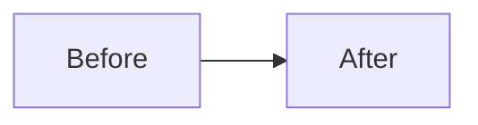

# Plan template

Use these H2 headings exactly once and in this order. Where the template explicitly permits
non-applicability, delete the table/diagram branch and write `Not applicable: <specific reason>`;
bare `N/A`, bare `none`, mixed branches, and filler are invalid. A _justified_ absence (`None
because …`, `N/A: …`) is treated the same as a bare one everywhere except the Dependencies and
Dependents columns below, which are the only fields that accept it. Prose that merely begins with
`none`/`N/A`/`not applicable` — e.g. "None of the existing helpers cover this case" — is ordinary
evidence, not an absence marker.

````markdown
## Solves

- #123
- Source: https://github.com/owner/repo/issues/123

## Why

- Goal: …
- Root cause: …
- Chosen fix: …

## KPIs

| KPI | Target | Measurement |
| --- | ------ | ----------- |
| …   | …      | …           |

## Alternatives analysis

| Alternative             | Benefits | Costs or risks | Decision reason              |
| ----------------------- | -------- | -------------- | ---------------------------- |
| No change: …            | …        | …              | Chosen or rejected because … |
| Reuse: …                | …        | …              | Chosen or rejected because … |
| Materially different: … | …        | …              | Chosen or rejected because … |

## Affected files and modules

| Path or module | Existing or new | Role and change | Dependencies | Dependents |
| -------------- | --------------- | --------------- | ------------ | ---------- |
| …              | Existing        | …               | …            | …          |

Not applicable: <specific reason no repository file changes because No change is the chosen
alternative>.

## Before and after



| Concern | Before | After |
| ------- | ------ | ----- |
| …       | …      | …     |

Not applicable: <specific reason a visual comparison would not clarify the plan>.

## Implementation plan

1. …

## Affected tests

| Test | Existing or new | Why affected | Behavior to check before implementation |
| ---- | --------------- | ------------ | --------------------------------------- |
| …    | Existing        | …            | …                                       |

Not applicable: <specific reason no existing test can be affected>.

## New tests and scenarios

| Scenario | Setup | Expected outcome |
| -------- | ----- | ---------------- |
| …        | …     | …                |

Not applicable: <specific reason no new test scenario is warranted>.

## Documentation

| Document | Update |
| -------- | ------ |
| …        | …      |

Not applicable: <specific reason no durable documentation changes>.

## Verification steps

- `pnpm exec vitest run --project <project> <test-file>`
- `./ci/lint-links.sh --offline` — required when the change restructures Markdown links or anchors, or deletes/moves linked targets. Note: `lychee.toml` excludes `.agents/**` and `.claude/**`, so links involving those trees are not validated.
- `pnpm --dir web build` — production Next build; required when the change touches `web/**` server/client component boundaries (e.g., adds/moves 'use client', converts a component, moves files between `app/` and `components/`).

## Live browser preflight

- Status: `not-required`

## Planning review

- Independent exploration: …
- Independent advisor/reviewer: …
- Finding: …
- Disposition: accepted or rejected, with a reason.
````

Repository-owned `pnpm run` scripts, Vitest `--project`/`--config` references, and repo-relative
executables in Verification steps must resolve in the current worktree. New test-file arguments may
not exist yet. `pnpm --filter` is not resolved against a package.json.

For an exact direct request with no GitHub source, use `- Direct user request; no prior GitHub issue.` as the only Solves source line. Do not use placeholder text, HTML comments, or code fences as evidence.
