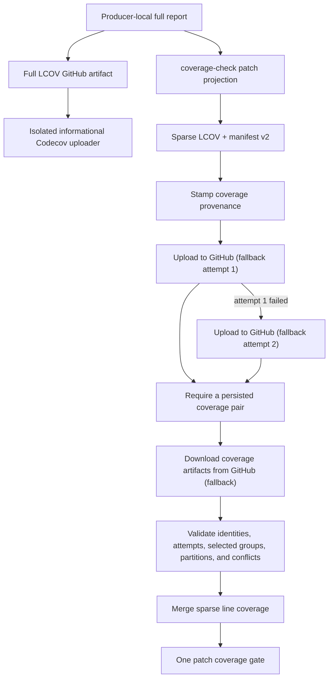

# Coverage

Pull-request coverage is reported and enforced by `ci.yml#test-coverage`, displayed as
**Patch Coverage**. Each producer projects its full local report onto the exact lines changed between
the pull request base and head before anything is uploaded. It publishes that small patch LCOV with
a `coverage-manifest.json` through GitHub artifacts. `test-coverage` passes the current
successful-job producer groups to validate the self-described producer partitions, merges the patch
LCOV, and runs `coverage-check check` against the same base and head SHAs.

The built-in Actions summary reports coverage for the code exercised in the current PR run and the
patch-threshold table. It is not a full-repository or historical comparison when path filters skip
suites. Patch failures also update the sticky PR comment with uncovered files and line ranges.

There is no main-branch coverage baseline or coverage history. Main workflows do not persist LCOV.

## Provenance and transport

The `coverage-check` package owns patch projection, manifest schema v2, payload integrity,
partition validation, strict multi-source selection, and atomic canonical-output replacement.
Filaments supplies only suite descriptors, run identity, and workflow orchestration. A manifest
binds the sparse LCOV to repository, suite/projects, revision,
run and attempt, collector, exact LCOV digest, patch base/head and changed-line digest, plus a
producer group/index/total. Fan-in therefore learns what shards exist from successful producers;
it does not reconstruct a separate expected-shard catalog. The current successful-job selection
names required producer groups: complete earlier-attempt groups may be reused, wholly earlier
unselected groups are pruned, and missing or current-attempt unselected groups fail closed. Empty
sparse payloads are valid because a successful suite may exercise none of the changed lines. See
[Coverage Provenance and Transport](../../docs/development/reference-ci-coverage-provenance-and-transport.md).

Both the coverage pair and the Vitest blob travel over GitHub artifacts only. There is no S3
transport or presign/discover bootstrap job, and their producer and consumer jobs have no
`id-token: write` grant. Every producer stamps provenance once, then makes up to two upload
attempts — a first attempt, and one retry only if that attempt fails — before an outcome step
requires that at least one attempt persisted. Each consumer makes one bounded, non-fatal download
attempt per artifact family (coverage pairs, Vitest blobs) and treats "nothing published" as an
explicit, diagnosable state rather than a job failure.

Full LCOV reports also travel through GitHub artifacts to a separate informational Codecov workflow.
That job uses Codecov OIDC for same-repository pull requests and the pinned Codecov action's public
fork fallback. It has `id-token: write`, but only runs SHA-pinned external checkout, artifact
download, and Codecov actions: it never executes repository scripts, dependency lifecycle hooks, or
local composite actions. It is not a prerequisite for `tests` or Patch Coverage, so upload failures
and timeouts cannot gate a PR. The Patch Coverage job remains the sole coverage gate and has no OIDC
permission.

The two composite actions (`upload-coverage-pair`, `upload-vitest-blob`) each own one unconditional
artifact-upload operation. Callers retain the names, stable step IDs, `continue-on-error`, timeouts,
and permission scoping around each of the two upload attempts so a fresh retry stays independently
diagnosable and bounded. Step names keep the historical "fallback" wording even though there is no
longer a primary transport to fall back from: the wording is load-bearing, not merely historical —
`ci/transient-retry`'s coverage-artifact classifier matches these exact step names to authorize an
automatic main-CI rerun, so renaming them would silently break auto-rerun.

Each producer gives GitHub artifact upload attempt 1 three minutes and, only if that attempt fails,
one fresh three-minute retry. A producer succeeds when either attempt persists the complete sparse
LCOV and manifest pair. If neither does, the producer itself fails with
`COVERAGE_TRANSPORT_EXHAUSTED`; the downstream fan-in is not the first failure signal.

The consumer downloads GitHub artifacts with `./ci/download-optional-run-artifacts.sh`, which
reports explicit availability rather than relying on `continue-on-error`: an unavailable optional
source preserves the original diagnostic, emits one bounded warning, and leaves the probe
successful so it does not attach a misleading failure annotation. The subsequent preparation and
Vitest-report merge are terminal: incomplete or corrupt evidence still fails the fan-in job.
`coverage-check` selects the newest valid attempt for each suite, accepts identical copies across
upload attempts, and requires each producer group to contain exactly indices `1..total`. It receives
the current successful-job producer groups after selection: a complete required group may come
from an earlier attempt, but an unlisted group is pruned only when every selected contribution is
older than the current attempt. Missing required groups and unlisted current-attempt contributions
fail closed. No fan-in environment variable or inline catalog predicts which suite names or shard
totals should exist. Malformed, stale-revision, wrong-run, collector-mismatched, conflicting,
duplicate, unknown-suite, and incomplete-partition inputs are rejected before anything is copied
into `coverage-artifacts/` or merged. See
[CI reference](../../docs/development/ci.md#coverage-provenance-and-transport) for the script
boundaries and [workflow authoring](AUTHORING.md#artifact-rerun-safety) for artifact rules.

Reusable test workflows default `publish_coverage` to `false`; `ci.yml` enables it only for pull
requests, so workflows with no Patch Coverage consumer do not pay Vitest instrumentation cost or
leave orphaned LCOV artifacts. This does not disable diagnostics: JUnit, blob, and report-attempt
artifacts remain enabled whenever the workflow runs tests, including main and no-coverage runs.

## Rules

[`.coverage-rules.yml`](../../.coverage-rules.yml) is first-match-wins. Every rule contains only a
`patch_coverage_min` threshold. Unmatched files are informational and do not fail the build.

Current broad thresholds are:

| Scope                                                       | Minimum patch coverage |
| ----------------------------------------------------------- | ---------------------: |
| Cloudflare Worker                                           |                   100% |
| Lambdas, email templates, shared TypeScript, web API client |                   100% |
| Backend                                                     |                    95% |
| Web                                                         |                    80% |

Narrow exemptions for uninstrumented manifests, scripts, generated/test helpers, and integration
bodies must appear before their broader workspace rule.

## Local use

- `./ci/coverage-artifacts.sh html` renders HTML from an existing `coverage-artifacts/` directory.
- See [local test commands](../../docs/development/tests.md#local-patch-coverage-preview) for producing and checking
  coverage locally.

The coverage workflow is guarded by
[`coverage-summary.test.mts`](coverage-summary.test.mts) and
[`coverage-rules.test.mts`](coverage-rules.test.mts).
