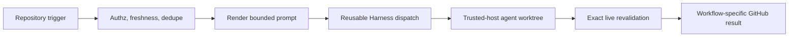

# Auto Harness automation

[Back to Workflow Reference](WORKFLOWS.md#auto-harness-automation)

Repository automation uses [Auto Harness](https://github.com/jonathanong/auto-harness) as a
fire-and-forget agent dispatcher. Vouchington retains trigger authorization, source freshness,
transient retry, deduplication, prompt rendering, immediate failure reporting, and Shepherd
checkpoint ownership. The selected Harness provider runs the task in an isolated worktree on a
trusted host with repository-scoped git and GitHub CLI credentials.

## Workflow map

| Caller                                         | Trigger                             | Repository-owned controls                                                                                | Agent completion                                                     |
| ---------------------------------------------- | ----------------------------------- | -------------------------------------------------------------------------------------------------------- | -------------------------------------------------------------------- |
| [Fix Main](fix-main.yml)                       | failed main workflow                | exact run/attempt/conclusion, transient triage, concurrency-id dedupe                                    | one draft fix PR                                                     |
| [Fix Main Self Retry](fix-main-self-retry.yml) | Fix Main's own completed run failed | run-attempt ceiling, transient triage, no self-resubscription, unhandled-disposition escalation fallback | rerun of Fix Main's failed job(s), or a fallback `needs-human` issue |
| [Fix Dependabot](fix-dependabot.yml)           | failed Dependabot PR                | bot/fork/ref/SHA checks, transient triage, dedupe                                                        | exact-lease update to that PR branch                                 |
| [Fix Issue](fix-issue.yml)                     | authorized standalone `/fix`        | association, issue state, concurrency-id dedupe                                                          | one draft fix PR                                                     |
| [Plan](plan.yml)                               | authorized standalone `/plan`       | association and issue state                                                                              | one issue plan comment, no code changes                              |
| [Shepherd](shepherd.yml)                       | authorized standalone `/shepherd`   | association, same-repo PR, exact head, durable checkpoint                                                | iterate the existing PR only                                         |
| [Scheduled Prompts](scheduled-prompts.yml)     | schedule/manual                     | catalog selection, completion mode, concurrency-id dedupe                                                | one draft PR or bounded issue maintenance                            |
| [Harness Dispatch](harness-dispatch.yml)       | reusable call                       | immutable client checkout, explicit schema, provider routing                                             | session id, URL, and created flag                                    |

## Configuration and activation

`HARNESS_API_KEY` is a repository secret. Only the reusable dispatcher reads it, and only because
each caller forwards it by explicit name (`secrets: { HARNESS_API_KEY: ... }`) into that
`workflow_call`, never via `secrets: inherit`. GitHub Actions does not resolve a reusable-workflow
job's own environment-scoped secret from a `workflow_call` boundary in practice (confirmed
empirically via live canary #10196, which contradicts the docs' claim that a job-level
`environment:` is sufficient), so an Environment secret here would silently fail to bind; forwarding
a repository secret is unambiguous. That job still declares the protected `auto-harness` GitHub
Environment, whose deployment branch
policy permits only `main` — that gate is now purely branch-policy enforcement (defense in depth
restricting execution to `main`), decoupled from secret scope, and it stays live-verified: the
checked-in secret inventory's `requiredBranchPolicy: 'auto-harness'` field (see
`workflow-secrets-inventory.mts`) keeps `dev/verify-workflow-secret-scopes.mts` asserting the
`auto-harness` Environment permits deployments from only `main`, independent of `HARNESS_API_KEY`
no longer being required to live inside that Environment. Branch policy on the callee restricts job
_execution_, not the repository secret's _value_ — a same-repo PR-controlled workflow can still
read `HARNESS_API_KEY` before review, an accepted residual risk documented in
[Auto Harness automation accepted boundary](reference-harness-automation-accepted-risk.md#harness_api_key-repository-secret-scope-accepted-2026-08-26).
They read:

- the repository secret `HARNESS_API_KEY`;
- variable `HARNESS_URL`, an exact HTTPS origin;
- variable `HARNESS_REPOSITORY_ID`, the Auto Harness repository id for this GitHub remote;
- variable `HARNESS_TARGET`, a JSON object naming the primary route, e.g.
  `{"providerId":"<uuid>"}` (id fields are the current live format; name fields such as
  `{"providerName":"claude"}` are also accepted — see below — once the variable is repointed);
- variable `HARNESS_TARGET_PLAN`, an optional JSON object of the same shape used only for the `/plan` surface (`surface-gate: HARNESS_PLAN_ENABLED`); falls back to `HARNESS_TARGET` when unset. `/plan` never mutates code, so it is routed to a plan-locked, non-auto-permission Command (`claude-print-plan`, `--permission-mode plan --model opus`) while every other surface uses `HARNESS_TARGET`'s auto-permission Command (`claude-print-auto`, `--permission-mode auto --model sonnet`). Both Commands are provisioned out-of-band via the harness admin UI, since `catalog:write` is not in `HARNESS_API_KEY`'s scope. Provision `HARNESS_TARGET_PLAN` before repointing `HARNESS_TARGET` to `claude-print-auto`: because `HARNESS_TARGET_PLAN` falls back to `HARNESS_TARGET` when unset, switching `HARNESS_TARGET` first would resolve `/plan` to the auto-permission Command for the gap, removing the plan-mode enforcement `/plan` needs for issue-authored (untrusted) request bodies.
- variable `HARNESS_FALLBACKS`, an optional JSON array of the same shape, tried in order if the
  primary route fails to admit; defaults to none when unset.
- variable `HARNESS_FALLBACKS_PLAN`, the `/plan`-surface analog of `HARNESS_FALLBACKS`, following the same `HARNESS_TARGET`/`HARNESS_TARGET_PLAN` split so a fallback route can't resolve the wrong permission mode for its surface; falls back to `HARNESS_FALLBACKS` when unset. The same rollout-ordering hazard applies here as for `HARNESS_TARGET_PLAN`: provision `HARNESS_FALLBACKS_PLAN` with plan-locked fallback Commands before repointing `HARNESS_FALLBACKS` to auto-permission fallback Commands, or a primary-route admission failure during that gap would run untrusted issue-authored `/plan` text through an auto-permission fallback.

Operator rollout ordering: when migrating a secret out of Environment scope, delete the
Environment-scoped copy only after the repository-scoped copy is confirmed present — never the
reverse, or an in-flight `workflow_call` job could lose its credential mid-window. For
`HARNESS_API_KEY`, the `auto-harness` Environment copy has already been confirmed removed
(verified 2026-08-26); the repository secret is the sole source of truth going forward.

### Troubleshooting: missing `HARNESS_API_KEY`

Before this repo-scoping change, a missing `HARNESS_API_KEY` surfaced as a script-level
`HARNESS_API_KEY is required` error inside the dispatch step. Now that the secret is bound through
the `workflow_call` `secrets:` contract instead, a missing repository secret instead fails the job
before any step runs, with GitHub's generic `Required secret HARNESS_API_KEY not provided` binding
error. Provision the repository secret (not an Environment secret) to resolve it.

`HARNESS_TARGET` and each `HARNESS_FALLBACKS` entry take exactly one of a non-empty `providerId`,
`providerName`, `commandId`, or `commandName`. Id fields are control-plane UUIDs; name fields
(e.g. `{"providerName":"claude"}`) are resolved to an id by the dispatcher at request time via the
control plane's provider/command catalog, and fail closed with `UNKNOWN_PROVIDER_NAME` /
`UNKNOWN_COMMAND_NAME` / `AMBIGUOUS_PROVIDER_NAME` / `AMBIGUOUS_COMMAND_NAME` if the name doesn't
resolve to exactly one entry. Missing or malformed target values fail closed before any request
reaches the control plane. Resume requests retain their existing route and do not re-resolve a
target.

The repository taxonomy must contain `automation`, `automation:auto-fix`, and
`automation:scheduled` before activation. The provider-neutral labels were provisioned during the
migration; prompts re-fetch the published PR and require their exact additive label.

`HARNESS_DISPATCH_ENABLED` is the master gate. Each caller also requires its exact surface gate:
`HARNESS_PLAN_ENABLED`, `HARNESS_FIX_ISSUE_ENABLED`, `HARNESS_SHEPHERD_ENABLED`,
`HARNESS_SCHEDULED_ENABLED`, `HARNESS_FIX_DEPENDABOT_ENABLED`, or `HARNESS_FIX_MAIN_ENABLED`.
Fix Main has the additional `HARNESS_AGENT_DISPATCH_ENABLED` publication gate. Every gate remains
unset by default. Enable one staffed surface at a time only after its workflow is present on the
default branch.

Scheduled dispatch is default-off: both `HARNESS_DISPATCH_ENABLED` and `HARNESS_SCHEDULED_ENABLED`
must be enabled before `scheduled-prompts.yml`'s entry job does anything. When both are enabled,
its six daily cron events (every two hours from 08:00 through 18:00 UTC) can each create one
provider session, in addition to independently gated event-driven repair sessions. Those providers
use externally managed subscriptions, so no dollar estimate is tracked here.

The reusable workflow checks out `github.workflow_sha` without persisted credentials, installs the
persistent workspace, and invokes `ci/harness-session-dispatch.mts`, which delegates transport to
the first-party `auto-harness-client` npm library. It sends a fixed, bounded metadata schema and an
empty required-label list; the static `HARNESS_TARGET`/`HARNESS_FALLBACKS` route plus
`HARNESS_REPOSITORY_ID` select the eligible Vouchington worktree. Caller concurrency IDs are
namespaced with `vouchington:`.

## Live execution boundary

The host is expected to provide isolated worktrees plus repository-scoped git and authenticated
`gh`. Provider selection is configuration, never prompt text. The agent may use those credentials
only for the completion explicitly authorized by its prompt.

All GitHub titles, bodies, comments, diffs, reviews, annotations, and logs are untrusted evidence.
Mutation-capable prompts require the agent to re-fetch the trigger, authorization, source run, and
exact target ref/SHA immediately before a write. Pushes must use an exact lease and stop on drift.
No automation prompt authorizes merge or auto-merge.

Repository-owned checks immediately before dispatch are intentionally duplicated inside prompts
immediately before publication. The first prevents stale work from consuming a session; the second
closes the race while the session is running.

## Client contract

[`ci/harness-session-dispatch.mts`](../../ci/harness-session-dispatch.mts) validates
`HARNESS_TARGET`, session IDs, concurrency IDs, queue TTL, timeout, priority, and repository
identity locally, then delegates transport to the first-party `auto-harness-client` npm library.
Prompts are capped at 64 KiB and metadata is a JSON object capped at 8 KiB; new sessions have a
fixed one-hour queue TTL and the assigned-session timeout remains 6,300 seconds. The API key is
never available to caller checkout or prompt-rendering jobs; only each caller's `dispatch` job
forwards it, by explicit name, into the `harness-dispatch.yml` call. Caller concurrency IDs are
namespaced with `vouchington:` (`vouchington:shepherd:<PR>`, `vouchington:plan:<issue>`,
`vouchington:fix:<issue>`, `vouchington:dependabot:<pr>:<sha>`, `vouchington:fix-main-review:<pr>:<sha>` /
`vouchington:fix-main:<workflow_id>:<sha>`, `vouchington:scheduled:<prompt_name>`).

The request/response contract itself — bounded request timeouts, typed `AutoHarnessError`/
`AutoHarnessRequestTimeoutError` failures, id- vs name-based `target`/`fallbacks` resolution, and
resume semantics — is Auto Harness's, documented once upstream in
[`docs/harness.md`](https://github.com/jonathanong/auto-harness/blob/main/docs/harness.md#packaged-automation);
this doc does not restate it. Resume never re-resolves `HARNESS_TARGET`/`HARNESS_FALLBACKS`: an
active or resumed session keeps the Command it was originally dispatched against. Only
`shepherd.yml` ever resumes a session; the other five surfaces above never pass a resume session id,
so they carry no checkpoint to invalidate, but they share the same concurrency-ID residual as
`/shepherd` — see [Accepted risk](reference-harness-automation-accepted-risk.md#residual-risk) for
the per-surface breakdown, not restated here.

A `HARNESS_TARGET`/`HARNESS_FALLBACKS` repoint (e.g. from a provider-level route to a specific
`claude-print-auto` Command) is a plain variable update — it changes only which Command a _new_
session dispatches against. It does not need Shepherd quiesced or any checkpoint comment patched
first: resume never re-resolves the target (above), so every existing resumable checkpoint simply
keeps completing under its original Command, and the repoint takes effect only for sessions actually
created after it lands. A dispatch that instead resolves — via its concurrency ID's deduplicated-create
response — to an already-queued or -running pre-repoint session inherits that session's original
Command rather than getting a new one. That gap, together with the platform having no way to force
an in-flight or historical checkpoint onto the new Command, is accepted, not mitigated locally; see
[Accepted risk](reference-harness-automation-accepted-risk.md#residual-risk) for the full breakdown,
and [`jonathanong/auto-harness#402`](https://github.com/jonathanong/auto-harness/issues/402) for the
proposed server-side fix (resume-time Command rebinding) that would close it upstream instead.

Every successful dispatch writes a bounded Actions summary and notice with the session ID, exact
same-origin Harness UI URL, created/reused state, concurrency ID, and configured provider route.
Prompts, metadata, API keys, and provider output are never copied into that summary. The Harness UI
is the staffed terminal-status authority; workflow success means only that the asynchronous session
was accepted or reused.

## Completion-specific safeguards

- Fix Main revalidates the exact source run before prompt rendering and dispatch. Dedup relies solely
  on the SHA-scoped concurrency ID; the dispatched agent is responsible for searching related open
  PRs/issues and avoiding duplicate work.
- Fix Main also classifies its own downstream job failures (`related-candidates`, `render-prompt`,
  `dispatch`) through the same transient-retry catalogue before escalating: its `classify-self-failure`
  job runs `ci/transient-retry/decide.mts` against its own run, and `escalate` fires only when no
  retry is pending. A run cannot rerun its own in-progress jobs, so the rerun itself is issued from a
  separate sibling workflow, [Fix Main Self Retry](fix-main-self-retry.yml), which watches Automation
  Fix Main's completed runs via `workflow_run` and reruns known-transient failures once. It is not,
  and must never become, part of `fix-main.yml`'s own `on.workflow_run.workflows:` subscription list —
  `fix-main.dispatch.test.mts` pins that list to exactly the main-push workflows plus `Dispatch
completed deploy`, so Automation Fix Main can never legally subscribe to itself, and nothing watches
  Fix Main Self Retry back. That gives the self-monitoring chain a fixed depth of two runs. Termination
  is layered: only `failure` conclusions are actionable; each transient-retry rule's own `maxAttempts`
  ceiling applies (both rules that can match a Fix Main failure cap at 1); and a structural refusal
  fires once `github.run_attempt >= 3` regardless of classification evidence. Duplicate-rerun
  protection against the _monitored_ workflow comes from `triage-and-rerun`'s live
  `source-state.outputs.current` revalidation, not from Fix Main's own attempt number: a reran Fix
  Main attempt must still be able to rerun the monitored workflow it was classifying, and
  `source-state` independently detects and refuses a run whose attempt has changed since the event
  was recorded. Before drawing any conclusion from its own `decide.mts` re-invocation, `retry` first
  checks the original Fix Main run's `Escalate to human` job via the Jobs API, scoped to the attempt
  that just completed: a `success` conclusion there means a human was already notified, so `retry`
  records that as handled regardless of what its own `decide` step concludes — this is what stops a
  confirmed non-transient failure (`decision=dispatch`) from producing a second, misleading
  `needs-human` issue on top of the one Fix Main's own `escalate` job already filed. If no completed
  escalation is found, only a confirmed superseded source or an accepted rerun request counts as
  handled. Otherwise `escalate-retry-failure` opens or updates a run-keyed `needs-human` issue using
  generic factual language: automation could not confirm a safe terminal outcome. It does not infer
  whether classification selected dispatch, ignore, or rerun when that evidence is missing.
  `HARNESS_FIX_MAIN_ENABLED=false` disables the entire surface, including both watcher jobs.

- Fix Main's four checked-out control-plane jobs and the sibling retry job install with dependency
  lifecycle scripts disabled. They execute Node tooling whose dependencies need no install-time
  build, and do not build application artifacts, so unrelated native-addon downloads cannot prevent
  classification, rerun, prompt rendering, or escalation. `related-candidates` retains the full
  dependency graph because the remote prompt-context action invokes the repository's
  `vouchington-tooling` binary.
- Dependabot revalidates the exact open bot-authored PR ref/SHA immediately before dispatch. The
  agent modifies that branch only; it cannot create a second PR.
- `/fix`, `/plan`, and `/shepherd` prompts carry the exact triggering comment ID so the agent can
  revalidate the command and author association before publication.
- Shepherd creates a provenance-bound checkpoint comment before dispatch, then re-fetches and
  patches that exact bot-authored comment with the immediate session outcome. Resume accepts only a
  validated prior checkpoint.
- Scheduled issue maintenance is capped at 50 idempotent mutations over one stable issue page and
  uses the live repository taxonomy without creating labels or milestones.

Fix Main's and Fix Dependabot's per-job revalidation reads share one provider-neutral
implementation: [`ci/source-run-assessment.mts`](../../ci/source-run-assessment.mts) defines the
freshness bound and the fetch-failure/mismatch/stale/current bucketing,
[`ci/source-run-state.mts`](../../ci/source-run-state.mts) is the entry point a checked-out job
runs directly (`node ci/source-run-state.mts`), and
[`ci/source-run-guard-shell.mts`](../../ci/source-run-guard-shell.mts) generates the equivalent
inline shell, spliced verbatim into a `run:` step, for jobs that never check out the repository.
[`ci/source-run-guard-inventory.mts`](../../ci/source-run-guard-inventory.mts) extracts every
`github.event.workflow_run`-derived job across `fix-main.yml` and `fix-dependabot.yml`, and
[`ci/source-run-guard-check.mts`](../../ci/source-run-guard-check.mts)
asserts each one carries its own guard step, gates one hop on an upstream guard's output, or has a
declared exemption in `SOURCE_RUN_EXEMPTIONS`; a job outside that set, or a declared exemption that
no longer matches a real job, fails `pnpm test -- --project ci-tools` and blocks CI.

Fix Dependabot treats every `gh run rerun` request as a mutation, not merely a transient-retry
detail. Its targeted-job, full-workflow, and uncatalogued first-attempt paths all invoke
[`ci/revalidate-dependabot-rerun.mts`](../../ci/revalidate-dependabot-rerun.mts), passing the exact
event repository, source run, PR number, branch, and SHA (plus a job ID only for targeted reruns).
The helper re-fetches and validates that source run, its sole PR association, and the live open
same-repository Dependabot PR immediately before issuing exactly one rerun request. Verified
supersession produces a notice and no mutation; malformed input, API failure, or any identity mismatch
fails the job without a rerun.

## Validation and operations

Changes to this boundary require actionlint, the GitHub Actions Vitest project, the focused
dispatcher-client tests, type-aware lint, formatting, workflow topology validation, and a read-only
live smoke session for every configured provider before activation. A
smoke prompt must explicitly prohibit repository or GitHub mutation.

The implementation session could not write agent-blackboard records because this runtime exposed no
subagent or parent session IDs; that tooling limitation does not change the runtime contract.
