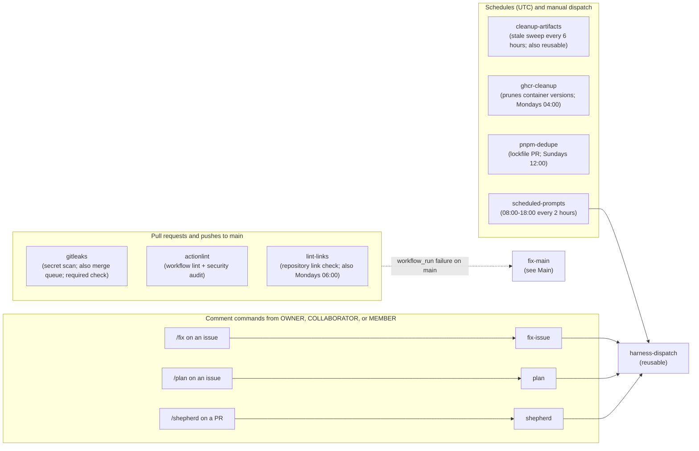

# Workflow automation: Always run

[Back to Workflow automation map](reference-workflow-automation-map.md) · [Back to Workflow Reference](README.md)

Workflows that run for both pull requests and `main`, on a schedule, or from a comment command.
`gitleaks`, `actionlint`, and `lint-links` fail on `main` into `fix-main` (see
[Main](reference-workflow-automation-main.md)). Comment commands and `scheduled-prompts` start Auto
Harness runs through the reusable `harness-dispatch` workflow; see
[Auto Harness automation](reference-harness-automation.md).

