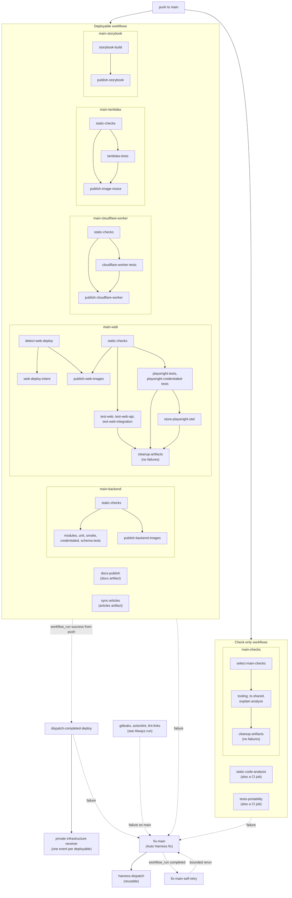

# Workflow automation: Main

[Back to Workflow automation map](reference-workflow-automation-map.md) · [Back to Workflow Reference](README.md)

Each deployable workflow validates and publishes on its own. When one succeeds from a push,
`dispatch-completed-deploy` sends its event to the private infrastructure receiver, which owns
deploy ordering; the event names are in the
[deployment CI/CD flow](../../docs/overview/infrastructure/reference-deployment-ci-cd-flow.md).
`fix-main` subscribes to every workflow that runs on `main`, including the
[Always run](reference-workflow-automation-always-run.md) checks, and hands failures to Auto
Harness.

