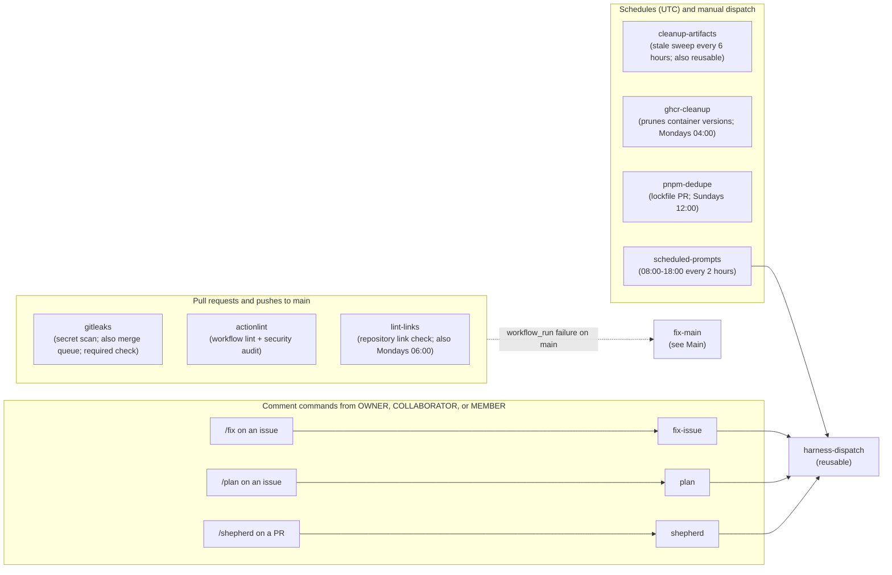
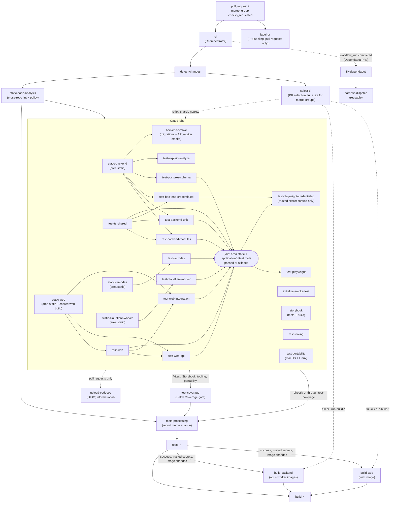
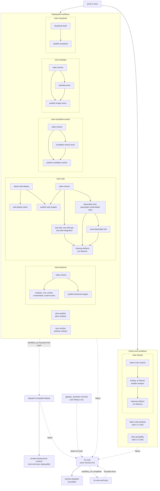

# Workflow automation map

[Back to Workflow Reference](README.md) · [Back to Workflow inventory](WORKFLOWS.md)

Each workflow sits in one section, chosen by what triggers it automatically. Manual
`workflow_dispatch` does not change its section.

- [Always run](#always-run): runs for both pull requests and `main`, on a schedule, or from a
  comment command.
- [Pull requests](#pull-requests): runs only for pull requests or the merge queue, including
  `workflow_run` followers of CI.
- [Main](#main): runs only for `main`, from a push or a `workflow_run` on `main`.

Reusable workflows that CI calls appear as CI jobs under Pull requests.
`static-code-analysis` and `tests-portability` also run directly on a push to `main`, so they
appear under Main too. The `Main` ruleset requires `tests` and `build` (Pull requests) and
`gitleaks` (Always run) before merge.

## Always run

`gitleaks`, `actionlint`, and `lint-links` fail on `main` into `fix-main` (see [Main](#main)).
Comment commands and `scheduled-prompts` start Auto Harness runs through the reusable
`harness-dispatch` workflow; see [Auto Harness automation](reference-harness-automation.md).

## Pull requests

`ci.yml` orchestrates pull requests and merge groups. Every gated job needs `detect-changes` and
`select-ci`, and `static-code-analysis` gates all of them (`backend-smoke` through
`static-backend`), so those edges are drawn once to the group. Docs-only changes skip the gated
jobs. `select-ci` can skip, shard, or narrow a job on a pull request and selects the full suite
for merge groups. The rounded join node is not a job: both Playwright suites wait for every area
static check and application Vitest root. Test-to-test edges accept a skipped upstream but not a
failed one; see the
semantic CI DAG in [CLAUDE.md](CLAUDE.md). For the exact job graph, run
`pnpm run ci:topology --format mermaid --workflow .github/workflows/ci.yml`.

## Main

Each deployable workflow validates and publishes on its own. When one succeeds from a push,
`dispatch-completed-deploy` sends its event to the private infrastructure receiver, which owns
deploy ordering; the event names are in the
[deployment CI/CD flow](../../docs/overview/infrastructure/reference-deployment-ci-cd-flow.md).
`fix-main` subscribes to every workflow that runs on `main`, including the Always run checks, and
hands failures to Auto Harness.

