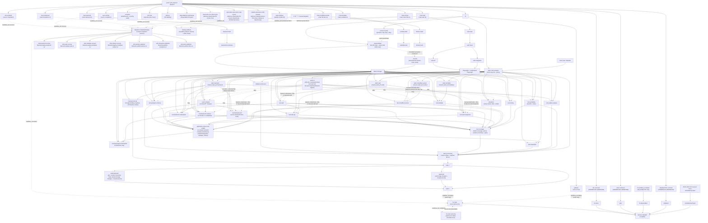

# Workflow automation map

[Back to Workflow Reference](README.md) · [Back to Workflow inventory](WORKFLOWS.md)

```mermaid
flowchart TD
    trigger["push / pull_request / dispatch"]
    static-trigger["main push / dispatch"]
    trigger --> ci["CI"]
    ci --> ready-dedupe["ready-dedupe\n(live PR state + same-SHA draft reuse)"]
    ready-dedupe -. "recorded successful producers" .-> reused-producers["<producer> reused\n(informational Checks rows; serial)"]
    ready-dedupe --> detect["detect-changes"]
    reused-producers --> detect
    ci --> record-state["record CI state\n(producer-only map; 1 day)"]
    record-state -. "same tested SHA" .-> ready-dedupe
    ci --> sca["static-code-analysis\n(cross-repo lint + policy)"]
    static-trigger --> sca
    ci --> gitleaks["gitleaks\n(secret scan)"]
    trigger --> sync-articles["sync-articles\n(source completion)"]
    trigger --> docs-publish["docs-publish\n(source completion)"]
    artifact-cleanup-sweep-trigger["0 */6 * * * / manual dispatch"] --> cleanup-artifacts["cleanup-artifacts\n(reusable producer cleanup + stale sweep)"]
    trigger --> actionlint["actionlint\n(workflow lint + security audit)"]
    trigger --> lint-links["lint-links\n(repository link check)"]
    trigger --> label-pr["label-pr\n(PR labeling)"]
    trigger --> dependabot-pr-automerge["dependabot-pr-automerge\n(Dependabot PR gate)"]
    trigger --> opencode-zen-code-review["opencode-zen-code-review\n(advisory OpenCode PR review; Zen)"]
    trigger --> opencode-openrouter-code-review["opencode-openrouter-code-review\n(advisory OpenCode PR review; OpenRouter NVIDIA Nemotron)"]
    trigger --> claude-openrouter-code-reviewer["claude-openrouter-code-reviewer\n(advisory Claude-harness PR review; Inkling via OpenRouter)"]
    trigger --> pnpm-dedupe["pnpm-dedupe\n(weekly lockfile PR)"]
    trigger --> main-backend["main-backend\n(main backend CI)"]
    trigger --> main-web["main-web\n(main web CI)"]
    trigger --> main-cloudflare-worker["main-cloudflare-worker\n(main Worker CI)"]
    trigger --> main-lambdas["main-lambdas\n(main Lambda CI)"]
    trigger --> main-storybook["main-storybook\n(main Storybook CI)"]
    trigger --> main-checks["main-checks\n(main check fan-in)"]
    main-checks -. "terminal success fan-in" .-> cleanup-artifacts
    main-web -. "terminal success fan-in" .-> cleanup-artifacts

    detect --> initialize-smoke-test["initialize-smoke-test"]
    sca --> initialize-smoke-test

    detect --> static-backend["static-backend\n(checks-static.yml backend)"]
    detect --> static-web["static-web\n(checks-static.yml web)"]
    detect --> static-lambdas["static-lambdas\n(checks-static.yml lambdas)"]
    detect --> static-worker["static-cloudflare-worker\n(checks-static.yml worker)"]
    sca --> static-backend
    sca --> static-web
    sca --> static-lambdas
    sca --> static-worker

    detect --> select-ci["select-ci\n(PR-only: centralized Vitest test selection;\nfail-open skip/shard/narrow signals)"]

    detect --> test-cloudflare-worker["test-cloudflare-worker"]
    detect --> test-lambdas["test-lambdas"]
    detect --> test-tooling["test-tooling"]

    sca --> test-cloudflare-worker
    sca --> test-lambdas
    sca --> test-tooling

    select-ci -. "skip-<job>" .-> test-cloudflare-worker
    select-ci -. "skip-<job>" .-> test-lambdas
    select-ci -. "skip-<job>" .-> test-tooling
    select-ci -. "skip-<job>" .-> test-portability

    detect --> test-ts-shared["test-ts-shared\n(ts-shared/** changes)"]
    sca --> test-ts-shared
    select-ci -. "skip-<job>" .-> test-ts-shared

    detect --> test-backend-modules["test-backend-modules\n(no Docker or credentials)"]
    sca --> test-backend-modules
    static-backend --> test-backend-modules
    test-ts-shared --> test-backend-modules
    select-ci -. "skip-<job>" .-> test-backend-modules
    detect --> test-backend["test-backend-unit\n(service-backed Docker tests)"]
    sca --> test-backend
    static-backend --> test-backend
    test-ts-shared --> test-backend
    select-ci -. "dynamic shard-total + files\nor skip-test-backend-unit" .-> test-backend
    detect --> backend-smoke["backend-smoke\n(Postgres/Valkey migration + API/worker smoke)"]
    static-backend --> backend-smoke
    backend-smoke --> tests

    detect --> test-backend-credentialed["test-backend-credentialed"]
    sca --> test-backend-credentialed
    static-backend --> test-backend-credentialed
    test-ts-shared --> test-backend-credentialed
    select-ci -. "skip-<job>" .-> test-backend-credentialed

    detect --> test-postgres-schema["test-postgres-schema"]
    sca --> test-postgres-schema
    static-backend --> test-postgres-schema
    select-ci -. "run-tests + selected files\n(retains side duties)" .-> test-postgres-schema

    detect --> test-web["test-web"]
    sca --> test-web
    static-web --> test-web
    select-ci -. "dynamic shard-total + files\nor skip-test-web" .-> test-web

    detect --> test-web-api["test-web-api"]
    sca --> test-web-api
    static-web --> test-web-api
    test-web --> test-web-api
    select-ci -. "dynamic shard-total + files\nor skip-test-web-api" .-> test-web-api

    detect --> storybook["storybook\n(entity stories; tests + build)"]
    sca --> storybook
    select-ci -. "storybook-browser-files\n(narrows browser test step only)" .-> storybook

    static-backend --> test-explain-analyze["test-explain-analyze"]
    detect --> test-explain-analyze
    sca --> test-explain-analyze

    detect --> test-portability["test-portability\n(macOS + Linux)"]
    sca --> test-portability

    detect --> test-web-integration["test-web-integration"]
    sca --> test-web-integration
    static-web --> test-web-integration
    test-web --> test-web-integration
    select-ci -. "manual shard-total + files\nor skip-test-web-integration" .-> test-web-integration

    detect --> test-playwright["test-playwright"]
    sca --> test-playwright
    detect --> test-playwright-credentialed["test-playwright-credentialed\n(trusted PRs only)"]
    sca --> test-playwright-credentialed

    static-lambdas --> test-lambdas
    static-worker --> test-cloudflare-worker
    application-vitest["application Vitest roots settled\n(ts-shared, backend modules/unit/schema, web/API/integration, lambdas, worker)"]
    test-ts-shared --> application-vitest
    test-backend-modules --> application-vitest
    test-backend --> application-vitest
    test-postgres-schema --> application-vitest
    test-web --> application-vitest
    test-web-api --> application-vitest
    test-web-integration --> application-vitest
    test-lambdas --> application-vitest
    test-cloudflare-worker --> application-vitest
    application-vitest --> test-playwright
    application-vitest --> test-playwright-credentialed
    test-backend-credentialed --> test-playwright-credentialed

    test-ts-shared --> test-coverage["test-coverage\n(Patch Coverage; sparse evidence summary + gate)"]
    test-backend-modules --> test-coverage
    test-backend --> test-coverage
    test-backend-credentialed --> test-coverage
    test-web --> test-coverage
    test-web-api --> test-coverage
    storybook --> test-coverage
    test-web-integration --> test-coverage
    test-cloudflare-worker --> test-coverage
    test-lambdas --> test-coverage
    test-tooling --> test-coverage
    test-portability --> test-coverage
    test-postgres-schema --> tests-processing
    initialize-smoke-test --> tests-processing["tests processing\n(report merge + required fan-in)"]
    test-coverage --> tests-processing
    test-playwright --> tests-processing
    test-explain-analyze --> tests-processing
    test-portability --> tests-processing
    sca --> tests-processing
    tests-processing --> tests["tests ✓"]
    tests --> build-backend["build-backend\n(api + worker via docker bake; backend image changes + trusted secrets)"]
    tests --> build-web["build-web\n(web image changes + trusted secrets)"]
    build-backend --> build["build ✓"]
    build-web --> build
    tests --> build

    docs-publish -. "workflow_run success" .-> dispatch-completed-deploy["dispatch-completed-deploy\n(trusted completion receiver)"]
    main-backend -. "workflow_run success" .-> dispatch-completed-deploy
    main-cloudflare-worker -. "workflow_run success" .-> dispatch-completed-deploy
    main-lambdas -. "workflow_run success" .-> dispatch-completed-deploy
    main-storybook -. "workflow_run success" .-> dispatch-completed-deploy
    main-web -. "workflow_run success" .-> dispatch-completed-deploy
    sync-articles -. "workflow_run success" .-> dispatch-completed-deploy
    dispatch-completed-deploy --> infra-backend["infra backend receiver\nfilaments-deploy-backend-v2"]
    dispatch-completed-deploy --> infra-web["infra web receiver\nfilaments-deploy-web-v2"]
    dispatch-completed-deploy --> infra-lambdas["infra lambdas receiver\nfilaments-deploy-lambdas-v2"]
    dispatch-completed-deploy --> infra-worker["infra Worker receiver\nfilaments-deploy-cloudflare-worker-v2"]
    dispatch-completed-deploy --> infra-articles["infra articles publisher\nfilaments-publish-articles-v2"]
    dispatch-completed-deploy --> infra-storybook["infra Storybook publisher\nfilaments-publish-storybook-v2"]
    dispatch-completed-deploy --> infra-docs["infra docs publisher\nfilaments-publish-docs-v2"]
    dispatch-completed-deploy -. "workflow_run failure" .-> fix-main

    main-backend --> main-backend-static["backend static"]
    main-backend-static --> main-backend-tests["backend test families"]
    main-web --> main-web-static["web static"]
    main-web-static --> main-web-vitest["web Vitest"]
    main-web-vitest --> main-web-api["web API"]
    main-web-vitest --> main-web-integration["web integration"]
    main-web-api --> main-web-playwright["Playwright + credentialed Playwright"]
    main-web-integration --> main-web-playwright
    main-lambdas --> main-lambda-static["Lambda static"]
    main-lambda-static --> main-lambda-tests["Lambda tests"]
    main-cloudflare-worker --> main-worker-static["Worker static"]
    main-worker-static --> main-worker-tests["Worker tests"]


    build -. "workflow_run failure\n(main only)" .-> fix-main["fix-main\n(Auto Harness fix)"]
    gitleaks -. "workflow_run failure\n(main only)" .-> fix-main
    fix-main -. "workflow_run completed" .-> fix-main-self-retry["fix-main-self-retry\n(watches Fix Main; bounded rerun)"]
    fix-main-self-retry -. "gh run rerun (bounded)" .-> fix-main
    trigger --> issue-comment["/fix comment\n(OWNER/COLLABORATOR)"]
    issue-comment --> fix-issue["fix-issue"]
    trigger --> plan-comment["/plan comment\n(OWNER/COLLABORATOR)"]
    plan-comment --> plan["plan"]
    trigger --> shepherd-comment["/shepherd PR comment\n(OWNER/COLLABORATOR)"]
    shepherd-comment --> shepherd["shepherd"]
    schedule-prompts["08:00-18:00 UTC every 2 hours\nscheduled prompts"] --> scheduled-prompts["scheduled-prompts"]
    ci-pr["CI workflow_run failure\n(dependabot PR only)"] --> fix-dependabot["fix-dependabot"]
    fix-main --> harness-dispatch["harness-dispatch\n(reusable)"]
    fix-issue --> harness-dispatch
    plan --> harness-dispatch
    fix-dependabot --> harness-dispatch
    shepherd --> harness-dispatch
    scheduled-prompts --> harness-dispatch
```
