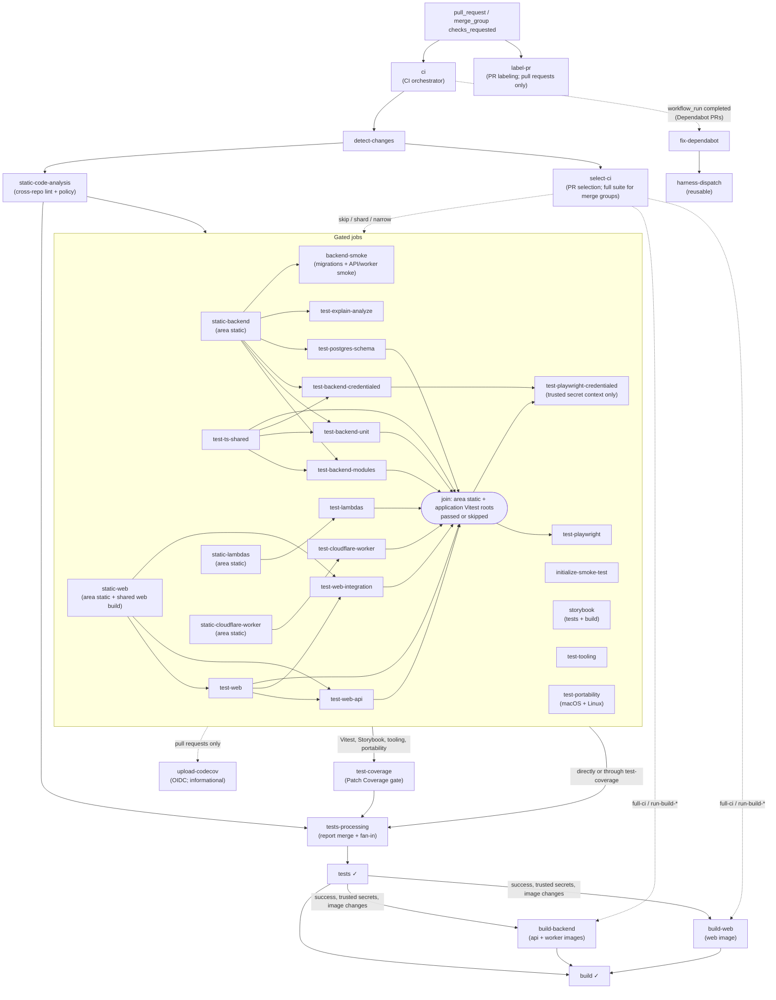

# Workflow automation: Pull requests

[Back to Workflow automation map](reference-workflow-automation-map.md) · [Back to Workflow Reference](README.md)

`ci.yml` orchestrates pull requests and merge groups. Every gated job needs `detect-changes` and
`select-ci`, and `static-code-analysis` gates all of them (`backend-smoke` through
`static-backend`), so those edges are drawn once to the group. Docs-only changes skip the gated
jobs. `select-ci` can skip, shard, or narrow a job on a pull request and selects the full suite
for merge groups. The rounded join node is not a job: both Playwright suites wait for every area
static check and application Vitest root. Test-to-test edges accept a skipped upstream but not a
failed one; see the semantic CI DAG in [CLAUDE.md](CLAUDE.md). For the exact job graph, run
`pnpm run ci:topology --format mermaid --workflow .github/workflows/ci.yml`.

