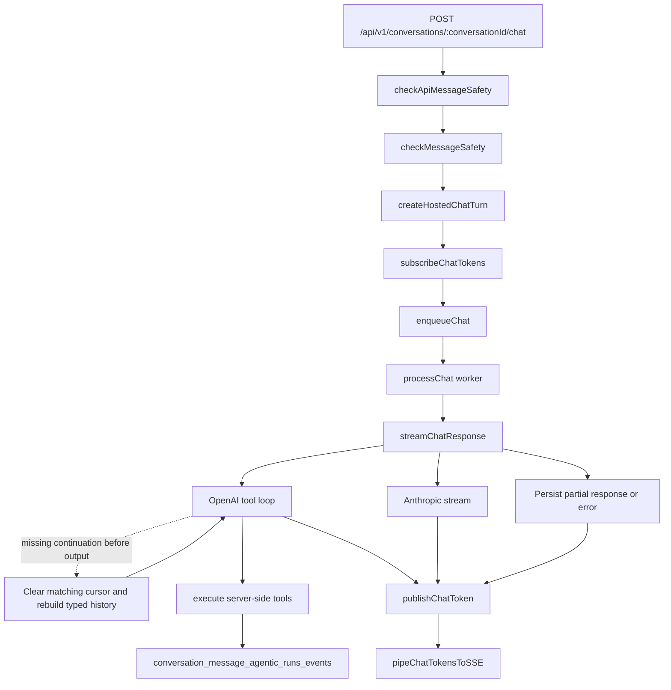

# Chat Agent

Personal finance assistant that answers user questions by calling tools and streaming responses
via hosted model providers.

## Files

| File                      | Description                                                                              |
| ------------------------- | ---------------------------------------------------------------------------------------- |
| `stream.mts`              | `streamChatResponse()` — main agentic loop, yields `ChatStreamEvent` items               |
| `build-system-prompt.mts` | `buildSystemPrompt()` — personalizes system prompt with user context                     |
| `safety.mts`              | `checkMessageSafety()` — pattern + injected text-moderation capability before processing |
| `index.mts`               | Barrel exports                                                                           |

## Architecture



The HTTP route creates the user message and assistant placeholder, subscribes to the assistant
message's token channel, and enqueues a worker job. The worker owns model calls, tool execution,
run-event persistence, assistant-message updates, and token publishing. The route only bridges
published chunks back to the client as SSE.

## Agentic Loop

`streamChatResponse()` is an `AsyncGenerator<ChatStreamEvent>` that:

1. Creates an agentic run record in the database
2. Builds a personalized system prompt
3. Loads the last 20 messages as application-owned `ChatHistoryMessage[]` values with sanitized,
   wrapped content boundaries
4. For OpenAI, maps those values to native Responses API message items and calls with
   `tool_choice: 'auto'` (model: `gpt-5.4-nano`)
5. For Anthropic, maps them to native Messages API turns and streams without tools
6. If OpenAI tool calls are returned, executes them and loops (up to 5 iterations)
7. If no tool calls, extracts text output, persists it, and yields `done`
8. On abort signal or API error, persists partial response and returns cleanly

## Stream Events

```typescript
type ChatSubagentEventBase = { agent_name: string; tool_call_id?: string }

type ChatStreamEvent =
  | { type: 'text'; content: string }
  | { type: 'tool_call'; tool_call_id: string; name: string; arguments: string }
  | { type: 'tool_result'; tool_call_id: string; result: string }
  | ({ type: 'subagent_step'; tool_name: string } & ChatSubagentEventBase)
  | ({ type: 'subagent_text'; content: string } & ChatSubagentEventBase)
  | { type: 'done' }
  | { type: 'error'; error: string }
```

## System Prompt

The system prompt establishes the assistant persona and tool guidance. It is a static constant
per the agent conventions ("Do not inject user data into the system prompt"). User-specific data
(profile, followed topics, financial info) is fetched on demand via tool calls like `get_my_profile`.

## Tools

| Tool                          | Purpose                                                          |
| ----------------------------- | ---------------------------------------------------------------- |
| `search_topics`               | Look up topic IDs by name (required before topic-based tools)    |
| `search_data_points`          | Find application outcomes (approved/denied) for a card           |
| `get_topic_insights`          | Aggregate approval rate, median credit limit, score distribution |
| `compare_topics`              | Side-by-side comparison of two cards or products                 |
| `get_referral_links`          | Retrieve prioritized referral links for a card                   |
| `get_my_profile`              | User's wallet, cards, valuations, and financial profile          |
| `update_my_financial_profile` | Save credit score, income, or other financial details            |
| `manage_my_cards`             | Add, update, or remove cards from wallet                         |
| `manage_my_point_valuations`  | Set rewards program point valuations                             |
| `manage_my_rewards_statuses`  | Track loyalty tier statuses                                      |
| `manage_my_spending`          | Track spending by category                                       |
| `search_posts`                | General discussions, reviews, and news                           |
| `search_crawls`               | External web content by keyword                                  |
| `search_crawls_semantic`      | External web content by semantic similarity                      |
| `search_rss_feed_items`       | RSS feed articles                                                |

## Safety

`checkMessageSafety()` runs two checks before the message is processed:

1. **Pattern detection** — regex patterns for common prompt injection phrases
   (e.g., "ignore previous instructions", `<system>` tags, `[INST]` tokens)
2. **Text moderation** — flags content that violates moderation policy

Both checks throw a 400 error on failure (codes: `PROMPT_INJECTION`, `MODERATION_VIOLATION`).
`checkApiMessageSafety()` supplies the API's routed text-moderation capability: its DynamicConfig
flag can route only the provider call through the API egress proxy, while pattern detection and policy errors
stay in the API. `streamChatResponse()` uses `checkMessageSafety()` directly with the OpenAI provider;
it records a failed agentic run
plus assistant error content when the guard rejects a message.

Conversation history is not flattened into text or serialized into a JSON prompt. Stored turns are
runtime-validated as user/assistant messages, sanitized, wrapped as external conversation data, and
mapped to each provider's native message format at the provider boundary. The system/developer
prompt remains a separate trusted parameter, so persisted content cannot create a privileged role.
Malformed stored messages fail before a provider request; the expected null assistant placeholder
is omitted.

OpenAI starts a response chain with the full typed history and no `previous_response_id`. Once a
response ID exists, later requests send only the typed current user turn with that ID. Anthropic has
no shared OpenAI chain ID, so it always receives the full typed history.
Because the 20-message window can begin mid-conversation, the Anthropic adapter removes leading
assistant turns until the first user message. It preserves every subsequent turn as-is; consecutive
same-role messages remain ordered and Anthropic combines them server-side.

### OpenAI Continuation Recovery

OpenAI retains Responses API application state for 30 days by default, while Voucha conversations
remain durable. If a saved `previous_response_id` has expired, OpenAI returns the structured
`previous_response_not_found` error for that parameter. Before any user-visible stream event,
`streamChatResponse()` atomically clears that exact saved ID and retries once with the existing
sanitized, typed 20-message history and no continuation ID. The successful retry stores its
replacement response ID through normal finalization.

Recovery never matches error-message text and never retries after text, tool, or subagent output.
If another writer has replaced the saved ID, the conditional clear fails and preserves the newer
value. A failed retry uses normal error finalization and leaves the stale ID cleared. See
[AI agent architecture](../../../docs/overview/architecture/ai-agents.md#llm-agent-conversations)
for provider-retention references and the cross-system contract.

## Related

- API route: [../../api/v1/conversations/README.md](../../api/v1/conversations/README.md)
- Tools: [../../tools/CLAUDE.md](../../tools/CLAUDE.md)
- Conversations service: [../../services/conversations-messages/](../../services/conversations-messages/)
- Agents CLAUDE.md: [../CLAUDE.md](../CLAUDE.md)
- AI agent architecture: [../../../docs/overview/architecture/ai-agents.md](../../../docs/overview/architecture/ai-agents.md)
