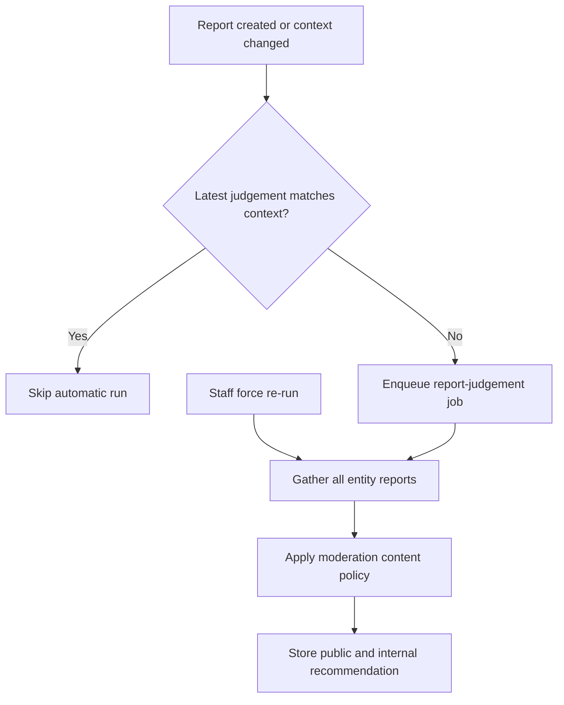

# @agents/report-judgement

AI agent that reviews moderation reports and recommends a moderation action.

## Purpose

When a moderation report is created or materially changes the report context for a given entity (post, comment, user, rss_feed_item, or url_hostname), this agent is enqueued (fire-and-forget) to analyse the reported content against the platform content policy (ToS §4) and optional community rules. It emits a public-safe verdict for display to signed-in users and a detailed internal verdict for moderators.

Automatic runs skip when the latest stored judgement already matches the current report context. Moderation staff (site moderators and admins) may force a re-run via `POST /api/v1/reports/:id/judgements`; the re-run gathers all accumulated reports for the entity and feeds them as context.

Structured model calls use OpenRouter's OpenResponses-compatible API. Terminal provider metadata
settles the shared usage ledger directly; this agent does not use the direct OpenAI
background-response reconciler.



## Output

```ts
{
  recommended_action: 'no_action' | 'warn' | 'remove' | 'escalate'
  public_response: string // vague, safe for signed-in non-staff
  internal_response: string // detailed reasoning for moderators
}
```

## Queue

Triggered by `backend/queues/ai-agents/enqueues/report-judgement.mts` (job name `report-judgement`). Processed by `backend/workers/ai-agents/processors/process-report-judgement.mts`.

## Content policy

Reads `backend/services/moderation/content-policy.mts` — a curated subset of ToS §4. Keep it in sync with ToS §4 and `articles/how-moderation-works.md`.
