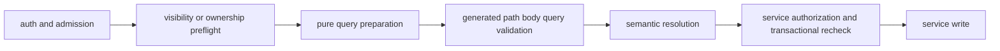

# Request validation

[Back to API Routes](README.md#route-helpers)

Routes authenticate and complete admission, visibility, suspension, and non-mutating ownership
preflights before detailed generated request validation. The generated path/body/query check then
runs before semantic resolution or writes; services retain authorization guards and transactional
rechecks. A lag-sensitive mutation preflight reads from the primary when it must observe a
preceding write.

`validateRequestContract` is backed by `@services/runtime-request-validation`; routes use the
adapter rather than its registry. Signature-verified and raw-body routes keep their specialized
parsers. Query routes prepare a normalized wire projection before asynchronous identifier
resolution, preserving pagination clamping and malformed limit/cursor 400 behavior while malformed
typed values remain visible for 422. There is no shared Ajv coercion, and UUID routes retain
`validateUUIDParam` alongside generated path validation.

A typed raw-body declaration or explicit request-contract marker must emit a meaningful body
schema: invoking the adapter against an empty object is not coverage. Compiler-built request-bundle
assertions in [API fixtures](../test-helpers/api-fixtures/openapi/write-openapi.test.mts) verify
emitted carriers and schemas; route HTTP tests verify invocation order, status, and no-write
behavior.
