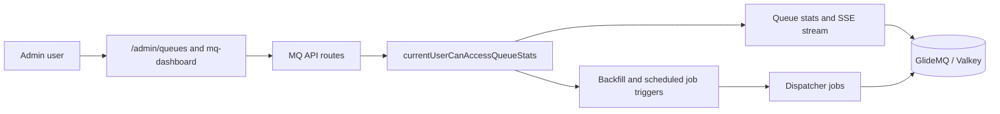
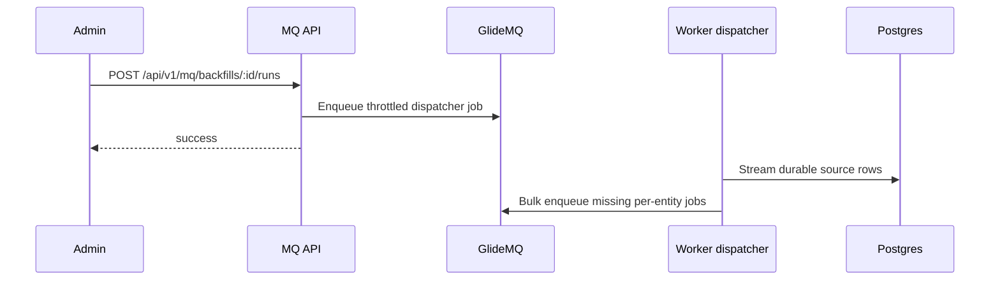

# Message Queue (MQ) API

Admin-only endpoints for monitoring and managing glide-mq job queues.

## Endpoints

| Method | Route                                  | Authentication   | Description                           |
| ------ | -------------------------------------- | ---------------- | ------------------------------------- |
| GET    | `/api/v1/mq/stats`                     | Required (admin) | Get aggregated queue statistics       |
| GET    | `/api/v1/mq/queues`                    | Required (admin) | List all queues with individual stats |
| GET    | `/api/v1/mq/stream`                    | Required (admin) | SSE stream of real-time queue stats   |
| GET    | `/api/v1/mq/scheduled-jobs`            | Required (admin) | List all triggerable scheduled jobs   |
| GET    | `/api/v1/mq/backfills`                 | Required (admin) | List all registered backfill entries  |
| POST   | `/api/v1/mq/backfills/:id/runs`        | Required (admin) | Trigger a backfill by registry ID     |
| POST   | `/api/v1/mq/queues/:name/pause`        | Required (admin) | Pause a queue                         |
| POST   | `/api/v1/mq/queues/:name/resume`       | Required (admin) | Resume a paused queue                 |
| POST   | `/api/v1/mq/queues/:name/retry-failed` | Required (admin) | Retry all failed jobs in a queue      |
| POST   | `/api/v1/mq/scheduled-jobs/:id/runs`   | Required (admin) | Manually trigger a scheduled job      |

## Authorization

All endpoints require admin access (`currentUserCanAccessQueueStats`). Returns 401 if unauthenticated, 403 if not an admin.

## GET /api/v1/mq/stats

Returns aggregated statistics across all queues (waiting, active, completed, failed counts, queue count).

## GET /api/v1/mq/queues

Returns per-queue statistics.

Response: `{ queues: [...], total: <number> }`

## GET /api/v1/mq/stream

Server-Sent Events stream that emits `stats` events every 2 seconds with both aggregate and per-queue statistics.

## POST /api/v1/mq/queues/:name/pause

Pauses the named queue.

Response: `{ success: boolean }`

## POST /api/v1/mq/queues/:name/resume

Resumes the named queue.

Response: `{ success: boolean }`

## POST /api/v1/mq/queues/:name/retry-failed

Retries all failed jobs in the named queue.

Response: `{ success: boolean, retried: number }`

## GET /api/v1/mq/scheduled-jobs

Returns all scheduled jobs registered in the scheduled jobs registry (`scheduled-jobs-registry.mts`). Does not include jobs that already have trigger buttons on domain-specific admin pages (`/admin/postgresql`, `/admin/valkey`).

Response: `{ jobs: Array<{ id, queue_name, job_name, schedule, description }> }`

## POST /api/v1/mq/scheduled-jobs/:id/runs

Manually triggers a scheduled job immediately by its scheduler ID. Calls the corresponding enqueue function from the job's system.

Response: `{ success: boolean }`

## GET /api/v1/mq/backfills

Returns all backfill entries registered in the backfill registry (`backfills-registry.mts`). Each entry represents a replayable queue with a scanner that can re-enqueue all entities missing a derived result from the Postgres source-of-truth.

Response: `{ backfills: Array<{ id, queue_name, job_name, description, source_table }> }`. The
post-publication registry includes separate `post-publication-shadow-dry-run` and
`post-publication-shadow-repair` entries; trigger the dry-run entry before the repair entry during
rollout.

## POST /api/v1/mq/backfills/:id/runs

Triggers a backfill by its registry ID. Enqueues a single deduplicated dispatcher job (priority 100, `throttle` dedup, 1h TTL) that scans the source table and re-enqueues per-entity jobs for all rows missing a result. Returns immediately — the scan runs inside the worker.

Response: `{ success: boolean }`

## GlideMQ Dashboard

A full-featured queue management UI is available at `/admin/mq-dashboard` (requires admin auth). This is powered by the `@glidemq/dashboard` Express middleware mounted in [`backend/entrypoints/api/serve.mts`](../../../entrypoints/api/serve.mts).

## Performance

| Endpoint                                  | Round Trips | Caching | Notes                                 |
| ----------------------------------------- | ----------- | ------- | ------------------------------------- |
| GET /api/v1/mq/stats                      | 2           | None    | Auth + aggregated Valkey queue stats  |
| GET /api/v1/mq/queues                     | 2           | None    | Auth + per-queue Valkey stats         |
| GET /api/v1/mq/stream                     | 1/tick      | None    | SSE; polls getAllQueueStats every 2s  |
| POST /api/v1/mq/queues/:name/pause        | 2           | None    | Auth + queue pause                    |
| POST /api/v1/mq/queues/:name/resume       | 2           | None    | Auth + queue resume                   |
| POST /api/v1/mq/queues/:name/retry-failed | 3           | None    | Auth + getJobs + parallel retries     |
| GET /api/v1/mq/scheduled-jobs             | 1           | None    | Auth only; registry is in-memory      |
| POST /api/v1/mq/scheduled-jobs/:id/runs   | 1           | None    | Auth + enqueue (fire-and-forget)      |
| GET /api/v1/mq/backfills                  | 1           | None    | Auth only; registry is in-memory      |
| POST /api/v1/mq/backfills/:id/runs        | 1           | None    | Auth + enqueue dispatcher (throttled) |

## Related

- Service: [../../../services/queue-monitoring/](../../../services/queue-monitoring/README.md)
- GlideMQ Dashboard: [../../../entrypoints/api/glidemq-dashboard.mts](../../../entrypoints/api/glidemq-dashboard.mts)
- Parent: [../../CLAUDE.md](../../CLAUDE.md)
