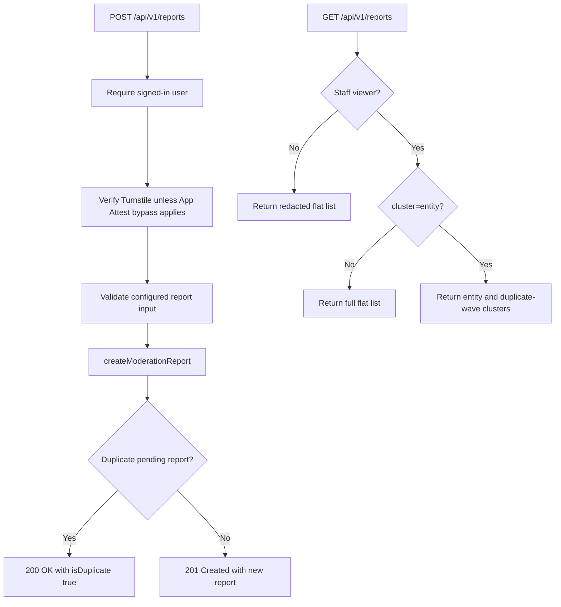

# Reports API

Submit and list moderation reports for entities (RSS feed items, posts, comments, users, and URL
hostnames). Canonical `entityType` values are `rss_feed_item`, `post`, `comment`, `user`, and
`url_hostname`.

## Endpoints

| Method | Route             | Authentication | Description                     |
| ------ | ----------------- | -------------- | ------------------------------- |
| POST   | `/api/v1/reports` | Required       | Submit a moderation report      |
| GET    | `/api/v1/reports` | Required       | List pending moderation reports |



## POST /api/v1/reports

Creates a moderation report. Duplicate pending reports from the same user for the same entity return `200 OK` with `isDuplicate: true` instead of creating a new row.

**Request body:**

```json
{
  "entityType": "rss_feed_item" | "post" | "comment" | "user" | "url_hostname",
  "entityId": "<uuid>",
  "reason": "spam" | "harassment" | "misinformation" | "illegal_content" | "vote_manipulation" | "other",
  "note": "<optional string, max 1000 chars>",
  "cf_turnstile_response": "<Cloudflare Turnstile token>"
}
```

`vote_manipulation` is valid only when `entityType` is `post`.

The report service uses the configurable `@vouchington/utils/moderation` input-parser primitive
while the route retains Vouchington's catalog, CAPTCHA/App Attest precondition, response contract, and
moderation service integration.

**CAPTCHA:** Requires a Cloudflare Turnstile token in `cf_turnstile_response`; the route calls `verifyCaptchaToken` (see [`@services/captcha`](../../../services/captcha/README.md)) — `422` if missing, `400` if rejected, `502` if siteverify is unreachable. Requests carrying valid Apple App Attest headers bypass this Turnstile requirement — see [App Attest bypass](../../../services/captcha/README.md#app-attest-bypass) in `@services/captcha` (actionTag: `reports.create`).

**Response:** `201 Created` with `{ report, isDuplicate: false }`, or `200 OK` with `{ report, isDuplicate: true }` for duplicate pending reports.

## GET /api/v1/reports

Returns a paginated list of moderation reports. Signed-in non-staff viewers receive a redacted flat
list. Staff viewers receive full report details, default to severity sorting in flat mode, and may
request clustered mode.

**Query params:**

| Param     | Type                                                             | Default              | Description                                                                              |
| --------- | ---------------------------------------------------------------- | -------------------- | ---------------------------------------------------------------------------------------- |
| `limit`   | number                                                           | `25`                 | Max results (capped at 100)                                                              |
| `after`   | string                                                           | —                    | Opaque `page_info.end_cursor` value for the next page                                    |
| `before`  | string                                                           | —                    | Opaque `page_info.start_cursor` value for the previous page                              |
| `status`  | `pending`, `reviewed`, `actioned`, `dismissed`                   | `pending`            | Report status filter                                                                     |
| `sort`    | `severity`, `most_reported`, `created_at_asc`, `created_at_desc` | `severity` or newest | Staff flat mode supports all values; non-staff and clustered mode use created-time sorts |
| `cluster` | `entity`                                                         | flat report results  | Staff-only grouped response mode                                                         |

`severity` and `most_reported` cursors embed the cursor row's current report count and, for
severity, judgement rank. If those keys change — another report on the same entity, a new
judgement, or the cursor row leaving the requested status — `GET` returns `422 Invalid cursor` and
the client must restart from page one. `created_at_*` cursors are id-only and stay valid when
sibling rows change.

**Response:** `200 OK` with
`{ results: ModerationReport[], page_info: { has_next_page, has_previous_page, start_cursor, end_cursor } }`.
Each report includes `report_count`, the total number of reports for the same entity and status.
Non-staff responses omit reporter identity, notes, resolution identity, admin paths, target-user
identity, restriction flags, AI judgements, system-generation flags, and ban-evasion context. They
also exclude all system-generated reports from the list.

When `cluster=entity`, staff receive:

```ts
{
  cluster_mode: 'entity',
  results: ModerationReportEntityCluster[],
  duplicate_clusters: ModerationReportDuplicateCluster[],
  page_info: {
    has_next_page: boolean,
    has_previous_page: boolean,
    start_cursor: string | null,
    end_cursor: string | null,
  }
}
```

Entity clusters group all returned reports for the same `(entity_type, entity_id)` and include report
count, reporter count, reason breakdown, target metadata, nested reports, and post indicators.
Duplicate-wave clusters surface reported post groups when at least 3 returned post clusters match
within 24 hours by stored content hash or stored embedding similarity. The endpoint reuses stored
post spam-detection data, post content hashes, post embeddings, and unresolved `velocity_spike`
`vote_integrity_flags`; it does not enqueue or recompute spam detection or embeddings.

`duplicate_clusters` is a page-local sidecar derived only from the returned `results`. The backend
does not perform an unbounded cross-page reconstruction. A qualifying group may recur on later pages
with the same stable ID and only that page's members; clients merge recurring IDs and member cluster
IDs when they accumulate multiple pages.

## Performance

| Endpoint                           | Round Trips | Caching      | Notes                                                      |
| ---------------------------------- | ----------- | ------------ | ---------------------------------------------------------- |
| POST /api/v1/reports               | 2–3         | None (write) | Auth, insert, optional select on duplicate                 |
| GET /api/v1/reports                | 2           | None         | Auth, paginated query                                      |
| GET /api/v1/reports?cluster=entity | 4–5         | None         | Staff auth, entity aggregation, nested reports, indicators |

## Related

- Service: [`backend/services/moderation-reports/`](../../../services/moderation-reports/README.md)
- Integrity queue: [`backend/queues/report-integrity/`](../../../queues/report-integrity/README.md)
