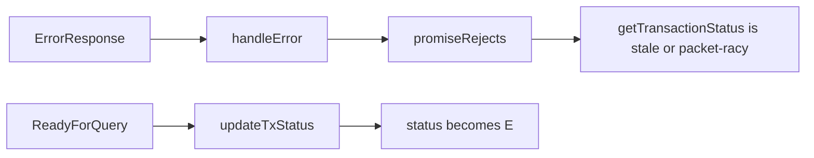

# Transactions

[Back to PostgreSQL Data Store](README.md#transactions)

`@vouchington/postgres` provides explicit transactions, which Filaments re-exports through
[transactions.mts](transactions.mts). Prefer an explicit resource for newly owned transaction
scopes:

```ts
await using transaction = await beginTransaction()
await write('/* insertThing */ INSERT INTO things (id) VALUES ($1)', [id], {
  query: transaction,
})
await transaction.commit()
```

`beginBoundedTransaction()` takes connection and statement timeouts. Both resources roll back when
their scope exits without a successful explicit `commit()`. `registerPostCommitAction()` actions
run only after that commit, and are discarded after rollback, commit failure, or scope disposal.

Use `QueryOptions.query` inside nested helpers so every query stays on the transaction client.
Pass a selected pool or borrowed idle client to the explicit resource:

```ts
await using transaction = await beginTransaction({ client })
await write('/* insertThing */ INSERT INTO things (id) VALUES ($1)', [id], {
  query: transaction,
})
await transaction.commit()
```

`withTransactionOptions` remains the API for joining a client that is already inside a
transaction, because that nested scope must not own the outer transaction's commit or rollback.

## Nested clients and transaction probes

`withTransactionOptions({ client })` calls `withClientTransaction`, which must know whether the
caller already opened a transaction so this helper does not emit a nested `BEGIN` / `COMMIT` /
`ROLLBACK`. New transaction ownership uses `beginTransaction({ client })` instead.

Detection is a live backend probe, not `client.getTransactionStatus()`:

- `@vouchington/postgres` `isInTransaction()`: `SAVEPOINT` / `RELEASE SAVEPOINT vouchington_transaction_probe`
- [transaction-ownership.mts](../../services/moderation-reports/transaction-ownership.mts)
  `ownsReportResolutionTransaction`: the same pattern with `voucha_report_resolution_probe`

`25P01` (`no_active_sql_transaction`) means the client is idle. Any other error, including `25P02`
(`in_failed_sql_transaction`), is not treated as idle and is rethrown.

Use raw `client.query` for that probe, not the package query helper: the expected `25P01` must not
be recorded as a query error in `pg_query_timing` on every outside-transaction probe. That telemetry
reason is separate from the getter race below.

## Why `getTransactionStatus()` is not a replacement

JS `pg` `getTransactionStatus()` returns `_txStatus`. PostgreSQL `ReadyForQuery.status` is `I`
(idle), `T` (in transaction), or `E` (failed). The JS client initializes `_txStatus` to `null` and
writes it only in `_handleReadyForQuery`. The method has existed since pg 8.21.0. pg 8.23.0
pipelining (`pipeline: true`, default off) does not change this rule.

PostgreSQL sends `ErrorResponse` before `ReadyForQuery`. node-postgres rejects the query promise or
invokes the error callback in `Query.handleError` on `ErrorResponse`, before `_txStatus` is
updated:



Callback error handlers that read the getter immediately are stale. Promise `catch` is
packet-boundary racy: `reject()` is a microtask, so if `ErrorResponse` and `ReadyForQuery` are
parsed in the same turn, `catch` may see `E`; if they arrive in separate I/O turns, it still sees
the previous status (`T`). Do not claim `catch` always sees `T`.

Upstream docs (`client.mdx`) show a `catch` reading `E`. Upstream integration tests
(`txstatus-tests.js`) run `SELECT 1` after the error callback "to ensure ReadyForQuery has been
processed" before asserting `E`.

[transaction-status.test.mts](transaction-status.test.mts) verifies the supported boundary against
a real PostgreSQL server without sleeps: the error callback observes stale `T` while the client is
not ready, the protocol `ReadyForQuery` boundary advances the status to `E`, and rollback advances
it to `I`.

Do not replace either SAVEPOINT probe with the getter until upstream documents and tests a safe
immediate `E` with no follow-up query. Track that on [#9805](https://github.com/jonathanong/filaments/issues/9805).
Do not patch `pg`.
