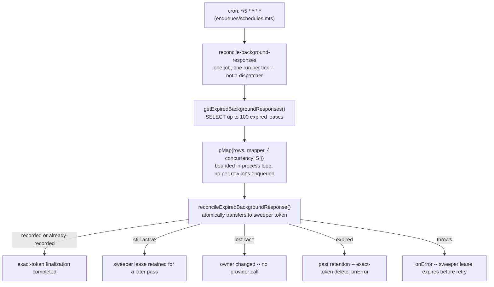

# AI Agents System

Unified queue package for AI agent workloads. OpenAI-backed agent jobs run through `ai_agents`
with shared RPM and TPM limits. The limiter-independent `openai-spend-cap-rechecks` queue owns the
single coordinator that releases jobs when an operator relaxes the daily cap.

## Summary

| Processor                                   | Job Name                                 | Description                                                                                                                                                    |
| ------------------------------------------- | ---------------------------------------- | -------------------------------------------------------------------------------------------------------------------------------------------------------------- |
| `processChat`                               | `chat`                                   | Runs hosted chat responses and publishes token chunks through Valkey pub/sub                                                                                   |
| `processAutotaggerPost`                     | `autotagger-post`                        | Runs the autotagger agent on a post                                                                                                                            |
| `processAutotaggerRssFeedItem`              | `autotagger-rss-feed-item`               | Runs the autotagger agent on an RSS feed item                                                                                                                  |
| `processModerationDispatcher`               | `moderation-dispatcher`                  | Dispatches enabled built-in community AI agent jobs for a post                                                                                                 |
| `processModerationPrompt`                   | `moderation-prompt`                      | Runs a single built-in moderation prompt on a post after rechecking community enablement                                                                       |
| `processCommunityModerationDispatcher`      | `community-moderation-dispatcher`        | Dispatches community moderation prompt jobs; post-created recovery awaits queue delivery so failures retain the reconciliation checkpoint                      |
| `processCommunityModerationPrompt`          | `community-moderation-prompt`            | Runs a community moderation prompt on a post                                                                                                                   |
| `processCustomerSupport`                    | `customer-support`                       | Generates a customer support response                                                                                                                          |
| `processStoryPost`                          | `story-post`                             | Generates or refreshes a story summary; entity recovery uses the awaited enqueue so queue failure retains the durable checkpoint for retry.                    |
| `processStoryClustering`                    | `story-clustering`                       | Clusters an RSS feed item into stories; re-enqueues with 5 s delay (up to 10 times) when embedding is not yet visible — mirrors the autotagger retry pattern   |
| `processReconcileBackgroundResponses`       | `reconcile-background-responses`         | Crash-recovery sweep of orphaned OpenAI `background: true` responses (cancel/retrieve/record); see [Background Response Sweeper](#background-response-sweeper) |
| `processReconcileChatRuntimeGenerations`    | `reconcile-chat-runtime-generations`     | Fails stale hosted-chat generations and releases their conversation turn after an interrupted worker                                                           |
| `processReconcileMemberSupportAgentIntents` | `reconcile-member-support-agent-intents` | Re-enqueues member-created support drafts that committed before keyed queue delivery                                                                           |

## Architecture

- **Queue name**: `ai_agents`
- **Concurrency**: `getWorkerConcurrency('aiAgents', { baseline: 5 })` — `WORKER_CONCURRENCY_AI_AGENTS` env var overrides the baseline, clamped to `WORKER_CONCURRENCY_MAX` (default 25)
- **Rate limits**: `OPENAI_RPM` env var (default: 60 req/min), `OPENAI_TPM` env var (default: 500,000 tokens/min)
- **Spend cap**: `openai-spend-cap` `DynamicConfig` bounds the daily dollar total across all agents (default $10/day), independent of the rate limits above; see [Daily spend cap](../../workers/ai-agents/README.md#daily-spend-cap)
- **Spend-cap coordinator**: `openai-spend-cap-rechecks`, concurrency 1, no OpenAI RPM/TPM limiter; it drains at most 100 registered `ai_agents` jobs per pass
- **Lock duration**: 300,000 ms (5 min); stalled interval: 30,000 ms (default)
- **Enqueue files**: `enqueues/*.mts` — one file per job category
- **Coordinator enqueue**: [`enqueues/spend-cap-recheck.mts`](enqueues/spend-cap-recheck.mts) — one simple-deduplicated job per queried UTC day

Coordinator failures cannot lose agent work: every registered job is also delayed to its queried
UTC midnight and becomes eligible naturally at rollover. The coordinator retries once per minute
for the registry's full two-day retention window. Each release cycle has a generation-scoped
deduplication ID, so a registration accepted during the prior coordinator's final return creates a
new coordinator instead of deduplicating against the old active job. Coordinator enqueue is an
explicitly reported best-effort optimization: if the dedicated queue is unavailable after
registration, the source job still reaches its midnight delay fallback.

> **Chat starvation risk**: `chat` jobs use priority 1, but all worker slots can be occupied by long-running background jobs (autotagger and moderation) before a chat job arrives. If interactive chat latency spikes, tune `WORKER_CONCURRENCY_AI_AGENTS` or split chat into a dedicated queue.

## Enqueue Files

- [`enqueues/autotagger.mts`](enqueues/autotagger.mts) — autotagger jobs
- [`enqueues/chat.mts`](enqueues/chat.mts) — chat jobs
- [`enqueues/community-moderation.mts`](enqueues/community-moderation.mts) — fire-and-forget community moderation jobs plus an awaited recovery variant
- [`enqueues/customer-support.mts`](enqueues/customer-support.mts) — customer support jobs
- [`enqueues/moderation.mts`](enqueues/moderation.mts) — moderation jobs
- [`enqueues/story-clustering.mts`](enqueues/story-clustering.mts) — story clustering jobs
- [`enqueues/story-post.mts`](enqueues/story-post.mts) — fire-and-forget creation enqueue plus an awaited recovery variant that propagates delivery failure
- [`enqueues/reconcile-background-responses.mts`](enqueues/reconcile-background-responses.mts) — background-response sweeper job
- [`enqueues/reconcile-chat-runtime-generations.mts`](enqueues/reconcile-chat-runtime-generations.mts) — hosted-chat runtime recovery job
- [`enqueues/reconcile-member-support-agent-intents.mts`](enqueues/reconcile-member-support-agent-intents.mts) - member support draft-intent recovery job

## Chat Streaming

`reconcile-chat-runtime-generations` runs every five minutes while hosted chat remains available.
It selects at most 100 stale top-level conversation runs, signals only that immutable batch to stop
the matching worker, and atomically terminalizes each selected run and assistant message. This
prevents a worker crash from leaving a conversation permanently unable to accept another turn.

## Built-In Community AI Agents

`moderation-dispatcher` loads the post's community and checks `community_auto_tagger_agents` before
dispatching fixed global label agents such as `self-promotion`, `marketplace`, and `ai-generated`.
The agent definitions always remain global; only enablement is scoped to `community_id`.

`moderation-prompt` repeats the enablement check before running the specific agent. If a moderator
disables an agent after dispatch but before execution, the job exits as skipped and does not write a
moderation result.

Chat jobs use the `ai_agents` queue for background model execution and Valkey pub/sub for the SSE
bridge:

1. API creates the user message and assistant placeholder, starts SSE, and immediately emits full
   metadata with a deterministic job ID derived from the assistant message ID
2. API subscribes to the assistant message's token channel, then enqueues a `chat` job using that
   same logical ID for `jobId` and deduplication
3. `processChat` runs `streamChatResponse()` in the worker
4. Worker publishes text, tool, subagent, done, and error chunks with `publishChatToken`
5. API pipes Valkey token chunks to the client as SSE events
6. On an ordinary HTTP abort, API sends `abort`; on lifecycle expiry it sends
   `sse-cycle-expired`. The worker preserves ordinary disconnect behavior, while expiry aborts the
   generator and persists partial output with a retryable assistant error

Inbound SES support messages supply a per-message logical ID and triggering support-message ID to
`enqueueCustomerSupportAwaited`. The logical ID is used for both the GlideMQ job and simple
deduplication, and the message ID anchors agent context. Ordinary support updates retain the
one-minute thread-level debounce and unkeyed consumer path. The five-minute SES reconciliation job
pages PostgreSQL for inbound messages without a completed keyed run, bulk-enqueues missing jobs,
and retries retained failed jobs with the same logical ID. An exact matching completed job retained
by GlideMQ is removed before its stable ID is re-added; other jobs are never scanned or removed.

Member-created support drafts persist the same keyed run intent before their post-commit queue
delivery. `reconcile-member-support-agent-intents` runs every five minutes, pages unfinished
`member_thread` run intents from PostgreSQL, and calls `enqueueOrRetryBulkCustomerSupport` with
the persisted `{ threadId, supportMessageId, logicalJobId }`. The stable message-derived ID is used
for both queue deduplication and retained-failure retry, so a crash between commit and enqueue
cannot lose a draft or create a second run.

### Member draft-intent recovery matrix

The required eight-mode durability contract and exact test evidence live in the
[member draft-intent recovery matrix](reference-member-draft-intent-recovery.md).

## Background Response Sweeper

Every OpenAI call in this queue that goes through `createOpenAIResponse()`
(`@modules/openai-utils/create-response.mts`) — every job here except `chat`'s own streamed
assistant response, which stays foreground for chat's time-to-first-token budget — now runs with
`background: true` internally, so a response keeps generating and billing on OpenAI's side even if
the worker that started it crashes, OOM-kills, or is replaced mid-call by an ECS rolling deploy.
`reconcile-background-responses` is the crash-recovery reconciler for that class of orphan: it runs
every 5 minutes (`enqueues/schedules.mts`), pages durable registry rows whose PostgreSQL-clock
lease has expired, and atomically transfers each selected row to a two-minute sweeper lease before
calling OpenAI. The original owner renews its three-minute lease every 60 seconds, so a legitimate
long-running generation is not selected merely for being old. The worker then cancels/retrieves the
terminal response and finalizes only with its exact lease token. Bounded concurrency
(`RECONCILE_CONCURRENCY = 5`) prevents a large expired-lease backlog from fanning out into an
OpenAI rate-limit burst. It is declared in the queue's scheduled-job manifest
and projected into `SCHEDULED_JOBS_REGISTRY`
(`backend/api/v1/mq/scheduled-jobs-registry.mts`), so it is also admin-triggerable like every other
scheduled job.

Each cron tick runs exactly one job — it is a batch reconciler, not a dispatcher that enqueues a
sub-job per row. The bounded concurrency is an in-process loop inside that single job run:

The registry, lease/token fencing, response-ID idempotency guarantee, the sweeper's own recovery logic, and the
full failure-mode transition matrix live in
[`@services/openai-background-responses`](../../services/openai-background-responses/README.md) —
this queue package only owns the enqueue/schedule wiring
(`enqueues/reconcile-background-responses.mts`) and the thin processor
(`backend/workers/ai-agents/processors/process-reconcile-background-responses.mts`).

## Related

- Agents (business logic): [../../agents/README.md](../../agents/README.md)
- Systems overview: [../README.md](../README.md)
- Worker entry point: [../../entrypoints/worker-cpu/README.md](../../entrypoints/worker-cpu/README.md)
