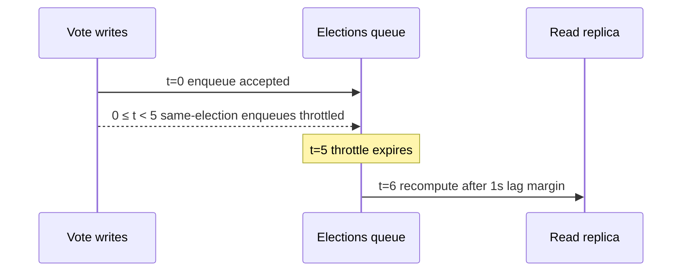

# Elections System

Queue system for asynchronous vote-stat refreshes.

## Queue

| Queue       | Processor                        | Group Keys        | Default Priority |
| ----------- | -------------------------------- | ----------------- | ---------------- |
| `elections` | `processUpdateElectionVoteStats` | `post`            | 10               |
| `elections` | `processUpdateElectionVoteStats` | `entity_relation` | 10               |
| `elections` | `processUpdateElectionVoteStats` | `rss_feed_item`   | 10               |

## Responsibilities

- refresh election vote stats after write paths enqueue follow-up work
- keep expensive stats recalculation off synchronous request paths
- coalesce each election ID into a fixed five-second throttle window, then wait one additional
  second for replica propagation before recomputing
- carry both the entity-relation ID and its metadata-validated relation table for entity-relation
  jobs, allowing PostgreSQL to prune the relation table and UUIDv7 range partitions

## Related

- Vote services: [../../services/elections-votes/README.md](../../services/elections-votes/README.md)
- PostgreSQL aggregation rule:
  [../../../docs/development/postgres-schema-rules.md#large-aggregation-recomputes-read-the-replica-and-absorb-lag-asynchronously](../../../docs/development/postgres-schema-rules.md#large-aggregation-recomputes-read-the-replica-and-absorb-lag-asynchronously)
- Systems overview: [../README.md](../README.md)
