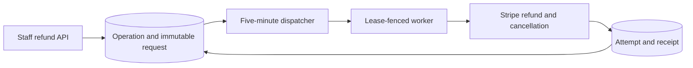

# Refund Reconciliation Reference

PostgreSQL owns refund work and provider identity. The queue carries only an operation ID and its
lease token, so queue retention and delivery are never correctness boundaries.

## Failure transitions

| Failure mode                                       | Detectable state                                                                        | Recovery/reconciliation path                                                                                      | Idempotency guarantee                                              | Evidence                                                                                                                                                           |
| -------------------------------------------------- | --------------------------------------------------------------------------------------- | ----------------------------------------------------------------------------------------------------------------- | ------------------------------------------------------------------ | ------------------------------------------------------------------------------------------------------------------------------------------------------------------ |
| Dispatch failure                                   | An incomplete operation remains due without a fresh lease                               | The five-minute dispatcher leases it on the next scan                                                             | `FOR UPDATE SKIP LOCKED` plus the operation lease token            | `backend/services/memberships/refund-reconciliation/dispatcher.test.mts`                                                                                           |
| Provider non-consumption                           | The append-only attempt has no provider refund ID                                       | A durable retry reuses that attempt's Stripe idempotency key                                                      | One provider key per operation and attempt ordinal                 | `backend/services/memberships/refund-reconciliation/refund-reconciliation.test.mts`                                                                                |
| Provider consumption followed by DB-commit failure | The attempt lacks a provider ID or receipt after Stripe may have accepted the create    | Stripe idempotency resolves the same create; beyond 23 hours, bounded metadata discovery scans before replacement | Stable provider key and operation/attempt metadata                 | `backend/services/memberships/refund-reconciliation/refund-reconciliation.test.mts`                                                                                |
| Durable commit followed by reply loss              | A provider ID or refund receipt exists while the caller or job lacks an acknowledgement | Exact API replay, `charge.refunded`, or the scheduler resumes the same operation                                  | Unique provider refund receipt and immutable administrator request | `backend/api/v1/memberships/refund.test.mts`; `backend/services/stripe/event-charge-refund-reconciliation.mock.test.mts`                                           |
| Retry/reconciliation                               | `reconciliation_due_at` records the next exponential-backoff deadline                   | The scheduled dispatcher claims due work and the child reconciles one fenced operation                            | Attempt ordinal, durable due time, and lease token                 | `backend/services/memberships/refund-reconciliation/refund-reconciliation.test.mts`                                                                                |
| TTL expiry                                         | GlideMQ history may be absent while the incomplete operation and attempts remain        | The next PostgreSQL scan re-derives the dispatcher and child jobs                                                 | Queue state is not the receipt or retry clock                      | `backend/queues/memberships/enqueues.test.mts`; `backend/api/v1/mq/scheduled-job-manifests.test.mts`                                                               |
| Orphan cleanup                                     | A lease is older than five minutes on an incomplete due operation                       | The dispatcher rotates the stale lease and enqueues a newly fenced child                                          | A stale child cannot read or mutate through the new token          | `backend/services/memberships/refund-reconciliation/dispatcher.test.mts`; `backend/services/memberships/refund-reconciliation/administrator-cancellation.test.mts` |
| Normal terminal removal                            | The operation has `completed_at` and one linked receipt                                 | Retained or removed queue jobs are ignored; PostgreSQL keeps the terminal facts                                   | Partial unique receipt-per-operation index and fenced completion   | `backend/services/memberships/refund-reconciliation/administrator-cancellation.test.mts`                                                                           |

## Stripe operation identity

| Column                        | Contract                                                                                                                                                                                                         |
| ----------------------------- | ---------------------------------------------------------------------------------------------------------------------------------------------------------------------------------------------------------------- |
| Intent owner                  | The staff API caller creates and retains a UUID token before the first request. The service claims the immutable operation and request before Stripe is called.                                                  |
| Provider verb                 | Refund creation is Stripe POST. Immediate subscription cancellation is Stripe DELETE, followed by GET retrieval after an ambiguous DELETE result. Metadata recovery is bounded Stripe GET/list.                  |
| Logical idempotency key       | The actor-bound caller token identifies one administrator operation; automatic reversal policy supplies its own immutable operation identity. A changed administrator request conflicts.                         |
| Provider idempotency key      | Each append-only refund attempt uses `voucha-membership-refund-reconciliation:<operation-id>:<attempt-ordinal>` unchanged across retries. Stripe DELETE has no idempotency key.                                  |
| Receipt/retention horizon     | Attempts and `membership_refunds` receipts remain in PostgreSQL independently of queue TTL. Metadata discovery begins only after the 23-hour Stripe idempotency horizon and persists its cursor and stable head. |
| Replacement/supersession      | Pending attempts are resumed. Only a provider-terminal failed or canceled refund opens the next ordinal; the old provider ID cannot move to its replacement.                                                     |
| Rolling-version compatibility | Older binaries may still write their legacy intent and receipt pair during the bottom-layer deploy. New binaries require operation-linked receipts but do not require or mutate legacy intent rows.              |
| Concurrent-winner resolution  | Provider/environment/application uniqueness, one operation ordinal, one provider refund ID, one receipt per operation, fair row locking, and rotating lease tokens converge racing callers and workers.          |

Return to the [memberships queue overview](README.md).
