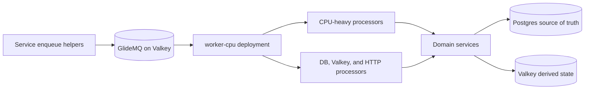

# Active Workers

[Back to Systems Summary](README.md#active-workers)

`Baseline Concurrency` is the value passed to `getWorkerConcurrency(name, { baseline })` from [`@modules/queue-config`](../modules/queue-config/README.md). The resolved concurrency is `round(baseline * WORKER_CONCURRENCY_SCALE)` clamped to `[1, WORKER_CONCURRENCY_MAX]`, with `WORKER_CONCURRENCY_<NAME>` as a per-worker override (still clamped). `WORKER_CONCURRENCY_MAX` defaults to `25`. `Global Concurrency Limits` covers queue-wide caps such as `ordering.concurrency`. `Effective Concurrency` is the practical upper bound before rate limiting at default scale (`1`).

| Worker Export                                  | Queue                                          | Jobs / Processors                                                                                                                                                                                                                                                                                                                                                                | Baseline Concurrency | Global Concurrency Limits                                                                                                     | Effective Concurrency                                                                                |
| ---------------------------------------------- | ---------------------------------------------- | -------------------------------------------------------------------------------------------------------------------------------------------------------------------------------------------------------------------------------------------------------------------------------------------------------------------------------------------------------------------------------- | -------------------- | ----------------------------------------------------------------------------------------------------------------------------- | ---------------------------------------------------------------------------------------------------- |
| `topicRatings`                                 | `topic-ratings`                                | `processUpdateTopicRatingStats`                                                                                                                                                                                                                                                                                                                                                  | `5`                  | None                                                                                                                          | `5`                                                                                                  |
| `postPublication`                              | `post-publication`                             | `processReconcilePostPublication`                                                                                                                                                                                                                                                                                                                                                | `1`                  | `publication-reconciliation: 1`                                                                                               | `1`                                                                                                  |
| `storyPostRelatedUrlProjections`               | `story-post-related-url-projections`           | `processReconcileStoryPostRelatedUrlProjections`                                                                                                                                                                                                                                                                                                                                 | `2`                  | `story-post-related-url-projections: 1`                                                                                       | `1`                                                                                                  |
| `elections`                                    | `elections`                                    | `processUpdateElectionVoteStats`                                                                                                                                                                                                                                                                                                                                                 | `5`                  | `topic: 25`, `hostname: 25`, `agent_moderation: 25`, `post: 25`, `entity_relation: 25`, `rss_feed_item: 25`, `user_vouch: 25` | `5`                                                                                                  |
| `entityMetricsCacheRefresh`                    | `entity-metrics-cache-refresh`                 | `processRefreshTopicMetrics`, `processRefreshPostMetrics`, `processRefreshUserMetrics`                                                                                                                                                                                                                                                                                           | `5`                  | None                                                                                                                          | `5`                                                                                                  |
| `cachePurge`                                   | `cache-purge`                                  | `processPurgeCacheTag`                                                                                                                                                                                                                                                                                                                                                           | `5`                  | None                                                                                                                          | `5`, plus worker limiter `4` jobs per 60s                                                            |
| `entitiesListeners`                            | `entity-listeners`                             | `processUser*`, `processTopic*`, `processPost*`, `processImageCreated`, `processUrlCreated`, `processAutoFollowReferrer`, `reconcileEntity`, `reconcileEntities`, `processReconcilePostCategoryFinalizations`                                                                                                                                                                    | `5`                  | `post-category-finalization-reconciliation: 1`                                                                                | `5`, with post-category finalization recovery serialized to `1`                                      |
| `emails`                                       | `emails`                                       | All `processSend*Email` jobs plus `dispatchEngagementEmails` and `dispatchCommunityModerationSummaryEmails`                                                                                                                                                                                                                                                                      | `5`                  | `dispatchEngagementEmails: 100`, `dispatchCommunityModerationSummaryEmails: 100`                                              | `5`                                                                                                  |
| `urlsDomainsBlacklist`                         | `urls-domains-blacklist`                       | `processBlacklistDispatcher`, `processBlacklistSourceSync`                                                                                                                                                                                                                                                                                                                       | `5`                  | `dispatcher: 1`, `sync: 5`                                                                                                    | `5`                                                                                                  |
| `rss_feeds`                                    | `rss-feeds`                                    | `dispatchRssFeeds`, `fetchRssFeed`                                                                                                                                                                                                                                                                                                                                               | `5`                  | `dispatcher: 1`, `fetch: 5`                                                                                                   | `5`                                                                                                  |
| `rssFeedDiscoverability`                       | `rss-feed-discoverability`                     | `processEvaluateRssFeedDiscoverability`                                                                                                                                                                                                                                                                                                                                          | `5`                  | None                                                                                                                          | `5`                                                                                                  |
| `crawlEmbeds`                                  | `crawl_embeds`                                 | `resolve_crawl_oembed`, `backfill_crawl_embeds`                                                                                                                                                                                                                                                                                                                                  | `5`                  | `oembed:<destination hostname>`: 1 request/s; `backfill`: 1                                                                   | `5`, subject to destination-host rate limiting                                                       |
| `rssFeedItemCategories`                        | `rss-feed-item-categories`                     | `processReconcileRssFeedItemCategorySnapshots`, `processBackfillCategoriesForTopicAliases`                                                                                                                                                                                                                                                                                       | `5`                  | `snapshot-reconciliation: 1`                                                                                                  | `5` (reconciliation effective: `1`)                                                                  |
| `languageDetection`                            | `language_detection`                           | Entity detection for `post`, `rss_feed_item`, `crawl`, `community`, `user`, and `topic`, plus backfill jobs                                                                                                                                                                                                                                                                      | `5`                  | None                                                                                                                          | `5`                                                                                                  |
| `topicAliases`                                 | `topic-aliases`                                | `processTopicAliasesUpdate`, `processReconcileTopicAliasCategoryMappings`, `processInvalidatePostsForTopicAliases`                                                                                                                                                                                                                                                               | `5`                  | `category-mapping-reconciliation: 1`, `post-invalidation: 1`                                                                  | `5` (each recovery continuation effective: `1`)                                                      |
| `bedrock_embeddings_nova_multimodal_v1_single` | `bedrock_embeddings_nova_multimodal_v1_single` | `post`, `topic`, `rss_feed_item`                                                                                                                                                                                                                                                                                                                                                 | `5`                  | None                                                                                                                          | `5`, plus worker limiter `10` jobs per second                                                        |
| `bedrock_embeddings_batch`                     | `bedrock-embeddings-batch`                     | `creation_dispatcher`, `poll_dispatcher`, `topics`, `posts`, `rss_feed_items`, `crawl_chunks`, `poll_batch`                                                                                                                                                                                                                                                                      | `5`                  | `creation: 1`, `dispatcher: 1`, `polling: 10`                                                                                 | `5`, with polling also rate-limited to `10` jobs per second                                          |
| `openai_moderation_omni_single`                | `openai_moderation_omni_single`                | `post`, `image`, `reconcile_image_quarantines`, `reconcile_post_moderation`                                                                                                                                                                                                                                                                                                      | `5`                  | One throttled image-quarantine reconciler and one throttled post-moderation reconciler per minute                             | `5`, plus worker limiter `10` jobs per second                                                        |
| `ai_agents`                                    | `ai_agents`                                    | `chat`, `autotagger-post`, `autotagger-rss-feed-item`, `moderation-dispatcher`, `moderation-prompt`, `community-moderation-dispatcher`, `community-moderation-prompt`, `story-clustering`                                                                                                                                                                                        | `5`                  | None                                                                                                                          | `5`, RPM-limited by `OPENAI_RPM` (default 60/min) and TPM-limited by `OPENAI_TPM` (default 500k/min) |
| `openAiSpendCapRechecks`                       | `openai-spend-cap-rechecks`                    | `recheck`                                                                                                                                                                                                                                                                                                                                                                        | `1`                  | One simple-deduplicated coordinator per UTC day                                                                               | `1`, deliberately outside `ai_agents` RPM/TPM limits                                                 |
| `postMentions`                                 | `post-mentions`                                | `processPostMentions`                                                                                                                                                                                                                                                                                                                                                            | `5`                  | None                                                                                                                          | `5`                                                                                                  |
| `psql`                                         | `psql`                                         | `runMigrations`, `runViews`, `runConfigDriven`, `createPartitions`, `cleanupPartitions`, `dataRetentionCleanup`                                                                                                                                                                                                                                                                  | `1` (`ignoreScale`)  | None                                                                                                                          | `1`                                                                                                  |
| `crawlUrls`                                    | `crawl_urls`                                   | `crawl_url`                                                                                                                                                                                                                                                                                                                                                                      | `5`                  | Per-hostname serialization via `ordering.rateLimit` when used                                                                 | `5`                                                                                                  |
| `crawlHostnames`                               | `crawl_hostnames`                              | `crawl_hostnames_dispatcher`, `crawl_urls_per_hostname_dispatcher`, `crawl_tier1_dispatcher`, `crawl_tier2_dispatcher`, `refresh_hostname_crawler_dispatcher`, `refresh_hostname_crawler`, `crawl_cleanup`                                                                                                                                                                       | `5`                  | None                                                                                                                          | `5`                                                                                                  |
| `boilerplateRemoval`                           | `crawl_html_boilerplate_removal`               | `boilerplate_removal_dispatcher`, `boilerplate_removal`                                                                                                                                                                                                                                                                                                                          | `5`                  | None                                                                                                                          | `5`                                                                                                  |
| `images`                                       | `images`                                       | `cleanup-abandoned-uploads`, `extract-metadata`                                                                                                                                                                                                                                                                                                                                  | `5`                  | None                                                                                                                          | `5`                                                                                                  |
| `accountDataRequests`                          | `account-data-requests`                        | `processExportRequest`, `processCleanupExpiredExports`, `recoverExportRequests`                                                                                                                                                                                                                                                                                                  | `2` (`ignoreScale`)  | None                                                                                                                          | `2`                                                                                                  |
| `userDeletions`                                | `user-deletions`                               | `processUserDeletion`, `recoverUserDeletions`                                                                                                                                                                                                                                                                                                                                    | `2` (`ignoreScale`)  | None                                                                                                                          | `2`                                                                                                  |
| `activitypubInboxWorker`                       | `activitypub-inbox`                            | `processDelivery`, `recoverDeliveries`, `rearmFailedDeliveries`, `cleanupExpiredDeliveries`                                                                                                                                                                                                                                                                                      | `5`                  | None                                                                                                                          | `5`                                                                                                  |
| `activitypubDeliveryWorker`                    | `activitypub-delivery`                         | `distributeActivity`, `deliverActivity`                                                                                                                                                                                                                                                                                                                                          | `5`                  | `distributeActivity`: per-activity ordering concurrency `1`                                                                   | `5`, with each activity's fan-out serialized                                                         |
| `bloomFilters`                                 | `bloom-filters`                                | `processPopulateBloomFilter`, `processRebuildBloomFilter`, `processBackfillBloomFilter`, `processBackfillUserBookmarkBloomFilter`, `processDeleteUserBookmarkBloomFilter`, `processRebuildEmbeddingBloomFilter`                                                                                                                                                                  | `5`                  | Per physical filter: `1`                                                                                                      | `5`, with same-filter rebuilds serialized                                                            |
| `findYourFriends`                              | `find-your-friends`                            | `dispatchFindYourFriends`, `syncFacebookFriends`, `syncXFriends`, `syncGithubFriends`                                                                                                                                                                                                                                                                                            | `5`                  | `dispatcher: 1`, `sync_facebook: 5`, `sync_x: 2`, `sync_github: 5`                                                            | `5`                                                                                                  |
| `oauthAuthorizationExchangeWorker`             | `oauth-authorization-exchange`                 | `exchangeOAuthAuthorization`, `dispatchOAuthAuthorizationExchanges`                                                                                                                                                                                                                                                                                                              | `4` (`ignoreScale`)  | `dispatcher: 1`                                                                                                               | `4`                                                                                                  |
| `sitemapWorker`                                | `sitemaps`                                     | `processUpdatePostDaySitemap`, `processUpdatePostTypeIndex`, `processUpdatePostsIndex`, `processUpdateRootIndex`, `processNightlyBackfillWeekDispatcher`, `processWeeklyBackfillMonthDispatcher`, `processMonthlyBackfillArchiveDispatcher`                                                                                                                                      | `5`                  | `post_day_today: 1`, `post_day_past: 1`, `indexes: 1`, `dispatcher: 1`                                                        | `1`                                                                                                  |
| `membershipsWorker`                            | `memberships`                                  | `processStripeEvent`, `recoverStripeEvents`, `processMembershipVerification`, `recoverMembershipVerifications`, `reconcileStripeMembershipCatalog`, `deliverMembershipEntitlementEffects`, `expireElapsedMemberships`, `processRenewalNotificationCheck`, `processSendRenewalPriceIncreaseEmail`, `dispatchMembershipRefundReconciliation`, `reconcileMembershipRefundOperation` | `5`                  | `stripe-catalog:voucha-web: 1`                                                                                                | `5`                                                                                                  |
| `notificationsWorker`                          | `notifications`                                | Reconcile, lifecycle/push/delete, and weekly community activity digest dispatch/batch jobs                                                                                                                                                                                                                                                                                       | `5`                  | Digest batches form an ordered `afterUserId` cursor chain                                                                     | `5`                                                                                                  |
| `voteWeight`                                   | `vote-weight`                                  | `processRecalculateUserVoteWeight`, `processRecalculateVoteWeightDispatcher`                                                                                                                                                                                                                                                                                                     | `5`                  | None                                                                                                                          | `5`                                                                                                  |
| `voteIntegrity`                                | `vote-integrity`                               | `processVoteIntegrityCheck`                                                                                                                                                                                                                                                                                                                                                      | `5`                  | None                                                                                                                          | `5`                                                                                                  |
| `crawlReferralLinks`                           | `crawl_referral_links`                         | `crawl_referral_links_dispatcher`, `crawl_referral_link`                                                                                                                                                                                                                                                                                                                         | `5`                  | `dispatcher: 1`, `crawl: 5`                                                                                                   | `5`                                                                                                  |
| `crawlBrowser`                                 | `crawl_browser`                                | `crawl_browser`                                                                                                                                                                                                                                                                                                                                                                  | `1` (fixed)          | None                                                                                                                          | `1` (scale horizontally)                                                                             |
| `spamDetectionWorker`                          | `spam_detection`                               | `post`                                                                                                                                                                                                                                                                                                                                                                           | `5`                  | None                                                                                                                          | `5`, plus worker limiter `5` jobs per second                                                         |
| `adminImportsWorker`                           | `admin-imports`                                | `processImportRow`                                                                                                                                                                                                                                                                                                                                                               | `5`                  | None                                                                                                                          | `5`                                                                                                  |
| `userRssFeedImports`                           | `user-rss-feed-imports`                        | `processImportRow`                                                                                                                                                                                                                                                                                                                                                               | `5`                  | None                                                                                                                          | `5`                                                                                                  |
| `kagiSmallWeb`                                 | `kagi-smallweb`                                | `sync`                                                                                                                                                                                                                                                                                                                                                                           | `1` (`ignoreScale`)  | None                                                                                                                          | `1`                                                                                                  |
| `sesInboundWorker`                             | `ses_inbound`                                  | `processInboundEmail`, `reconcileInboundEmail`                                                                                                                                                                                                                                                                                                                                   | `1` (`ignoreScale`)  | `reconcileInboundEmail`: `ses-inbound-reconciliation` (concurrency 1)                                                         | `1`                                                                                                  |
| `blueskyFollowPropagationWorker`               | `bluesky-follow-propagation`                   | `reconcileFollow`, `backfillBlueskyFollowPropagation`, `disconnectRequested`, `backfillBlueskyDisconnectRequests`                                                                                                                                                                                                                                                                | `1` (`ignoreScale`)  | None                                                                                                                          | `1`                                                                                                  |

Operators tune the worker process via env vars (defaults documented in [`docs/development/worker-performance.md`](../../docs/development/worker-performance.md)):

- `WORKER_CONCURRENCY_SCALE` — float multiplier on every worker's baseline (default `1`).
- `WORKER_CONCURRENCY_MAX` — configurable ceiling for every worker (default `25`; can be raised or lowered).
- `WORKER_CONCURRENCY_<NAME>` — per-worker override that bypasses scale but is still clamped by max (e.g. `WORKER_CONCURRENCY_AI_AGENTS=10`).
- `ignoreScale` workers (`psql`, `accountDataRequests`, `userDeletions`, `kagiSmallWeb`) ignore the global scale knob and only respect their per-worker override and the global max.
