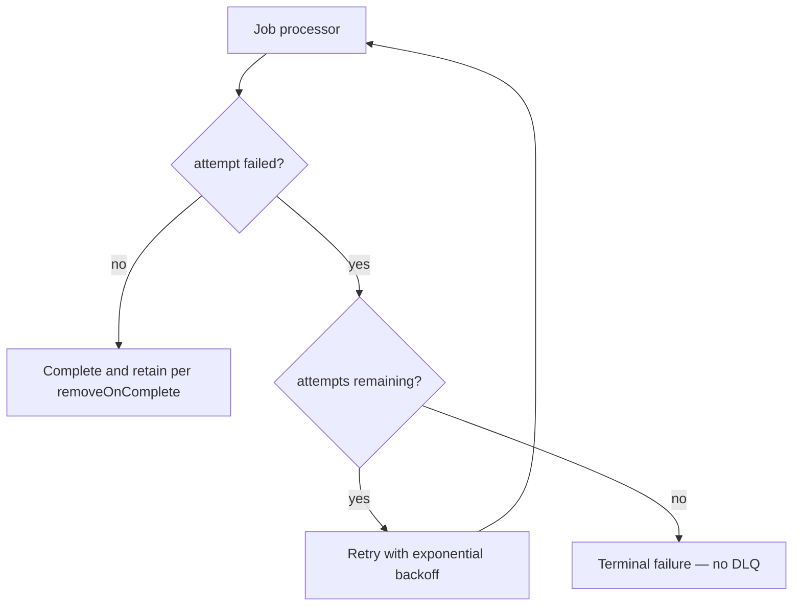

# Terminal Failure Recovery

[Back to Systems Summary](README.md#terminal-failure-recovery)

GlideMQ dead-letter queue support was removed (see staging Valkey OOM incident follow-up); no
queue configures `deadLetterQueue` anymore.

Every queue must independently satisfy the backfill/idempotency guarantees above, or document an
explicit accepted-loss reason in
[Job Replayability & Idempotency](../../docs/requirements/platform/JOB-REPLAYABILITY.md#rules-for-new-jobs).

### User deletion recovery

`user-deletions` persists the account privacy fence and deletion request before its initial enqueue.
Every bounded batch rotates a fenced processing-attempt token before enqueueing its successor. A
terminal process-job failure rotates its token before GlideMQ retains the failed job, while ordinary
recovery preserves unstarted attempt tokens and replaces attempts stuck for 30 minutes. The
five-minute recovery schedule uses that same dispatcher, which is also available as the
`user-deletion-recovery` operator backfill. Required provider work remains in PostgreSQL until it
succeeds, so terminal queue failure cannot silently mark deletion complete.

### OpenAI spend-cap coordinator

`openai-spend-cap-rechecks` is an early-release optimization over the durable `ai_agents` delay,
not the source of truth for whether work survives. Every registered agent job remains delayed to
its queried UTC midnight, so it becomes eligible at rollover independently. The coordinator retries
once per minute for all 2,880 minutes in the registry's two-day retention window.
Generation-scoped deduplication lets a new registry cycle create a successor even while the prior
coordinator is still returning. The registry only targets bounded operator-triggered release
without scanning unrelated delayed jobs.

### OAuth authorization exchange recovery

The `oauth-authorization-exchange` queue recovers terminal failures from
`oauth_authorizations`. Its 60-second dispatcher and the
`oauth-authorization-exchange-dispatch` admin backfill serialize under one ordering key, remove
matching retained completed jobs, re-enqueue missing stable IDs, and retry matching retained failed
jobs. A fenced claim prevents a stale worker from committing after another attempt has reclaimed
the row.

### Email Delivery Guarantees

Postgres state and SES delivery cannot commit in one transaction, so an email processor cannot
guarantee exactly-once delivery. Each processor must choose and test one of these contracts:

- **Retryable delivery:** a provider failure leaves the job eligible for retry. This favors eventual
  delivery, but an ambiguous provider response can result in a duplicate.
- **At-most-once delivery:** persist a delivery-attempt marker immediately before calling the
  provider, and skip every later attempt once that marker exists. This prevents duplicate sends,
  but a provider rejection or ambiguous failure after the marker is committed can lose the email.

The one-time engagement processors use `user_engagement_email_sends.delivery_attempted_at`; renewal
price-increase emails use `memberships.renewal_price_increase_delivery_attempted_at`. Both markers
are committed before SES is called. Engagement `sent_at` and
`memberships.renewal_price_increase_notified_at` are written only after SES accepts the message,
but a failed attempt remains terminal and must not be cleared for a queue retry.

Community moderation summary delivery is retryable. Its durable claim prevents duplicate dispatcher
fanout, but SES rejection leaves `sent_at` unset so the queue retry can send again. If SES accepts
the message but its response is lost, that retry can produce a duplicate.

The canonical replayability rules and delayed-job audit checklist are in
[Job Replayability & Idempotency](../../docs/requirements/platform/JOB-REPLAYABILITY.md).
