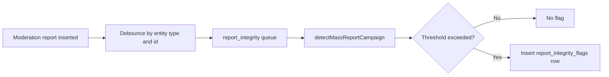

# queues/report-integrity

Debounced queue for detecting mass-report campaigns after each new moderation report.

## Jobs

| Job                           | Trigger                                                                                 | Description                                                                                   |
| ----------------------------- | --------------------------------------------------------------------------------------- | --------------------------------------------------------------------------------------------- |
| `processReportIntegrityCheck` | Fire-and-forget from `@services/moderation-reports/integrity` after every report insert | Runs `detectMassReportCampaign`; inserts a `report_integrity_flags` row if threshold exceeded |

Deduplication: `debounce` mode with a 30-second TTL per `(entityType, entityId)` pair. Rapid report
bursts collapse into a single check.
