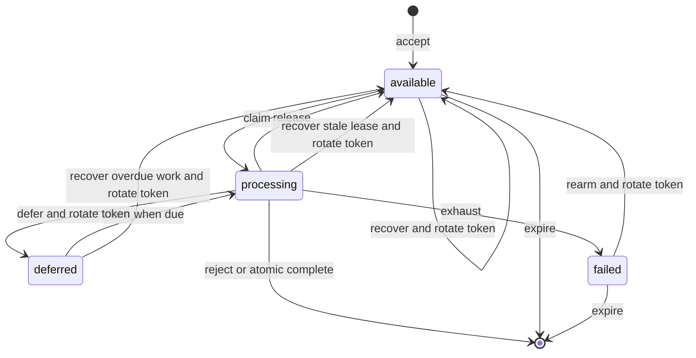

# AP Inbox Activities

Replay-dedup ledger and dispatch logic for inbound ActivityPub activities (Phase C2). Backed by
`ap_inbox_activities` (migration `0562`) — a pure operational log, not an entity table; it has no
soft-delete and is never read by anything other than this service's own unique-constraint check.
Durable unverified request envelopes are stored separately in `ap_inbox_deliveries` (migrations
`0584` and `0604`) until a worker reaches a final protocol outcome or the bounded retention
deadline.

- `parseInboundActivity(rawBody)` — parses and minimally validates a raw request body Buffer into
  `{ id, type, actor, object }`. Throws a 400 `http-errors` error on malformed JSON or a
  missing/empty `id`/`type`/`actor`. `object` is passed through untyped for
  `dispatchInboundActivity` to interpret per activity type.
- `recordInboxActivity(activityId, activityType, actorUri)` — inserts into `ap_inbox_activities`
  with `ON CONFLICT (activity_id) DO NOTHING`. Returns `true` the first time an activity id is
  seen (caller should dispatch), `false` on a replay (caller should short-circuit with an
  idempotent response) — dedup is purely on the `activity_id` unique constraint; `activity_type`
  and `actor_uri` are recorded for operational visibility only.
- `dispatchInboundActivity(remoteActor, activity)` — maps `Follow` / `Undo(Follow)` onto the
  existing `remote_actor -> user -> follow` entity relation via `@services/entity-relations`,
  gated on the target user having `fediverse_federation_enabled`. Writes use `origin: 'remote'` so
  Phase C3's loop-prevention gate suppresses outbound fan-out for relations that originated from a
  remote activity. `Like` / `Undo(Like)` map onto the isolated `ap_posts`/`ap_post_likes` ledger via
  `@services/ap-post-likes` — deliberately never `post_votes`, so a remote actor's Like can never
  move local ranking (see the reuse-mapping table in
  `docs/overview/architecture/fediverse-federation.md`). A Like's `object` is resolved back to a
  local `postId` via `@modules/activitypub-uris`'s `parseLocalPostUriId`, gated on the post
  actually existing via `@services/posts`'s `getPostByAny`. Every other activity type (`Create`,
  `Announce`, ...) is a silent no-op — the activity has already been durably recorded by
  `recordInboxActivity` before dispatch runs, so an unrecognized type must not fail the request.
- `recordAndDispatchInboundActivity(remoteActor, activity)` — the route-facing entry point that
  commits `recordInboxActivity` and the core database effect in one PostgreSQL transaction. A
  failure rolls both back; a successful Follow yields an Accept intent that is enqueued only after
  commit. Duplicate Follow recovery re-resolves and restores the guarded relation in that same
  transaction before returning an Accept intent. Fenced durable completion also shares the
  transaction, so losing the delivery lease rolls back the dedup marker or recovered relation
  rather than committing work that can no longer be retried.

Durable deliveries checkpoint `verified_at` and `remote_actor_id` as a pair. A retry still parses
the body and checks instance approval, but loads that active actor by database ID from the
PostgreSQL primary and does not refetch its key or repeat signature verification. If the
checkpointed actor is inactive, the delivery is terminally rejected without network access.

## Durable delivery lifecycle

`activityPubInboxDeliveryTransitions` is the only mutation surface for
`ap_inbox_deliveries`. The contract uses lifecycle states
`available | processing | deferred | failed` and checkpoints
`unverified | verified | sender-allowed`; timestamps remain the database representation rather
than adding a second status column.

Verification advances `unverified → verified`, sender admission advances
`verified → sender-allowed`, and completion requires the final checkpoint. Every single-row
mutation is fenced by `processing_attempt_id`. Recovery uses five-minute unstarted/due leases and a
thirty-minute processing lease; recovery and manual rearm claim at most 500 rows with
`FOR UPDATE SKIP LOCKED`. The migration constraints enforce paired verification, verified-only
deferral, active-processing failure, and diagnostics on deferred or failed rows.

The database maintains a transactional singleton ledger for retained rows/raw-body bytes and the
unverified subset. Unknown signers are admitted only while that subset is at or below 10,000 rows
and 256 MiB. Unverified rows have a one-hour deadline; the first exhausted operational failure is
immutable and anchors a sticky seven-day deadline. Cleanup uses the two partial retention indexes,
deletes unverified work first, respects current thirty-minute processing leases, and invalidates
the deleted rows' fencing tokens by removing the rows atomically.

The API adapter owns the network-free preflight, an optional local-cache signature check, and
durable accept/enqueue acknowledgement. `accept` still mints an `unverified` row for unknown
actors; when the API already verified a cached signer it checkpoints `sender-allowed` at insert
time. `processDurableActivityPubInboxDelivery` owns allowlist recheck, actor lookup for unknown
signers, received-time signature verification, sender admission when not already checkpointed,
and dispatch. See the [API adapter](../../api/activitypub/README.md),
[queue](../../queues/activitypub-inbox/README.md), and
[worker](../../workers/activitypub-inbox/README.md).

## Performance

`recordInboxActivity` and `dispatchInboundActivity` are each single-row / single-relation
operations on the request's hot path (one INSERT for the dedup ledger, at most one
`upsertEntityRelation`/`softDeleteEntityRelation` call for `Follow`/`Undo(Follow)`, or one
single-statement `recordLike`/`undoLike` call plus a `getPostByAny` lookup for `Like`/`Undo(Like)`).
No batching is applicable — the inbox receives one activity per request.
