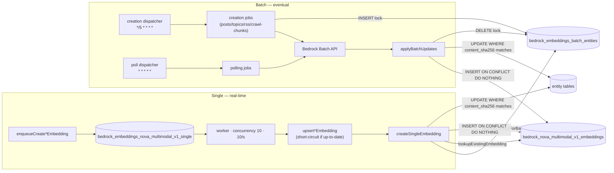
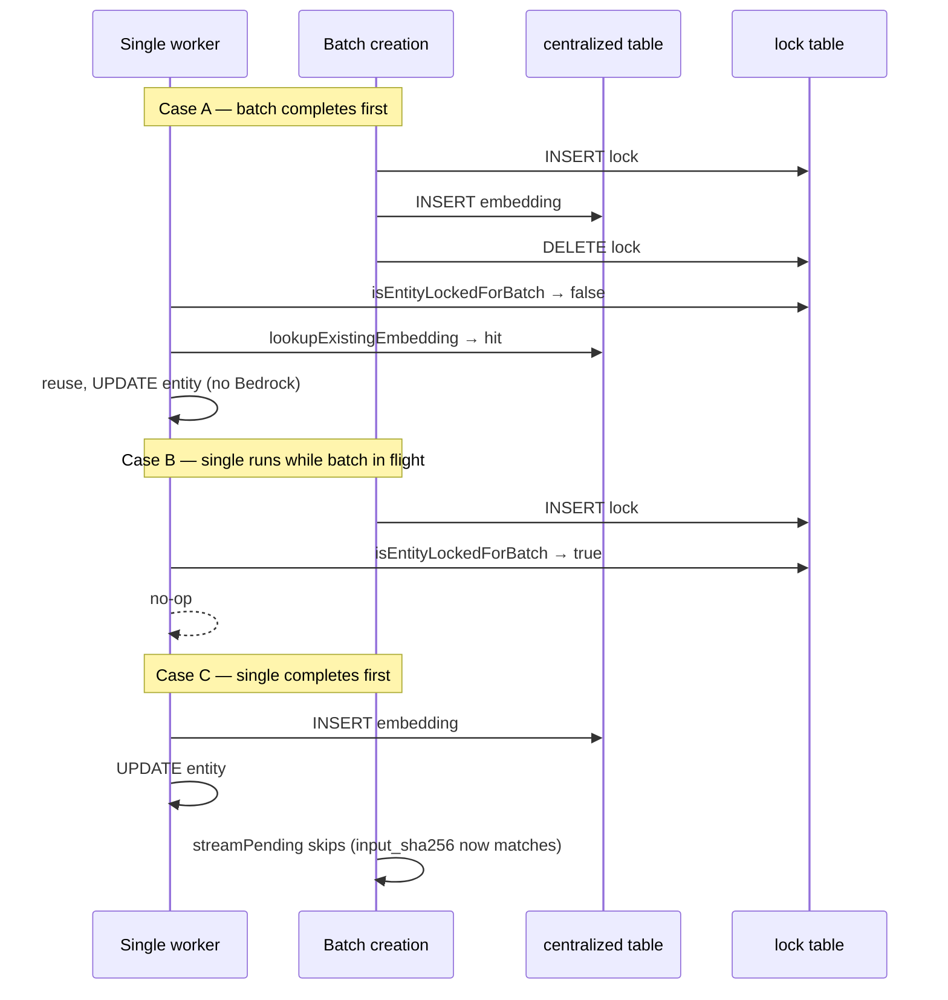

# Bedrock Embeddings Service

Manages generation, deduplication, and storage of `nova-2-multimodal-embeddings-v1` embeddings for posts, topics, RSS feed items, crawl chunks, support messages, and moderated images. Two complementary pipelines cover the full entity lifecycle:

- **Single pipeline** — real-time, user-visible ASAP, concurrency-10 queue
- **Batch pipeline** — eventual consistency via the Bedrock Batch API (minutes–hours), covers all entity types including crawl chunks and moderated images

Both paths write into a shared centralized table (`bedrock_nova_multimodal_v1_embeddings`) keyed on `content_sha256`, and guard entity-row updates with a `content_sha256` check so stale writes silently no-op.

## Dual Pipeline Architecture

## Dedup Contract

Single-embedding jobs are no-ops when:

1. The entity row already has `input_sha256 == content_sha256` with a non-null embedding and `created_at` — checked in `upsert*Embedding`.
2. The entity is locked in `bedrock_embeddings_batch_entities` — checked in `createSingleEmbedding` via `isEntityLockedForBatch`.
3. The centralized table already has the embedding for this content hash — `createSingleEmbedding` reuses it without calling Bedrock.

Entity UPDATEs in both the single and batch paths guard on `content_sha256` matching the stored value, so a stale write (content changed since job was created) silently no-ops rather than overwriting with outdated data.

## Race Outcomes

## Centralized Table

`bedrock_nova_multimodal_v1_embeddings` is keyed on `content_sha256` and holds the raw embedding vector. Both pipelines write with `INSERT ... ON CONFLICT DO NOTHING`, so the first writer wins and subsequent writes for the same content hash are harmless no-ops. This eliminates redundant Bedrock API calls when different entities share identical content. Image embeddings use the separate `bedrock_nova_multimodal_v1_image_embeddings` cache keyed on `image_sha_256`.

A Valkey Bloom filter (keyed by hex `content_sha256`) gates negative lookups: before hitting PostgreSQL, the service checks the filter. A miss means the embedding definitely does not exist; a hit may be a false positive, but the subsequent DB read is cheap. The filter self-heals on rebuild if it diverges due to a Valkey failure. Bloom filter errors are caught with `.catch(onError)` and treated as cache misses rather than hard failures.

## Input Limits

`nova-2-multimodal-embeddings-v1` requests are sent with `truncationMode: "END"`. RSS feed item embedding content is stripped down to semantic text before hashing so `content_sha256` matches the requested Bedrock input. Image batch rows use a resized image variant and skip images whose encoded payload would make the JSONL record too large.

## Credentials and Infrastructure

ECS uses IAM roles managed by `vouchington/vouchington-infra`, not Bedrock access keys. The backend and worker task roles can invoke `Amazon Nova 2 Multimodal Embeddings V1`; the worker can create and poll batch jobs and pass the dedicated Bedrock batch role. The batch role lets Bedrock read `bedrock-embeddings-input/*` and write `bedrock-embeddings-output/*` in a dedicated `voucha-bedrock-batch-{env}` bucket. See [environment variables](../../../docs/overview/infrastructure/environment-variables.md).

Local development can set `BEDROCK_AWS_ACCESS_KEY_ID`, `BEDROCK_AWS_SECRET_ACCESS_KEY`, and optionally `BEDROCK_AWS_SESSION_TOKEN`. When explicit Bedrock credentials are absent, the AWS SDK uses the default credential provider chain.

## Bloom Filter

The Bloom filter in Valkey tracks which `content_sha256` values are already in the centralized table. It is populated on startup and rebuilt periodically by the `processRebuildEmbeddingBloomFilter` job in the `bloom-filters` queue. Reads are gated by a deterministic ready marker; missing or partial filters fall back to a direct DB lookup, so correctness is maintained with slightly higher DB load until population or rebuild completes.

## Bedrock Batch API Limits

Bedrock batches are scheduled against configurable service quotas managed via the
`bedrock-embeddings-batch-config` Dynamic Config namespace (editable at `/admin/dynamic-config`):

- `max_inflight_jobs` limits active jobs in `Submitted`, `Validating`, `Scheduled`, or `InProgress`.
- `max_requests_per_hour` limits total batch records created in the last hour.
- `max_requests_per_file` caps JSONL records per input file.
- `max_file_size_gb` caps each input JSONL file.
- `max_job_size_gb` caps total active input size across jobs.
- `min_records_per_job` (default 100, AWS-required minimum) gates each batch — undersized creation jobs **defer** (return without submitting), and the next dispatcher cycle (every 5 minutes) re-streams pending entities until the minimum is met. Posts, topics, and RSS feed items get real-time embeddings via the single pipeline on creation, so the batch path is only used for updates and there is no urgency to drain undersized tails.

## Testing

Test files live alongside source files (`*.test.mts`). The external `createBedrockEmbedding` function carries `/* no-mistakes: integration=bedrock */` and is mocked in `.mock.test.mts` files; integration tests that hit the real Bedrock API run via `pnpm run test:backend:bedrock`. Local runs use the standard AWS credential chain and skip when credentials/model access are unavailable; set `REQUIRE_BEDROCK_INTEGRATION=true` to fail instead of skip.

If you trigger batch embeddings during testing, enqueue the request and cancel it immediately rather than waiting for completion.

## Related

- Batch pipeline implementation: [../bedrock-embeddings-batch/README.md](../bedrock-embeddings-batch/README.md)
- Systems:
  - [../../queues/bedrock-embeddings/README.md](../../queues/bedrock-embeddings/README.md) — Real-time single embedding queue
  - [../../queues/bedrock-embeddings-batch/README.md](../../queues/bedrock-embeddings-batch/README.md) — Batch embedding queue
- Docs overview: [../../../docs/overview/architecture/bedrock-embeddings.md](../../../docs/overview/architecture/bedrock-embeddings.md)
- Parent: [../CLAUDE.md](../CLAUDE.md)
