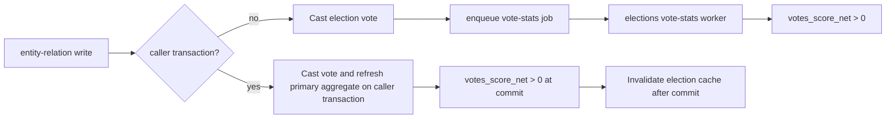

# Entity Relations

Entity relations are used to programmatically generate many-to-many or one-to-many relationships between entities.
These are NOT used for one-to-one relationships as these entities do not have any validations.
For one-to-one relationships, you probably want to use foreign keys on the entities themselves.
For example, a credit card's bank does not used this system - it's easier to just set something like `card.bank_id = company.id` (these tables do not exist).

Additionally, these are NOT meant for nullable fields.
For example, a URL `redirect` relation is 1-1 nullable,
which would not make sense for a relation.

The main purpose of this service is to easily create new relationship types,
create tables (one per relationship) and generate partition the tables (e.g. partition-wise queries with `Post`s programmatically),
and generate SQL queries.
With these relationship types, we can traverse the graph of entities and generate SQL queries to fetch data,
especially for AI tool calls.

For example, we may provide a few topics to the LLM initially, e.g. `Chase Sapphire Preferred`.
Via tool call, the LLM might say, `Please return the terms of service pages for this topic`,
after which it would return the following query:

- Subject: Chase Sapphire Preferred (Topic)
- Predicate: terms_of_service
- Object Type: Crawl Embeddings

To create or edit a relation, you only need to update the `entityRelationPredicates` and `entityRelations` configurations in `config.mts`.
The SQL tables will be created and updated automatically using the idempotent migration.

However, the migrations will not perform any destructive actions.
For example, if you previously set a relationship type as having elections then removed it,
the relation will continue to have elections.
It will just not be used by the app anymore.

## File Structure

- `config.mts` — source of truth: entity types (`EntityRelationEntityType`), predicates, and relation definitions
- `metadata.mts` — derives `entityRelationMetadatum` (all relation metadata) and `entityRelationEntityTables` (entity type → DB table mapping) from config
- `parse.mts` — route-input normalization for entity relation APIs (type validation, RSS item parsing, sort/limit normalization)
- `post-related-url-display-config.mts` — bounded DynamicConfig owner for the positive best-ranked post Related Links summary (default and maximum 10)
- `referral-link-eligibility-lock.mts` — shared transaction fence between related-URL eligibility reads and referral-program mutations
- `vote-score-filters.mts` — `buildVoteScoreFilters` helper used by `query.mts`; builds SQL fragments for `minNetVoteScore` and `positiveNetVoteScore` options in `EntityRelationQueryOptions`
- `upsert-helpers.mts` — shared types and helpers used by both upsert files
- `upsert.mts` — upsert a relation for one subject + many objects
- `upsert-for-subjects.mts` — upsert a relation for many subjects + one object
- `delete.mts` — soft delete entity relations
- `query.mts` — query relations with JOINed object data
- `build-select-query.mts` — builds the viewer-scoped relation read (post access filters, creator masking, cursors)
- `post-access.mts` — the subject and object post filters for reads, and `getRelatablePostIds` for a write's access check
- `object-projection.mts` — the explicit `object_data` column list for each readable object type
- `viewer.mts` — `EntityRelationViewer` (`system`, `anonymous`, or `user` with a staff role) and the access rules derived from it
- `mentioned.mts` — query existing "mentioned" relations for a post
- `user-tags.mts` — identifies the exact `user → category → topic` moderation-tag relation
- `assert-user-tag-relation.mts` — enforces the curated user-tag catalog at the service boundary

## Key Conventions

- **Never hardcode entity type → table mappings.** Use `entityRelationEntityTables[type].foreign_key_table` from `metadata.mts` instead.
- **Never hardcode entity type lists.** Derive from `Object.keys(entityRelationEntityTables)` or use `EntityRelationEntityType` from `config.mts`.
- **Adding a new entity type** only requires updating `EntityRelationEntityType` in `config.mts` and `entityRelationEntityTables` in `metadata.mts` — all other lookups derive from these automatically.
- Table names follow the deterministic pattern `relation__<subject>__<predicate>__<object>` — use `getEntityRelationTableNameOrThrow()` from `metadata.mts` for lookups rather than constructing the name manually.

## Semantics

Relations are defined in a sentence structure:

```
[Subject] [Predicate] [Object]
```

In other words, the "Predicate" is the word.
However, we don't always use verbs as the predicate - it just needs to make sense since this is just how we store it.
For example, `follow` (base verb) makes more sense than `following` (gerund),
but `related` (adjective) makes more sense than `relates_to` (prepositional).
Thus, choosing the predicate is subjective,
but try to avoid prepositions, unnecessary words, or extra characters (e.g. no `of`, `to`, `the`, etc.).

The `Subject` is the primary entity of this relationship.
For example, for `users -> follow -> users`, the main subject is the person doing the following.
From a system perspective, the subject is more important because we usually query by the subject, not the object.
In this case, we want to focus on the User (Subject) as we use their follows (e.g. bookmarks) to power their feed.
User (Object) is not used much - only to see who follows this user, which is not used as often.
Semantically and technically, it's more important to optimize on the subject.

## Directed Weighted

Relationships are a [directed weighted graph](https://en.wikipedia.org/wiki/Directed_graph).
In other words, if `post A -> related -> post B`'s relationship will have a different "length" in its edge than `post B -> related -> post A`.
Semantically, this is important to distinguish because `post A -> related -> post B`'s relationship must be understood in context with all other `post A -> related -> post X` relationships.

Not all relation types are reversible, some are unidirectional.
For example, only `topic -> terms_of_service -> url` makes sense,
it does not make sense to have a relationship `url -> terms_of_service -> topic`.

## Examples

- `Users -> Follow -> Users` - how our following system works
- `Users -> Hide -> Posts` - how posts are hidden by users
- `Topics -> FAQ -> Posts` - in a topic, people can tag FAQs and they will be ranked by their election
- `Posts -> Related -> Posts` - users can tag related posts for better cross referencing

The following are NOT powered by entity relations:

- Post images and videos - these should be ordered by the user and may have extra details like captions, so it doesn't make sense to use this generic service
- 1-1 relationships like a card's bank and rewards program - this system is too convoluted for such a simple relation

## SQL

Each relation above will be its own table.
As these relations become many-to-many and we are mixing different entity types,
it's important to avoid large databases.

## Upserting

When creating an entity relation, you select one subject, a relation, and one or more objects. If the relation supports elections, by default all the relations are upvoted.

The `user → category → topic` relation is reserved for curated moderation tags. Its service-boundary
guard rejects arbitrary topic IDs even when callers bypass the HTTP API.

### URL object validations

For any relation with `object_type === 'url'`, `upsertEntityRelation` runs pre-write validations and rejects the upsert with HTTP 422 (and applies the stacking blocked-hostname penalty to the creator) if one fires:

- `assertUrlsHaveNoBlockedHostnames` — runs for **all** `object_type === 'url'` relations; rejects URLs whose hostnames are flagged in `url_hostnames.blocked`.
- `assertUrlsAreNotReferralLinks` — runs only when `predicate === 'related'`; rejects URLs matching any enabled referral-program rule. Bookmarks (`user → save → url`) and topic URL metadata predicates (`faq`, `guide`, `landing_page`, `terms_of_service`) are intentionally excluded. Rules are streamed from PostgreSQL (no full in-memory load) via the same cursor-based detector used for content scans.

When a relation write receives `options.query`, the referral guard reads URL rows through that same transaction. This makes an uncommitted referral URL fail validation before the relation and its default vote can be written.

Story URL projection holds a shared referral-eligibility fence through its in-transaction recheck and relation insert. Mutations to referral rules, program enablement, and validation membership hold the exclusive fence so eligibility and mutation have one database-enforced order.

## Searching

When searching entity relations, you either choose an entity relation and either a subject type/id or an object type/id, but not both.

Authorization:

- If the relation is election based, filter by `election.votes_score_net > 0`

Sort options:

- `newest` - `created_at DESC`
- `best` - if elections are enabled, sort by `votes_score_sort DESC`
- `order_index` - if order index is enable, sort by `order_index ASC`

### Viewer and projection

Every read takes a required `viewer`. Request handlers build it with `entityRelationViewerFor`
from `@services/users`, since that package depends on this one. Trusted internal jobs pass
`SYSTEM_ENTITY_RELATION_VIEWER`.

- **Post access:** `post-access.mts` owns the post filters, and `system` readers skip them. Rows
  the viewer cannot read are filtered in SQL, so `limit + 1` page detection stays exact.
  - A subject post follows direct access (`buildDirectPostEligibilityFilter`). Its author also
    passes, so they can relate content to their own post while a community reviews it.
  - Listed object posts follow discovery rules, like other listings
    (`buildViewerPostDiscoveryEligibilityFilter`, or `buildPublicPostEligibilityFilter` when signed
    out).
  - Object posts named by `objectIds` follow direct access, like opening a link.
  - `getRelatablePostIds` checks a write's posts against the same subject and named-object filters
    on the primary, so a relation that passes the check is visible when read back.
- **Relation creator:** `created_by_id` is `null` when the creator is the anonymous author of the
  subject or object post. The viewer's own relations, administrators, and `system` readers still
  see the creator, matching `maskAnonymousPost`.
- **`object_data`:** each object type exposes a fixed column list from `object-projection.mts`.
  New columns stay private until someone adds them to that list. Object types without a
  projection throw, and a route test reads every routable tuple so this can't turn into a 500.
- **`objectIds`:** an optional filter that reads back specific objects, such as the row a write just
  created.

Election-capable relation tables include partial active-row indexes scoped by `subject_id` for both `best` (`votes_score_sort DESC, created_at DESC`) and `newest` (`created_at DESC`) listings.
Their vote events live in generated per-relation tables with composite foreign keys that include
`subject_id`; their `entity_relation_votes` partitioned parent provides the shared read contract.

Route handlers should call the parsing helpers in this service instead of duplicating entity-type,
predicate, RSS item ID, or pagination validation in API files.

`summary=true` is reserved for `post → related → url`. It owns the positive-score filter, `best`
ordering, and runtime summary limit. Ordinary reads retain their caller-selected cursor pagination
so tag-management surfaces can traverse every relation.

## Side Effects

Multi-row relation upserts acquire `(subject_id, object_id)` conflicts in canonical order before
returning rows in the caller's original order. This keeps concurrent inverse batches deadlock-free
without changing duplicate-input or publication-capture semantics; see the repository's
[PostgreSQL ordering guard](../../../static-code-analysis/README.md#postgresql-conflict-ordering).

`upsertEntityRelation` triggers the following side effects after a successful write:

- **Election vote stats** — standalone election-backed writes (including `post → category → topic`) cast the upvote in-process, then fire-and-forget `enqueueBulkUpdateEntityRelationElectionVoteStats`. When a caller supplies a transaction query, the vote and primary aggregate refresh use that same transaction, and the transaction wrapper invalidates changed election snapshots only after commit; no worker can race uncommitted rows. A process failure between commit and invalidation leaves only the normal five-minute cache TTL as recovery. Public topic metrics, viewer-aware topic counts, feed eligibility, and other `votes_score_net > 0` filters can read committed transactional writes immediately; standalone writes still wait for the worker. Tests that only need eligible fixture state use `relatePostToTopic` from `@voucha/test-helpers`; tests of this service's asynchronous election side effects must wait for the worker explicitly.
- **Notification reconcile** — `enqueueNotificationReconcileForRelations` is called on every upsert; the worker enqueues follow-up jobs only for applicable relation types.
- **Follow notification** — fires for `user → follow → user` relations.
- **URL crawl** — fires for any relation with `object_type === 'url'` via `enqueueBulkCrawlUrls` (fire-and-forget, debounced by `urlId`). Ensures the linked URL is enqueued for a fresh crawl so embed meta is up to date when a user adds a related link. See [docs/overview/architecture/crawling.md](../../../docs/overview/architecture/crawling.md#triggered-crawls).



## Related

- [backend/api/v1/entity-relations/README.md](../../api/v1/entity-relations/README.md)
- [backend/services/bookmarks/README.md](../bookmarks/README.md)
- [docs/overview/architecture/entity-relations.md](../../../docs/overview/architecture/entity-relations.md)
