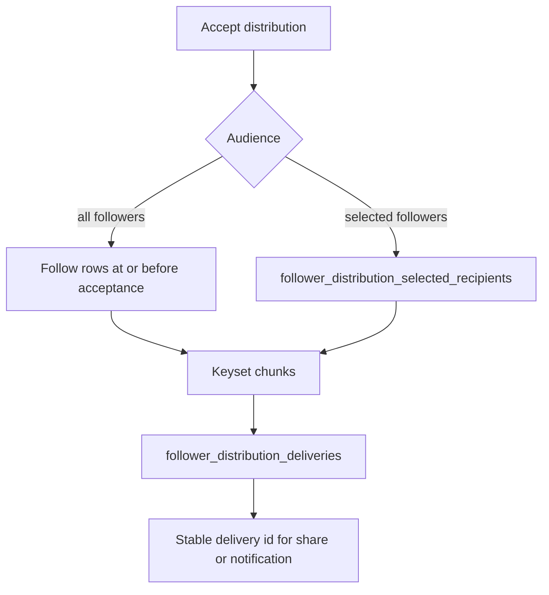

# Follower Distributions Service

Persists and processes manual follower share/send distribution intents for posts and RSS feed items.

## Responsibilities

- Validate post/RSS targets and selected-follower recipients before accepting an intent.
- Enforce once-per-day share/send dedupe per sender and target.
- Store small distribution records. Selected followers are distribution-owned recipient rows, not a UUID array.
- Process recipient chunks idempotently through `follower_distribution_deliveries`.
- Create feed-share rows or manual-send notification rows using stable per-recipient delivery ids.
- Stream incomplete distribution ids for queue backfill.

Selected recipients are validated as followers only at acceptance. Delivery does not require them to
still follow. `follower_distribution_deliveries` remains the idempotent delivery identity.

Delivery, share, and manual-send inserts acquire recipient conflicts in canonical key order, so
overlapping processor batches remain idempotent without serializing the queue. See the
[PostgreSQL ordering guard](../../../static-code-analysis/README.md#postgresql-conflict-ordering).

## Related

- Queue: [../../queues/follower-distributions](../../queues/follower-distributions)
- Worker: [../../workers/follower-distributions](../../workers/follower-distributions)
- API docs: [../../api/v1/posts/README.md](../../api/v1/posts/README.md), [../../api/v1/rss-feed-items/README.md](../../api/v1/rss-feed-items/README.md)
