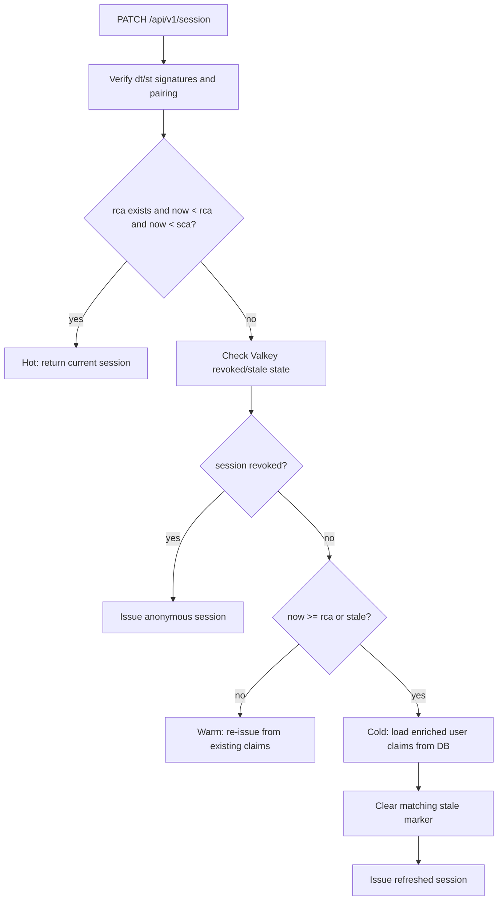
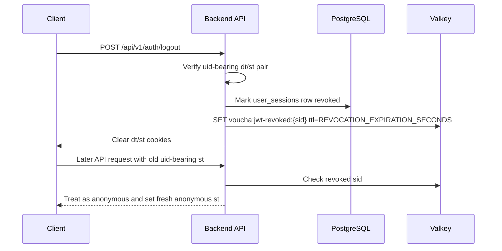

# Architecture

[Back to JWT Session Service](README.md#architecture)

### Stateless Design

Session state is embedded directly in the JWT payload. The backend verifies the signature and
`dt`/`st` pairing on every request; for uid-bearing sessions, it also checks the Valkey revocation
flag before resolving the current user. `PATCH /api/v1/session` still owns refresh/staleness
decisions on the warm/cold paths.

### JWT Payloads

**Device token (`dt`):** `{ did: string, aud: 'voucha:device', dc?: 'attested' }` — identifies the
device. `did` is always a UUIDv7. `dc` (DeviceClass) is set to `'attested'` once the device
completes Apple App Attest key registration (see
[App Attest](../../../docs/overview/architecture/app-attestation.md)) and never appears on the
session token payload — only the session token's expiry depends on it (see
[Session Expiry](#session-expiry-the-dc-claim) below).

**Session token (`st`):**

```
{
  did: string       // device ID (must match dt)
  sid: string       // session ID (UUIDv7)
  uid: string|null  // user ID (null for anonymous)
  // Authenticated-only enrichment fields:
  rol?: string[]    // user roles
  mpl?: string|null // membership plan slug
  tt?: number       // pre-computed trust tier (0–5)
  uil?: string|null // UI locale used by the web session
  rca?: number      // recheck-after: Unix epoch seconds — cold reload deadline
  sca?: number      // session-check-after: Unix epoch seconds — check Valkey after this time
}
```

### Session Expiry (the `dc` claim)

Session token expiry is not fixed — `sessionExpiryFor(dc)` / `sessionExpirySecondsFor(dc)`
(`@ts-shared/session-jwt`) return `'30 days'` / `30 * 24 * 60 * 60` when the device token's `dc` is
`'attested'`, and `'2 days'` / `2 * 24 * 60 * 60` otherwise. The device token's own expiry
(`DEVICE_EXPIRATION_STRING`, 30 days) never changes based on `dc` — only the session token/cookie
duration does.

`createDeviceAndSessionTokens` and `createSessionToken` (see [API](reference-api.md#api) below) both accept a
`deviceClass` option. It embeds `dc` on the device token (device-mint path only) and, in both
functions, selects the session's expiry via `sessionExpiryFor(deviceClass)`. Refresh paths in
`flows.mts` re-read `dc` from the verified device token on every warm/cold refresh and anon
fallback, so an attested device keeps its 30-day session expiry across refreshes without
re-attesting. See [App Attest](../../../docs/overview/architecture/app-attestation.md) for how a
device earns `dc: 'attested'`.

### Legacy UUID Compatibility Matrix

Legacy UUIDv4 inputs are accepted only on compatibility paths. All newly issued IDs are UUIDv7.
The focused regression suite is `legacy-compatibility.test.mts`.

| Flow                           | Legacy input accepted                      | Expected action                                                                                          |
| ------------------------------ | ------------------------------------------ | -------------------------------------------------------------------------------------------------------- |
| Shared JWT verifier            | Signed UUIDv4 `did` / `sid` / `uid` claims | Verify-only acceptance; no rotation happens in `@ts-shared/session-jwt`.                                 |
| `createDeviceAndSessionTokens` | `did`, `sid`                               | Rotate legacy device/session IDs to UUIDv7 before signing; revoke old authenticated `sid`.               |
| `createSessionToken`           | `sid`                                      | Rotate legacy session IDs to UUIDv7 before signing; `did` must already be UUIDv7.                        |
| `PATCH /api/v1/session`        | `dt`, `st`                                 | Refresh and anonymous fallback re-issue UUIDv7 `did`/`sid` values.                                       |
| `DELETE /api/v1/session`       | legacy `dt`, optional `st`                 | Revoke matching uid-bearing `sid`, then issue a fresh anonymous UUIDv7 session.                          |
| Request context re-mint        | legacy uid-bearing `dt`, `st`              | Already-verified requests stay read-only; revoked or missing-user re-mint emits UUIDv7 cookies.          |
| Active sessions registry       | legacy authenticated `sid` / `did`         | Do not insert UUIDv4 rows into `user_sessions`; repair/list only UUIDv7 rows.                            |
| Passkey/email login            | legacy anonymous `dt`, `st`                | Bind challenges and response payloads to the rotated UUIDv7 `did`/`sid`.                                 |
| App Attest `dc`                | legacy attested device `did`               | Drop stale `dc` when the device ID changes; preserve `dc` only when the verified device remains current. |

### Hot / Warm / Cold Paths (PATCH /api/v1/session)



| Path     | Trigger                                    | Valkey calls                    | Action                                                            |
| -------- | ------------------------------------------ | ------------------------------- | ----------------------------------------------------------------- |
| **Hot**  | `rca` exists, `now < rca`, and `now < sca` | 0                               | Return session as-is                                              |
| **Warm** | `now < rca` and `now >= sca`               | 1                               | Check revocation/staleness; renew `sca` while preserving `rca`    |
| **Cold** | missing/elapsed `rca` OR stale flag        | 1 script + optional stale clear | Reload user from DB, then set a fresh `rca` with fresh enrichment |

Per-request auth (every API call): signature verification, `dt`/`st` pairing, and immediate
revocation check for uid-bearing sessions.
The shared verifier rejects signed tokens with missing or malformed required claims before this
service compares the device/session pair.

### Revocation



`revokeSession(sid)` marks the matching `user_sessions` row revoked and sets
`voucha:jwt-revoked:{sid}` in Valkey with a TTL of `REVOCATION_EXPIRATION_SECONDS`
([`session-revocation-keys.mts`](session-revocation-keys.mts)), the longest supported session
lifetime. The same TTL applies to every revoked session regardless of device class, so the marker
outlives even an attested device's longer-lived session. Checked by request context for uid-bearing
sessions and by warm/cold refresh paths. Public logout and session reset skip revocation for
anonymous sessions because those markers are never checked by request context. When request context
sees a revoked uid-bearing session, it treats the request as anonymous and sets a fresh anonymous
session cookie so later requests stop rechecking the revoked session ID.

### Active Session Registry

The service also owns the persistent `user_sessions` registry keyed by JWT `sid`. It is
partitioned `RANGE(id)` with a default partition only, and `created_at` is a virtual column
derived from `uuid_extract_timestamp(id)`. `upsertAuthenticatedSession(...)` inserts or refreshes
an active row, keeping `last_seen_at`, `expires_at`, and request metadata in sync with the current
JWT chain. Service-owned writes run the user-agent dictionary insert and session upsert as
sequential statements in one transaction, so a writer that waits for a concurrent dictionary
insert reads the committed row before persisting its session; callers supplying a transaction keep
the same two statements inside that transaction. `revokeAuthenticatedSession` and
`revokeAllAuthenticatedSessions` mark rows revoked in PostgreSQL and write the matching Valkey
revocation keys, while `revokeSession(sid)` handles the generic sid-based revocation path used by
logout and session reset.

### Staleness

`markJwtStale(userId)` writes a unique marker to `voucha:jwt-stale:{userId}` in Valkey. Called
after role or membership changes. Forces a cold-path DB reload on the next PATCH /api/v1/session
call. Refresh clears that marker with `clearJwtStaleIfCurrent(userId, marker)` only after
re-issuing with fresh enrichment, so Valkyries' atomic `unlinkIfValueMatches()` cannot remove a
newer stale marker from an older refresh.

`markJwtStaleBatch(userIds)` writes the same per-user stale markers for multiple users while
deduplicating IDs first. It keeps the single-user path as one direct `SET` and uses a Valkey
`Batch` only for two or more unique users.
