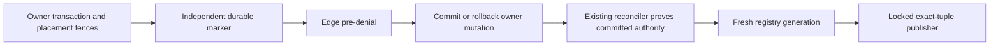

# Media Delivery Safety

This service provides fail-closed publication helpers for media routes whose ownership rows are
about to change or disappear. Callers publish the current immutable placement tuple as withheld
before mutating its owning user, topic, community, or profile-link row.

It owns the shared media-delivery registry, placement lock, staging, publication, replay, and
recovery implementation. Image and post services both depend on this lower-level boundary, so a
deployed workspace package never reaches across into a sibling service or creates an
images-to-posts package cycle.

The helper stages a generation-checked delivery-registry record in the caller's PostgreSQL
transaction, publishes the denial to the edge registry, invalidates the exact CloudFront route,
and marks only that generation complete. Provider failures reject the caller transaction. A later
database failure can leave an extra denial at the edge, but can never expose content that the
database intended to withhold.

Registry generations are database-assigned decimal values, not caller counters. The PostgreSQL
trigger advances them for a new authority state or explicit republish and uses a nontransactional
sequence above the legacy integer range. This prevents a deny published before a rolled-back
transaction from being overwritten by a reused generation; retries of the same persisted state keep
the same generation, while the edge rejects a conflicting state at that generation.

The publisher reads the committed exact tuple, retains its placement fence, locks relevant legal
cases before the registry row, and proves current byte safety, typed owner binding, revision,
restriction, and court/CCB eligibility before any allow. The generic worker, marker repair, and
periodic staging use the same proof. Periodic staging selects a bounded batch of changed or missing
records and stages each in its own authority transaction, avoiding registry lock cycles with owner
triggers. Registry and edge activation must both be enabled before a legal action mutates authority.

New binding admissions and unsafe image mutations first acquire the same immutable batch of
canonical UUID asset-admission roots, before image rows, owners, or placement discovery. PostgreSQL
transaction-local state permits subset reentry but rejects additional roots after that initial
batch; it follows borrowed clients and resets with transaction/savepoint rollback. Exact delivery
publication remains placement-only and does not expand into asset admission.

Surface mutations then retain stable owner identities and the complete historical placement
footprint in canonical order. They then re-read current tuples, pre-deny those revisions, and mutate
the owner. Image moderation retains the same placement domain from pre-denial through unsafe
flag/quarantine admission. An autocommit query cannot satisfy the retained-transaction contract.
Same-value surface updates compare UUID identity under the retained owner fence and do not deny an
unchanged route. Disabled registry publication retains repair markers without provider calls.

An independently committed, FK-free repair marker precedes each owner pre-commit denial. It also
precedes a publisher's local correction from stale allow to withheld, because that correction can
roll back after the edge accepts its fresh token. Ordinary committed withheld publication does
not create a marker. The existing reconciler consumes only the observed marker token, stages a
fresh generation derived from committed authority, and leaves publication/retries to the existing
outbox. Missing never-committed tuples receive only a fresh deny without a poisoned FK insert.

