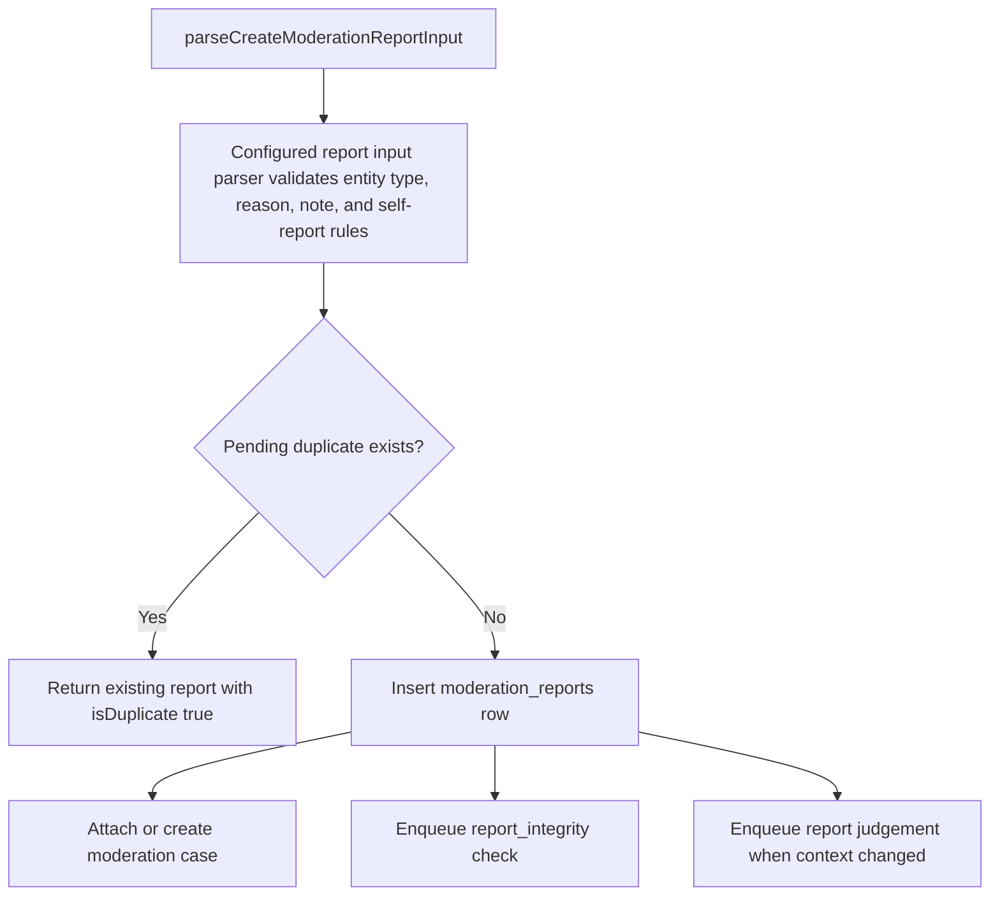

# moderation-reports

Service for creating and querying user-submitted moderation reports against entities (RSS feed
items, posts, comments, users, and URL hostnames). Canonical entity types are `rss_feed_item`,
`post`, `comment`, `user`, and `url_hostname`.

## Data Model

| Column              | Type                                  | Notes                                                                                          |
| ------------------- | ------------------------------------- | ---------------------------------------------------------------------------------------------- |
| `id`                | uuid                                  | PK, UUIDv7                                                                                     |
| `created_at`        | timestamptz                           | Generated from `id`                                                                            |
| `reviewed_at`       | timestamptz                           | Null until reviewed by an admin                                                                |
| `reporter_user_id`  | uuid                                  | FK -> `users(id)`                                                                              |
| Target FK           | uuid                                  | Exactly one of `post_id`, `reported_user_id`, `hostname_id`, or `rss_feed_item_id`             |
| `case_id`           | uuid                                  | FK -> `moderation_cases(id)`                                                                   |
| `reason`            | moderation_report_reason              | One of `spam`, `harassment`, `misinformation`, `illegal_content`, `vote_manipulation`, `other` |
| `note`              | text                                  | Optional, max 1000 chars                                                                       |
| `resolution_action` | `moderation_report_resolution_action` | Null while pending; then `reviewed`, `actioned`, or `dismissed`                                |
| `resolved_by_id`    | uuid                                  | FK -> `users(id)`, set when admin resolves                                                     |
| `escalated_at`      | timestamptz                           | Null until a report is escalated for senior-mod review                                         |
| `escalated_by_id`   | uuid                                  | FK -> `users(id)`, set when a moderator escalates                                              |

A `num_nonnulls(...) = 1` check enforces one target FK per row. Per-target partial unique indexes
with `reviewed_at IS NULL` prevent duplicate pending reports from the same user for the same target.
Another check keeps `reviewed_at` and `resolution_action` paired so pending rows have no final action
and reviewed rows always have one.
`vote_manipulation` is valid only for `post` reports.
This data-model summary is covered by `pnpm run repo-file-policy`, which runs
`static-code-analysis/repo-file-policy/schema-doc-drift-guard.mts` to block legacy reporting schema
examples from returning.



## Usage

`parseCreateModerationReportInput` adapts Vouchington's `entityType`/`entityId` request shape to the
generic `@vouchington/utils/moderation` parser. The local adapter keeps the canonical catalogs, UUID
validation, `vote_manipulation` post-only rule, 1000-character raw-note limit, and existing HTTP
validation messages stable for callers.

```ts
import {
  parseCreateModerationReportInput,
  createModerationReport,
} from '@services/moderation-reports'

const input = parseCreateModerationReportInput({ entityType, entityId, reason, note })
const { report, isDuplicate } = await createModerationReport(currentUserId, input)
```

`listModerationReports` rejects `severity` and `most_reported` continuation cursors with `422
Invalid cursor` when the cursor row's report count or judgement rank no longer matches. Clients
must restart from page one. See the route contract in
[`backend/api/v1/reports/README.md`](../../api/v1/reports/README.md).

## Related

- API: [`backend/api/v1/reports/`](../../api/v1/reports/README.md)
- Report review is table-backed; asynchronous integrity checks use
  [`backend/queues/report-integrity/`](../../queues/report-integrity/README.md).
