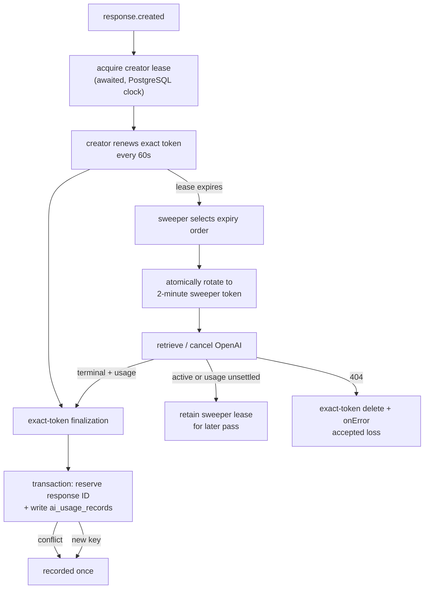

# @services/openai-background-responses

Durable registry and crash-recovery sweeper for OpenAI `background: true` responses (#8836).
`@modules/openai-utils/create-response.mts`'s `createOpenAIResponse()` always creates in the
background internally — see that module's README — so every OpenAI call that goes through it can
be cancelled and its usage recovered even if the process that started it crashes, OOM-kills, or is
replaced mid-call by an ECS rolling deploy. `streamOpenAIResponse()` (chat's streamed assistant
response) is the one call that stays foreground and is out of scope for this registry — see
[OpenAI Cost Model § What the ledger covers — and what it doesn't](../../../docs/overview/architecture/openai-cost-model.md#what-the-ledger-covers--and-what-it-doesnt)
for that accepted gap. This package owns the durable side of the background-mode guarantee; it never calls
`openai.responses.create()` itself (that stays in `backend/agents/*`, per
[`backend/agents/CLAUDE.md`](../../agents/CLAUDE.md)) — only `retrieveOpenAIResponse` /
`cancelOpenAIResponse`.

## Data Model

`openai_background_responses` records one response ID, its attribution, a fencing
`lease_token`, and a PostgreSQL-clock `lease_expires_at`. `created_at` remains audit metadata; it
does not decide liveness. The creator holds a three-minute lease and renews it every 60 seconds.
If renewal is temporarily unavailable it retries after five seconds; `stopAndSettle()` waits for an
in-flight renewal before the drain can finalize. This prevents a healthy, long-running non-chat
response from being mistaken for an orphan simply because it is old.

`ai_usage_openai_response_keys` is a separate, non-partitioned map from an OpenAI response ID to
its one `ai_usage_records` row. PostgreSQL cannot enforce global uniqueness for `response_id` on
the UUIDv7-range-partitioned ledger: a unique constraint on a partitioned table must contain that
table's partition key. The map is therefore the durable, cross-partition accounting fence.

## Functions

- `acquireBackgroundResponseLease({ responseId, agentSlug, communityId?, postId? })`
  (`register.mts`) — performs a bounded PostgreSQL transaction before the drain advances beyond
  `response.created`, using one same-token recovery attempt. It returns an owner lease controller
  or `undefined` when ownership cannot be proven.
- `OwnedBackgroundResponseLease.stopAndSettle()` (`lease-controller.mts`) — stops serialized
  renewal and awaits an in-flight attempt. Renewal uses the exact owner token, preventing a stale
  drain from extending a transferred lease.
- `getExpiredBackgroundResponses({ batchSize? })` (`expired.mts`) — selects at most 100 rows whose
  `lease_expires_at <= CURRENT_TIMESTAMP`, ordered by expiry then response ID.
- `claimExpiredBackgroundResponse(candidate)` (`claim.mts`) — atomically rotates an expired
  candidate to a fresh sweeper token with a two-minute lease _before_ any OpenAI call. A stale
  candidate loses harmlessly.
- `claimAndRecordBackgroundResponseUsage({ responseId, leaseToken, ... })`
  (`claim-and-record.mts`) — deletes only the caller's exact token and transactionally records
  usage. `recordAiUsage` reserves the response ID and inserts the ledger row together, so a
  conflict is `already-recorded`, not a duplicate.
- `reconcileExpiredBackgroundResponse(candidate)` (`reconcile.mts`) — the sweeper's per-row
  recovery: acquire the sweeper lease, then retrieve/cancel. A 404 reports accepted loss; an active
  or terminal-without-usage response remains under the short sweeper lease for a later pass; a
  terminal response finalizes with its exact token. If transactional ledger finalization fails,
  the transaction retains the lease and the reconciler must durably latch accounting uncertainty
  for the response's request day before returning. Called
  by `processReconcileBackgroundResponses`
  (`backend/workers/ai-agents/processors/process-reconcile-background-responses.mts`) on the
  `ai_agents` queue's `reconcile-background-responses` job, scheduled every 5 minutes
  (`backend/queues/ai-agents/enqueues/schedules.mts`) and admin-triggerable via the
  `SCHEDULED_JOBS_REGISTRY` (`backend/api/v1/mq/scheduled-jobs-registry.mts`), derived from the
  queue's scheduled-job manifest. Each row is reconciled with bounded concurrency
  (`RECONCILE_CONCURRENCY = 5`) so a large orphan backlog can't fan out into an OpenAI rate-limit
  burst — see `backend/CLAUDE.md`'s "avoid calling external APIs in a loop or unbounded
  `Promise.all()`" rule.

## Row lifecycle

Ownership and provider effects are fenced separately. The token fence prevents an old creator from
renewing or finalizing after the sweeper has taken over; the response-ID map makes any ambiguous or
concurrent ledger write converge on one row:

## Failure-mode transition matrix

Per the [durable transition matrix](../../../docs/checklists/backend-queues.md#durable-transition-matrix)
requirement for effectful worker operations. "This path" below means the original caller
(`callRecordingAgentResponseUsage` → `recordAgentResponseUsage` →
`claimRegisteredResponseUsage`, in `backend/agents/_shared/record-response-usage.mts`); "the
sweeper" means `reconcileExpiredBackgroundResponse` above.

| Failure mode              | Detectable state                                                                                               | Recovery/reconciliation path                                                                                                                                                                                                                                                                                                                                                          | Idempotency guarantee                                                                                                                                                                                  | Evidence (test)                                                                                                                                            |
| ------------------------- | -------------------------------------------------------------------------------------------------------------- | ------------------------------------------------------------------------------------------------------------------------------------------------------------------------------------------------------------------------------------------------------------------------------------------------------------------------------------------------------------------------------------- | ------------------------------------------------------------------------------------------------------------------------------------------------------------------------------------------------------ | ---------------------------------------------------------------------------------------------------------------------------------------------------------- |
| Dispatch failure          | The awaited registration transaction fails twice, or another token already owns the row.                       | One bounded same-token retry is attempted. If ownership remains unproven, the drain continues without a creator lease and the failure is reported. A terminal response can still record directly by response ID; a live pre-terminal interruption now latches `unknown_billed_attempt` because no reconciler owns it. A process crash before either settlement remains unrecoverable. | `ai_usage_openai_response_keys.response_id` globally admits only one ledger row, even across ledger partitions once PostgreSQL accepts the write.                                                      | `backend/agents/_shared/__tests__/record-response-usage.test.mts` plus the OpenAI-utils lease-missing interruption regression.                             |
| Provider create failure   | `openai.responses.create()`/its stream fails before `response.created`, so no row can be registered.           | The specific flex `resource_unavailable` 429 is known unbilled and may consume the caller's application retry budget. Every other potentially billed create failure awaits the request-day `unknown_billed_attempt` latch and stops; it is not silently replayed.                                                                                                                     | n/a.                                                                                                                                                                                                   | `backend/modules/openai-utils` response-attempt tests cover SDK-zero retries, the free flex retry, and the ambiguous-failure latch hook.                   |
| Lost or expired ownership | A creator's renewal returns no row, or a sweeper candidate loses its compare-and-swap token transfer.          | The old owner stops; only a successfully transferred sweeper token may call the provider or finalize. A lost candidate is a no-op and is reconsidered only from current durable state. The stale creator's `lost-race` claim is settled only after the response-id fence exists; otherwise it throws so the request day can be latched before another provider attempt.               | Exact-token `UPDATE`/`DELETE` fencing; stale owners cannot mutate the new owner’s lease. The response-id fence or the per-day latch is required before the stale creator treats accounting as settled. | `lease-controller.test.mts`, `registry.test.mts`, `reconcile.mock.test.mts`, and `backend/agents/_shared/__tests__/record-response-usage-ledger.test.mts`. |
| Retry/reconciliation      | `lease_expires_at <= CURRENT_TIMESTAMP`.                                                                       | The five-minute reconciler selects at most 100 expired rows, ordered by expiry and response ID, then atomically transfers each to a two-minute sweeper lease before provider work. Per-row errors are reported and the durable row becomes eligible again only after that lease expires.                                                                                              | Exact-token fence plus response-ID map.                                                                                                                                                                | `registry.test.mts` and `reconcile.mock.test.mts`.                                                                                                         |
| TTL expiry                | `retrieveOpenAIResponse` throws an `APIError` with `status === 404` after a successful sweeper token transfer. | Delete only with that sweeper token, report via `onError`, and accept that usage is unrecoverable from OpenAI.                                                                                                                                                                                                                                                                        | A new owner cannot be deleted by an old sweeper.                                                                                                                                                       | `reconcile.mock.test.mts`.                                                                                                                                 |
| Normal terminal removal   | A completed, billed response finalizes with its current owner token.                                           | Delete the registration and reserve/write the response-ID map plus ledger row in one transaction. A replay reports `already-recorded`. If the transaction fails, it rolls back, retains the lease, and the reconciler latches that request day's accounting uncertainty before settling.                                                                                              | Exact-token finalization plus global response-ID uniqueness; the per-day latch blocks later guarded spend while the ledger is uncertain.                                                               | `backend/agents/_shared/__tests__/record-response-usage.test.mts`, `backend/services/ai-usage/__tests__/record.test.mts`, and `reconcile.mock.test.mts`.   |

## Pre-launch baseline and rollback

Migrations 0490 and 0590 are edited in place because neither baseline has been deployed. The first
production deployment therefore has no live old-schema compatibility window. After this lease
protocol is deployed, rolling back to the pre-lease age-based reconciler is unsafe while registry
rows remain: an old worker can cancel or delete a response whose new creator still holds a valid
token. Drain the registry or disable the old reconciliation schedule/worker before such a rollback.
Future changes to this deployed protocol require an explicit expand/contract transition.

## See Also

- OpenAI cost model and pricing: [docs/overview/architecture/openai-cost-model.md](../../../docs/overview/architecture/openai-cost-model.md)
- `create-response.mts` boundary (background-mode create/stream, cancel, retrieve): [`@modules/openai-utils`](../../modules/openai-utils/README.md)
- Normal-completion claim path: [`backend/agents/_shared/record-response-usage.mts`](../../agents/_shared/record-response-usage.mts)
- Sweeper scheduling and worker wiring: [`backend/queues/ai-agents/README.md`](../../queues/ai-agents/README.md)
- Durable transition matrix requirement: [docs/checklists/backend-queues.md § Durable transition matrix](../../../docs/checklists/backend-queues.md#durable-transition-matrix)
- Cost ledger: [`@services/ai-usage`](../ai-usage/README.md)
