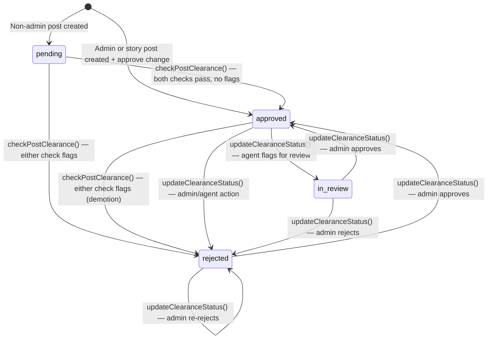

# Post Clearance Service

Service for managing post visibility gates with lifecycle timestamps and
`post_clearance_changes`. `clearance_status` is a derived API/display value from
`view_post_clearance_status`, not a stored `posts` column.

## State Machine



## Functions

### `checkPostClearance(postId: string): Promise<void>`

Atomic gate check. Inserts a `post_clearance_changes` row and updates the post lifecycle
timestamps only when both moderation inputs are complete:

1. **Rejection**: records `change_type='reject'`, clears `approved_at`/`in_review_at`, and sets `rejected_at` when a pending or approved post is flagged.
2. **Approval**: records `change_type='approve'` and sets `approved_at` when a pending post has no flags.

Invalidates the post cache if either UPDATE matched a row. Enqueues LLM agent moderation (fire-and-forget) only when the approval UPDATE matched.

**Called by**: `@queues/spam-detection` processor after spam check completes; `@queues/openai-moderation` worker after moderation completes.

### `updateClearanceStatus(postId: string, status: ClearanceStatus, updatedById?: string): Promise<void>`

Admin or agent override. Directly sets `clearance_status` to any valid value.

- Records a `post_clearance_changes` row, updates lifecycle timestamps, and updates `updated_by_id`
- Does NOT run gate logic — caller is responsible for determining the correct status
- Used by: admin review queue API, agent moderation processors, community moderation actions

### `resetPostClearance(postId: string, changedById?: string | null, options?: QueryOptions): Promise<boolean>`

Resets clearance to `pending` on post edit. Records `change_type='reset_to_pending'`, clears
`approved_at`, `rejected_at`, `in_review_at`, `openai_omni_moderation_created_at`,
`spam_detection_created_at`, and their result columns.
Returns `true` only when a reset row was recorded; already-pending posts with cleared moderation
fields are no-ops.

Callers that reset clearance because moderation inputs changed must durably enqueue the follow-up
moderation work before returning success. If that enqueue fails after clearance or moderation fields
were reset, the caller must restore the previous clearance and moderation state so the post is not
left pending without replacement jobs.

**Called by**: post update service whenever post content changes.

### `markSpamDetectionNotFlagged(postId: string): Promise<void>`

Marks spam detection as complete with no flag. Used when spam detection determines a post is clean.

## Integration Points

| Trigger                    | Function                                                                 |
| -------------------------- | ------------------------------------------------------------------------ |
| Non-admin post created     | No lifecycle timestamp; derived status is `pending`                      |
| Admin post created         | `approve` change recorded in `create.mts`; derived status is `approved`  |
| Story post created         | `approve` change recorded in `create-story-post.mts`                     |
| OpenAI moderation complete | `checkPostClearance()` called by moderation processor                    |
| Spam detection complete    | `checkPostClearance()` called by spam detection processor                |
| Post content edited        | `resetPostClearance()` re-queues the post, including admin-created posts |
| Admin review action        | `updateClearanceStatus()` via admin review queue API                     |
| Agent moderation flag      | `updateClearanceStatus()` via agent moderation processor                 |

## Types

```typescript
type ClearanceStatus = 'pending' | 'approved' | 'rejected' | 'in_review'
```

## Related

- [../../../docs/overview/architecture/post-lifecycle.md](../../../docs/overview/architecture/post-lifecycle.md) — post clearance and moderation flow
- [../../queues/spam-detection/](../../queues/spam-detection/README.md) — spam detection system
- [../../queues/openai-moderation/](../../queues/openai-moderation/README.md) — OpenAI moderation system
- [../../api/v1/admin/](../../api/v1/admin/README.md) — admin review queue API
