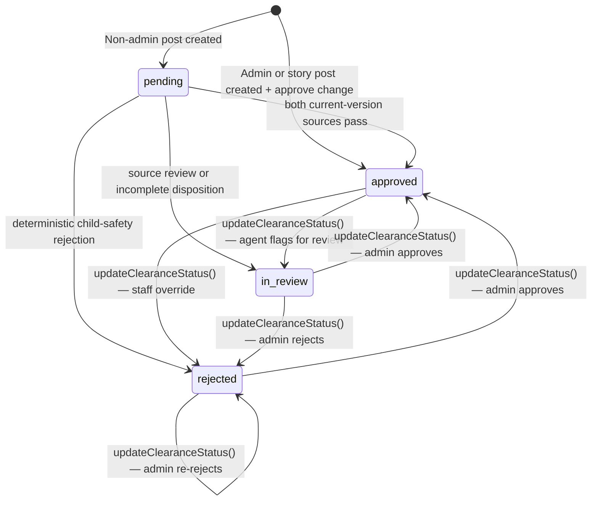

# Post Clearance Service

Service for managing post visibility gates with lifecycle timestamps and
`post_clearance_changes`. `clearance_status` is a derived API/display value from
`view_post_clearance_status`, not a stored `posts` column.

## State Machine



## Functions

### `checkPostClearance(postId: string): Promise<void>`

Atomic gate check. Inserts a `post_clearance_changes` row and updates the post lifecycle
timestamps only when both current-version automated dispositions exist:

1. **Rejection**: only a deterministic `reject` disposition can set `rejected_at`.
2. **Review**: `review` or `incomplete` sets `in_review_at`.
3. **Approval**: both sources must append `pass` before `approved_at` is set.

Invalidates the post cache if either UPDATE matched a row. Enqueues LLM agent moderation (fire-and-forget) only when the approval UPDATE matched.

**Called by**: `@queues/spam-detection` processor after spam check completes; `@queues/openai-moderation` worker after moderation completes.

### `updateClearanceStatus(postId, status, updatedById, decision): Promise<void>`

Administrator or site-moderator override. Directly sets `clearance_status` to any valid value.

- Requires a stable public reason code, accepts an optional private staff note, and records both a
  `post_clearance_changes` row and a staff disposition
- Does NOT run gate logic — caller is responsible for determining the correct status
- Used by: admin review queue API, agent moderation processors, community moderation actions

### `resetPostClearance(postId: string, changedById?: string | null, options?: QueryOptions): Promise<boolean>`

Resets clearance to `pending` on post edit. Records `change_type='reset_to_pending'` and clears the
three coarse lifecycle timestamps. Provider outcomes remain immutable on the prior content version.

Callers durably enqueue the new content hash. PostgreSQL owns three attempts at T+0/T+5/T+20 and a
T+30 fail-closed transition to staff review.

**Called by**: post update service whenever post content changes.

## Integration Points

| Trigger                    | Function                                                                 |
| -------------------------- | ------------------------------------------------------------------------ |
| Non-admin post created     | No lifecycle timestamp; derived status is `pending`                      |
| Admin post created         | `approve` change recorded in `create.mts`; derived status is `approved`  |
| Story post created         | `approve` change recorded in `create-story-post.mts`                     |
| OpenAI moderation complete | `checkPostClearance()` called by moderation processor                    |
| Spam detection complete    | `checkPostClearance()` called by spam detection processor                |
| Post content edited        | `resetPostClearance()` re-queues the post, including admin-created posts |
| Admin review action        | `updateClearanceStatus()` via admin review queue API                     |
| Agent moderation flag      | `updateClearanceStatus()` via agent moderation processor                 |

## Types

```typescript
type ClearanceStatus = 'pending' | 'approved' | 'rejected' | 'in_review'
```

## Related

- [../../../docs/overview/architecture/post-lifecycle.md](../../../docs/overview/architecture/post-lifecycle.md) — post clearance and moderation flow
- [../../queues/spam-detection/](../../queues/spam-detection/README.md) — spam detection system
- [../../queues/openai-moderation/](../../queues/openai-moderation/README.md) — OpenAI moderation system
- [../../api/v1/admin/](../../api/v1/admin/README.md) — admin review queue API
