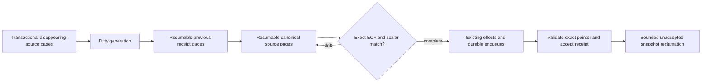

# Post Publication Service

Owns durable capture of post publication eligibility changes. Callers coalesce repeated changes for
one dependency scope in the same PostgreSQL transaction. Scopes cover posts and the author,
community, RSS feed, topic alias, or story dependencies that can change their public eligibility.
Typed key rows retain affected posts, topics, communities, identities, and sitemap shards so later
deletions or mapping changes cannot orphan an existing public projection. Topic-alias changes retain
the exact former alias text, so deletion or reassignment still invalidates the public lookup key that
existed before the transaction. A future queue worker
claims, cursors, and exactly acknowledges that bounded work; this package does not dispatch jobs or
apply projections.

RSS-feed state capture retains both the feed's owning topic and the mapped category topics of its
items. This keeps topic news/latest counts repairable even when a feed has no story-backed posts.
State reconciliation also materializes missing feed item notification impacts into the existing
partitioned key stream in bounded statements. The dirty-work row is not acknowledged until that
materialization and the downstream item enqueues succeed, so scheduled dirty-work recovery can
resume after database or queue failures without a second cursor table.

This storage is current repair state, not a second history ledger. The existing post revision system
remains the source of post history. Acknowledgement deletes the coalesced work and its retained keys;
projection receipts preserve only the last applied identities needed to compensate for hard deletes.
Retained keys and projection receipts are range-partitioned, each with a default partition.
Receipt-only hard-delete tombstones are selected and deleted in bounded pages; successful deletion
is the page cursor, so no additional checkpoint table or cursor column is required.

When the operator activates the `typed-v1` protocol after deploying expanded workers and audit
processes, each candidate's exact identities are materialized in bounded relational snapshot pages
before any effect or receipt update. A receipt only points at a complete snapshot after effects
succeed, so the prior accepted snapshot remains usable during replacement. Database guards reject
legacy worker and audit mutations after activation; their read-only audit output is stale until
they are upgraded. Snapshot attempts intentionally outlive dirty-work acknowledgement and their
keys are reclaimed in bounded pages.

The exact set is [`identity-source.mts`](identity-source.mts): authored and relation topics, positive
relation-only alias membership, distinct author UUID/username keys, candidate and root communities,
every post slug, live root-story feed sources, and exact sitemap type/day tuples. Source pages and
previous-receipt retention pages have independent durable cursors on the same attempt.
[`identity-source-paging.mts`](identity-source-paging.mts) advances one source branch and its native
indexed row key, limiting physical rows before mapping or filtering identities. Duplicate identities,
deleted relations and aliases with no topic still advance source progress; relational insertion
deduplicates their retained keys. Feed progress includes the item and feed keys. Disappearing
descendant sitemap targets page descendant post IDs before projecting the type/day tuple.
Native pages preserve the scoped composite index interval. Their positive safe-integer row budgets
are structural SQL literals so generic prepared plans can cost an early stop; identity and cursor
values remain parameters.
Typed prior receipts page the composite snapshot/key interval; compatibility receipts page bounded JSON array ordinals
in PostgreSQL. Neither reader repeats a whole-set union or expands a complete array for each page.
Every page
locks the current dirty-work generation and lease before inserting keys and checkpoints. Effects
wait for both stages. EOF compares exact sets in PostgreSQL and revalidates scalar eligibility;
drift abandons the attempt, while completed attempts are reused across retries and other posts in
the same work page. The receipt writer validates the candidate's exact complete pointer again after
the existing projection/enqueue acceptance boundary. Replacement leaves the previous receipt intact.

Audit repair only records dirty work. The worker stages old receipt identities without returning
JSON to Node, including receipts written before expansion and orphan receipts after hard deletion.
Current source capture still pages all disappearing identities in the caller's mutation transaction,
including descendant sitemap shards when their root is changed or removed.

Rollout is additive and starts inactive. Deploy the expanded API, worker and audit processes before
running the operator command from the initialized worktree:

```bash
source .env
node backend/scripts/activate-post-publication-identity-protocol.mts
```

Activation is monotonic and idempotent. The singleton's exclusive activation lock waits for prior
writer transactions holding its shared lock; ordinary writer transactions share that lock and do
not serialize unrelated scopes. After activation, old worker receipt/cursor/lease/acknowledgement
and audit checkpoint writes are rejected, while API insertion and generation increments remain
allowed. Activation cannot be reversed: typed stages or accepted receipts must never be interpreted
as empty identities by an old process. An old fingerprint includes JSON; the typed scalar
fingerprint intentionally causes a one-time receipt refresh during migration.

Each existing scheduled reconciliation invocation reclaims an independent bounded page even when
there is no dirty work. Cleanup advances a persisted cyclic header cursor, caps examined headers
before locking or checking accepted/current-generation ownership, and deletes keys through their native
snapshot/id interval, sharing [`snapshot-key-pages.mts`](snapshot-key-pages.mts) with typed receipt
retention. The composite ordering prevents a prepared plan from scanning unrelated interleaved
snapshot keys through the global key-ID primary key. A partially reclaimed snapshot pins sweep progress until its key page reaches EOF;
header EOF wraps the sweep so newly stale snapshots behind the cursor are revisited. The separate
candidate page bounds per-ID lock probes before `SKIP LOCKED`; skipped headers advance that
candidate boundary and are revisited after wrap instead of expanding the physical scan.
cleanup singleton locks only cleanup calls. Cleanup excludes accepted pointers and removes only
empty stale/abandoned attempts. The receipt foreign key prevents deletion of accepted storage,
which outlives dirty acknowledgement. Snapshot keys never cascade on deletion.



Projection receipts are the durable acceptance boundary for worker-owned effects: a receipt is
written only after cache invalidation plus durable sitemap and hashtag queue enqueues succeed.
Those downstream queues own their retry policy. The operator shadow audit compares canonical
primary eligibility fingerprints to receipts; dry runs accept an explicit cursor and never alter
the saved checkpoint, while repairs advance and reset that checkpoint at EOF.

Before projection effects, the worker asks the posts service to converge review succession for the
selected post page. Any automatic archive or restore records fresh `post_archived` dirty work with
the affected current and archive-time topics. The worker then enqueues a continuation and leaves the
claimed generation's receipts, cursors, and acknowledgement untouched; a no-write pass proceeds to
ordinary projection reconciliation.

The package's supported surface is exported from `index.mts`; keep internal modules behind that
barrel so new capture and reconciliation helpers do not require a duplicated file inventory here.

Every retained-key writer partitions UUID, text, and sitemap partial-index families, orders each
family by its complete conflict key before batching, and retains caller order where it is observed.
See the [PostgreSQL ordering guard](../../../static-code-analysis/README.md#postgresql-conflict-ordering).
