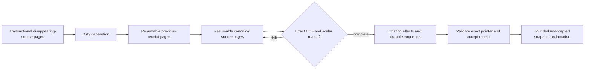

# Post Publication Service

Owns durable capture of post publication eligibility changes. Callers coalesce repeated changes for
one dependency scope in the same PostgreSQL transaction. Scopes cover posts and the author,
community, RSS feed, topic alias, or story dependencies that can change their public eligibility.
Typed key rows retain affected posts, topics, communities, identities, and sitemap shards so later
deletions or mapping changes cannot orphan an existing public projection. Topic-alias changes retain
the exact former alias text, so deletion or reassignment still invalidates the public lookup key that
existed before the transaction. The publication queue worker
claims, cursors, and exactly acknowledges that bounded work; this package does not dispatch jobs or
apply projections.

RSS-feed state capture retains both the feed's owning topic and the mapped category topics of its
items. This keeps topic news/latest counts repairable even when a feed has no story-backed posts.
State reconciliation also materializes missing feed item notification impacts into the existing
partitioned key stream in bounded statements. The dirty-work row is not acknowledged until that
materialization and the downstream item enqueues succeed, so scheduled dirty-work recovery can
resume after database or queue failures without a second cursor table.

This storage is current repair state, not a second history ledger. The existing post revision system
remains the source of post history. Acknowledgement deletes the coalesced work and its retained keys;
projection receipts preserve only the last applied identities needed to compensate for hard deletes.
Retained keys, projection receipts, and durable post identity bridges are range-partitioned,
each with a default partition. Accepted receipt references make post identity cardinality unbounded
over the product lifetime; the other six bridge families track only active repair references.
Receipt-only hard-delete tombstones are selected and deleted in bounded pages; successful deletion
is the page cursor, so no additional checkpoint table or cursor column is required.

Each candidate's exact identities are materialized in bounded relational snapshot pages before
any effect or receipt update. Every receipt requires a complete snapshot pointer after effects
succeed, so prior accepted storage remains usable during replacement. There is no activation
switch, compatibility JSON receipt, or shared writer barrier. Snapshot attempts intentionally
outlive dirty-work acknowledgement and their keys are reclaimed in bounded pages.

Stored payloads use concrete topic, author, community, feed, slug, username, and sitemap columns.
Immutable projection keys are never joined to live entities. Joined post/community/RSS-item impacts
and the six dirty-work scopes instead reference concrete identity bridges. Each bridge has a nullable
live-entity FK with `ON DELETE SET NULL`; hard deletion preserves compensation identity while
removing the live relationship. Snapshots and receipts reference the post bridge, and snapshots'
nullable work-owner FK clears on acknowledgement. Retained relationships restrict bridge deletion.

[`prepare-identity-bridges.mts`](prepare-identity-bridges.mts) prepares the complete declared scope,
impact, and prior-root set in canonical family/native-ID order before dirty writes. Multi-capture
transactions declare their combined set before the first capture; scope advisory locks precede
bridge insertion. Captures hold per-identity shared advisory ownership and FK key-share locks,
so independent captures coexist while bounded GC's try-exclusive fence skips active owners.
Alias batches merge raw-capped ownership pages in transaction-private `ON COMMIT DROP` staging,
then prepare post bridges in global native-ID order before alias bridges. Staged `post_key` values
are ephemeral input tokens, never joined to live tables; bounded token pages enter the normal
bridge helper, whose nullable live FK preserves a preimage when deletion races preparation.
The separate bridge sweep rotates seven families, examines at most 100 raw candidates per call,
checks every work/key/snapshot/receipt reference, and revisits skipped identities after wrapping.

The exact set is [`identity-source.mts`](identity-source.mts): authored and relation topics, positive
relation-only alias membership, distinct author UUID/username keys, candidate and root communities,
every post slug, live root-story feed sources, and exact sitemap type/day tuples. Source pages and
previous-receipt retention pages have independent durable cursors on the same attempt.
[`identity-source-paging.mts`](identity-source-paging.mts) advances one source branch and its native
indexed row key, limiting physical rows before mapping or filtering identities. Duplicate identities,
deleted relations and aliases with no topic still advance source progress; relational insertion
deduplicates their retained keys. Feed progress includes item/feed keys and an exhausted-item marker.
Native item pages use capped source-existence probes, so source-less stories advance a whole item
page without a database roundtrip per item; feeds of the first sourced item are exhausted before
later items advance. Disappearing
descendant sitemap targets page descendant post IDs before projecting the type/day tuple.
Native pages preserve the scoped composite index interval. Their positive safe-integer row budgets
are structural SQL literals so generic prepared plans can cost an early stop; identity and cursor
values remain parameters.
RSS story paging retains the live partial `(story_id, id)` covering index; foreign-key probes
across deleted items use an ordered `(story_id, deleted_at, id)` index instead of the old unordered
story index. The online leaf build is attached and validated before retiring that unordered index.
Native item and typed-key pages share [`story-item-pages.mts`](story-item-pages.mts) and
[`snapshot-key-pages.mts`](snapshot-key-pages.mts) recursive single-row scoped seeks in one SQL statement,
stopping before the next seek once their literal row budget is reached. `LIMIT 1` preserves
early-stop planning even when statistics underestimate a scope below the ordinary page size;
no whole-scope bitmap/sort or global-ID traversal is hidden behind an outer `LIMIT 100`.
Live RSS seeks explicitly prove `story_id IS NOT NULL` as well as `deleted_at IS NULL`, so
the planner can use the live partial covering index even with composite interval predicates.
Physical plan gates cover fresh and dirty databases, interleaved snapshot keys, deleted-item noise,
and unrelated feed sources in both prepared-plan modes. A source table small enough to fit the
entire probe budget is measured by exact cardinality times loops, avoiding PostgreSQL's rounded
per-loop filtered-row means; larger tables must use scoped indexed probes within the same cap.
Prior receipts page the composite snapshot/key interval in PostgreSQL without JSON expansion.
Every page
locks the current dirty-work generation and lease before inserting keys and checkpoints. Effects
wait for both stages. EOF compares exact sets in PostgreSQL and revalidates scalar eligibility;
drift abandons the attempt, while completed attempts are reused across retries and other posts in
the same work page. The receipt writer validates the candidate's exact complete pointer again after
the existing projection/enqueue acceptance boundary. Replacement leaves the previous receipt intact.

Audit repair only records dirty work. The worker stages old receipt identities from snapshots, including orphan receipts after hard deletion.
Current source capture still pages all disappearing identities in the caller's mutation transaction,
including descendant sitemap shards when their root is changed or removed.

This is a prelaunch schema change, not an operational rollout. The forward migration removes the
old receipt payload and requires the snapshot pointer immediately. Existing incompatible data
fails migration rather than being silently deleted or backfilled; an operator must explicitly
recreate a disposable development or staging schema. Complete fresh migrations and the normal
strict schema verifier establish the supported schema.

Each existing scheduled reconciliation invocation reclaims an independent bounded page even when
there is no dirty work. Cleanup advances a persisted cyclic header cursor, caps examined headers
before locking or checking accepted/current-generation ownership, and deletes keys through their native
snapshot/id interval, sharing [`snapshot-key-pages.mts`](snapshot-key-pages.mts) with typed receipt
retention. The snapshot-scoped primary key removes a competing global key-ID ordering that could
scan unrelated interleaved snapshots. Deletion joins both ownership and key ID. A partially reclaimed snapshot pins sweep progress until its key page reaches EOF;
header EOF wraps the sweep so newly stale snapshots behind the cursor are revisited. The separate
candidate page bounds per-ID lock probes before `SKIP LOCKED`; skipped headers advance that
candidate boundary and are revisited after wrap instead of expanding the physical scan.
cleanup singleton locks only cleanup calls. Cleanup excludes accepted pointers and removes only
empty stale/abandoned attempts. The receipt foreign key prevents deletion of accepted storage,
which outlives dirty acknowledgement. Snapshot keys never cascade on deletion.

Projection receipts are the durable acceptance boundary for worker-owned effects: a receipt is
written only after cache invalidation plus durable sitemap and hashtag queue enqueues succeed.
Those downstream queues own their retry policy. The operator shadow audit compares canonical
primary eligibility fingerprints to receipts; dry runs accept an explicit cursor and never alter
the saved checkpoint, while repairs advance and reset that checkpoint at EOF.

Before projection effects, the worker asks the posts service to converge review succession for the
selected post page. Any automatic archive or restore records fresh `post_archived` dirty work with
the affected current and archive-time topics. The worker then enqueues a continuation and leaves the
claimed generation's receipts, cursors, and acknowledgement untouched; a no-write pass proceeds to
ordinary projection reconciliation.

The package's supported surface is exported from `index.mts`; keep internal modules behind that
barrel so new capture and reconciliation helpers do not require a duplicated file inventory here.

Every retained-key writer orders concrete payloads by their complete unique conflict key before
bounded batching, and retains caller order where it is observed.
See the [PostgreSQL ordering guard](../../../static-code-analysis/README.md#postgresql-conflict-ordering).
