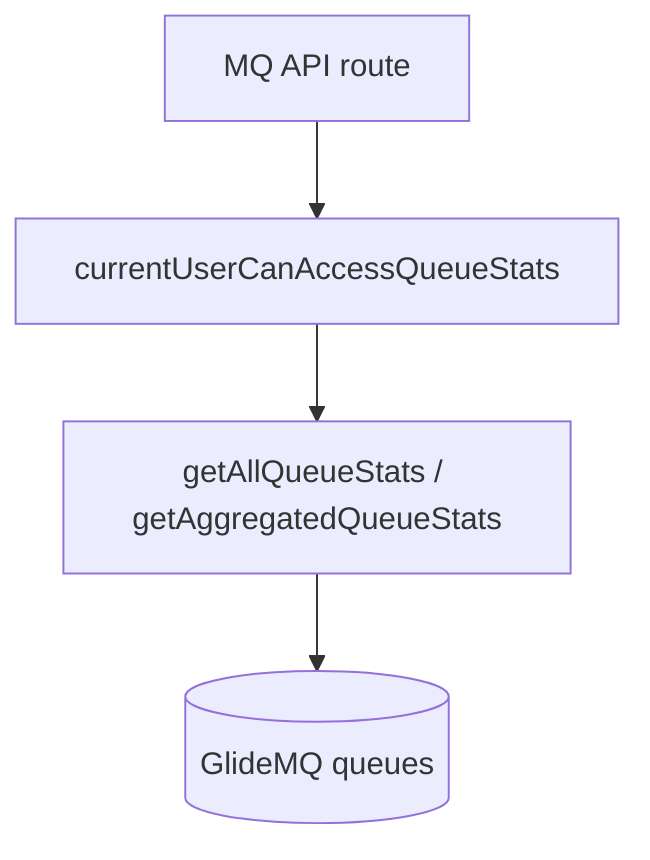

# Queue Monitoring Service

Real-time monitoring of glide-mq job queues.



## Modules

- **authorization.mts** — `currentUserCanAccessQueueStats()` admin role check
- **get-queue-stats.mts** — Queue statistics fetching and aggregation
- **publish-cloudwatch.mts** — bounded class-level depth/staleness publisher

## Functions

- `getQueueStats(name)` — get stats for a single queue (waiting, active, completed, failed, paused, oldest waiting age)
- `getAllQueueStats(queueNames)` — batch fetch and sort stats for multiple queues
- `getAggregatedQueueStats(queueNames)` — aggregate totals across all queues

## Data Model

No owned database tables. Reads live queue state directly from GlideMQ (Valkey-backed):

- Queue stats (waiting, active, completed, failed counts) are fetched via the GlideMQ client API.
- `oldestWaitingAgeMs` reads one oldest waiting job without loading the backlog.
- Paused state is tracked per-queue in the queue's Valkey key space.

The worker-cpu registers one five-minute publisher through the universal `heartbeat` queue. It
writes only `GlideMQWaiting` and `GlideMQOldestWaitingAge`, each with one `QueueClass` dimension
(`cpu` or `io`), to `Voucha/staging` or `Voucha/production`. SQS ingress queues stay on native
`AWS/SQS` metrics and are excluded from this publisher. Local and test environments are no-ops.

## Usage Examples

```typescript
import {
  getQueueStats,
  getAllQueueStats,
  getAggregatedQueueStats,
} from '@services/queue-monitoring'

// Single queue
const stats = await getQueueStats('email-queue')
// => { name: 'email-queue', waiting: 5, active: 2, completed: 1000, failed: 3, paused: false }

// All queues (sorted by name)
const allStats = await getAllQueueStats(['email-queue', 'moderation-queue'])

// Aggregate totals
const totals = await getAggregatedQueueStats(['email-queue', 'moderation-queue'])
// => { totalWaiting: 10, totalActive: 4, totalCompleted: 2000, totalFailed: 6, queueCount: 2 }
```

## Related

- [Queue Monitoring API](../../api/v1/mq/README.md)
- [Services CLAUDE.md](../CLAUDE.md)
- [Infrastructure Overview](../../../docs/overview/infrastructure/infrastructure.md)
