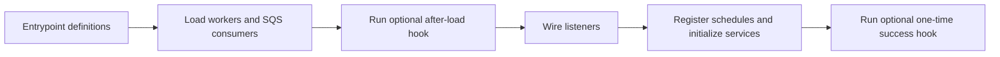

# Worker Runtime

Shared Vouchington composition layer loaded by both `worker-cpu` and `worker-io` entrypoints. The
published `@vouchington/worker-runtime` package owns generic queue parsing, GlideMQ worker
selection/loading, and schedule registration. This package injects Vouchington topology-skew
reporting and retains Vouchington-specific SQS, observability, lifecycle, inventory, and universal
worker composition.

## Worker Loading

Two loading paths exist:

| Path              | File                       | Description                                                                                                       |
| ----------------- | -------------------------- | ----------------------------------------------------------------------------------------------------------------- |
| **Policy-driven** | `worker-queue-policy.json` | Workers for queues in `WORKER_DEFINITIONS`. Filtered by `QUEUES` env var. Enforced by cpu/io partition invariant. |
| **Universal**     | `universal-workers.mts`    | Workers loaded unconditionally on every deployment, bypassing `QUEUES` and the cpu/io partition.                  |

### Universal Workers

Universal workers run regardless of the `QUEUES` environment variable. Use universal workers for
cross-cutting concerns such as liveness heartbeats.

Currently registered universal workers:

| Queue       | Package              | Purpose                                                                                   |
| ----------- | -------------------- | ----------------------------------------------------------------------------------------- |
| `heartbeat` | `@workers/heartbeat` | No-op job that echoes input with a timestamp; used for CI smoke tests and liveness probes |

**Design note:** universal workers must NOT appear in `worker-queue-policy.json`
or any `WORKER_DEFINITIONS` array — doing so would break the cpu/io partition
invariant test (`worker-queue-policy.test.mts`). Their names instead live in
`UNIVERSAL_WORKER_QUEUE_NAMES`; `allLiveWorkerQueueNames()` combines that inventory with every
policy-managed queue for cross-cutting administration such as Valkey diagnostics and flushes.

## Entrypoint Lifecycle

`lifecycle.mts` owns the startup sequence shared by the CPU and IO entrypoints. It derives the
cross-runtime queue exclusions, loads policy workers, universal workers, and SQS consumers in
parallel, then returns a starter that wires observability and runs schedule registration alongside
service setup. Entrypoints provide only their definitions and optional process-specific hooks.

Startup setup failures are reported after both setup operations settle. A process-specific success
hook runs only after both operations succeed; if that hook fails, the failure is reported and a
later call may retry it.

## Queue Policy

[`worker-queue-policy.json`](../modules/worker-queue-inventory/worker-queue-policy.json) is the
source of truth for canonical CPU-only, I/O-capable, and SQS-consumer queue classifications.
Infrastructure owns worker service names, task definitions, capacity, and deployment routing.
Local development starts the merged `worker-cpu` entrypoint with every policy-managed queue.

Every policy-managed definition must appear in exactly one queue class. The worker policy tests
enforce class alignment, full coverage of the local entrypoints, and the invariant that
`worker-cpu` can load all queues.

## Files

| File                    | Purpose                                                                |
| ----------------------- | ---------------------------------------------------------------------- |
| `lifecycle.mts`         | Shared worker loading, startup, reporting, and process hook sequence   |
| `worker-runtime.mts`    | Vouchington topology-skew reporting adapter for package worker loading |
| `universal-workers.mts` | `UNIVERSAL_WORKER_DEFINITIONS`, `loadUniversalWorkers`                 |
| `observability.mts`     | `addWorkerEventListeners`, job-completion logging                      |
| `scrub-job-data.mts`    | `scrubJobData` — PII/secret redaction for logged job payloads          |
| `setup.mts`             | `setup` — Valkey/glide-mq connection initialization                    |
| `logger.mts`            | Shared worker-runtime logger                                           |
| `sqs-consumer.mts`      | Queue selection, loading, consumer factory, and lifecycle              |
| `index.mts`             | Re-exports package queue/schedule contracts and local composition      |

## Observability

`addWorkerEventListeners` reports worker lifecycle events and queue job progress to analytics.
Failed jobs also pass through the shared backend `onError` handler with Sentry tags for `queue`,
`job_name`, and `job_id`, plus the configured retry `attempts` when available and `job_data`. Both
the deployed `job failed:` log and Sentry extra run `job_data` through `scrubJobData` (see
`scrub-job-data.mts`) before including it: PII/secret-shaped keys (emails, tokens, addresses,
phone numbers, names, etc.) and any other free-text string are replaced with `[Filtered]`; booleans,
numbers, UUID/ULID-shaped ids, and short enum-like strings pass through unchanged. Object keys are
capped at 32 (sorted) and arrays at 10 items, four levels deep, to bound payload size. Local
development `WorkerLogger` still prints unscrubbed, truncated job data — that path is off on
staging and production.

## See Also

- Worker entrypoints: [`../entrypoints/worker-cpu/`](../entrypoints/worker-cpu/CLAUDE.md),
  [`../entrypoints/worker-io/`](../entrypoints/worker-io/CLAUDE.md)
- Queue packages: [`../queues/CLAUDE.md`](../queues/CLAUDE.md)
- Worker packages: [`../workers/CLAUDE.md`](../workers/CLAUDE.md)
- Worker queue inventory and placement policy:
  [`../modules/worker-queue-inventory/README.md`](../modules/worker-queue-inventory/README.md)
- Heartbeat queue: [`../queues/heartbeat/README.md`](../queues/heartbeat/README.md)
- Heartbeat worker: [`../workers/heartbeat/README.md`](../workers/heartbeat/README.md)
