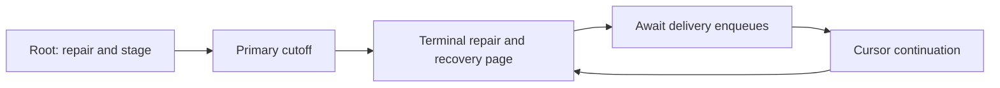

# Notifications Worker

Worker package for notification reconciliation, delivery, and cleanup jobs.

Durable push-intent jobs lease their effect record, recheck eligibility, and persist endpoint-level
completion so a retry never resends an already delivered endpoint.

Copyright delivery reconciliation routes durable legal intents without deciding compliance. The
in-app processor creates only the generic member projection; legal email remains in the emails
worker and records a separate SES receipt.

The processor claims with the push service's source-owned lease policy. During external delivery,
the service renews that exact pending claim and persists each endpoint result before finalizing or
releasing the intent. A lost claim stops the private provider agent and leaves recovery to reclaim
the durable intent.

Recovery scans use a fixed cursor snapshot. The worker enqueues each delivery before its next-page
continuation; the integration regression covers a 101-intent backlog and manually drains that
equal-priority FIFO order because the test queue shim does not schedule by priority.

Media-registry root reconciliation repairs markers and stages current authority before capturing a
primary-database cutoff. Root and continuation jobs terminalize a bounded set of abandoned final
claims, then dispatch one recovery page. Continuations retain an opaque delivery-key cursor and
cutoff, omit root staging, and are enqueued only after all child enqueues succeed. Failed pages
retry from the same cursor; the next scheduled root covers later eligibility changes. See the
[media-delivery safety protocol](../../services/media-delivery-safety/README.md).

## Exports

- `notificationsWorker` - worker instance for the `notifications` queue.

## Related

- Queue surface: [../../queues/notifications/README.md](../../queues/notifications/README.md)
- Worker entrypoint: [../../entrypoints/worker-io/README.md](../../entrypoints/worker-io/README.md)
