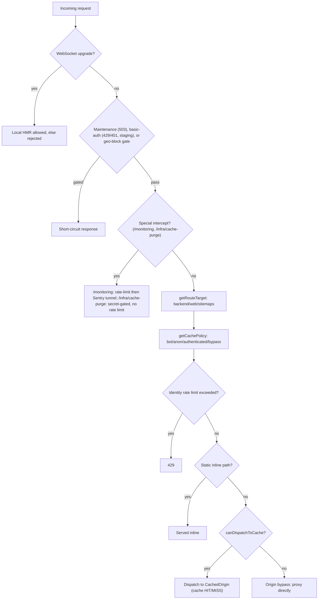

# Routing

[Back to Cloudflare Worker](README.md#routing)

### Private docs environment

The private-infrastructure-managed docs Worker serves the private docs landing page, OpenAPI reference, and
PostgreSQL schema from the `DOCS_BUCKET` R2 binding. It does not serve Storybook. The private
infrastructure source [`vouchington-infra/deploy/docs/index.html`](https://github.com/vouchington/vouchington-infra/blob/main/deploy/docs/index.html)
creates the root landing page; Filaments's [`ci/render-psql-docs.mts`](../ci/render-psql-docs.mts)
renders the PostgreSQL documentation beneath its supplied output directory.

The Worker requires HTTP Basic Auth before reading R2. Store the comma-separated
`BASIC_AUTH_CREDENTIALS` list only as an encrypted Cloudflare secret with
`wrangler secret put BASIC_AUTH_CREDENTIALS --env docs`; the infrastructure repository, GitHub Actions, SSM, and
artifacts never receive its value. Missing, empty, or partially malformed configuration fails
closed with `503`; missing or incorrect request credentials receive a `401` browser challenge.
See the
[private docs site runbook](../docs/operations/private-docs-site.md) for provisioning and rollout.

Staging exposes only the exact unauthenticated machine routes required for ActivityPub discovery,
inbox delivery, actor documents, and AT Protocol client metadata. See the
[fediverse staging interoperability runbook](../docs/operations/fediverse-staging-interop.md) for
the supported compatibility matrix and validation procedure.

The gateway (`src/index.mts` / `src/request-handler.mts`) walks the gates below in order before a
request ever reaches the routing table; only requests that pass every gate reach the cache
dispatch decision at the bottom.

`getRouteTarget()` itself resolves to one of three targets:

- `/api/*` -> `backend` (prefix matching is case-insensitive for edge classification)
- `/sitemap.xml` -> `sitemaps` (CloudFront origin via `SITEMAPS_ORIGIN`)
- `/sitemaps/*` -> `sitemaps` (CloudFront origin via `SITEMAPS_ORIGIN`)
- `/infra/*` -> `backend` (prefix matching is case-insensitive for edge classification)
- `/md/*` -> `backend` (markdown content for LLM consumption; prefix matching is case-insensitive)
- `/rss/*` -> `backend` (prefix matching is case-insensitive for edge classification)
- `GET /auth/callback/{facebook,x,github}/broker` ->
  `/api/v1/auth/oauth/{provider}/broker-callback` on `backend` (query parameters are preserved)
- `/admin/mq-dashboard` -> `backend` (GlideMQ dashboard, served by the Express backend)
- `/robots.txt` -> inline (generated by CF Worker, no origin round-trip)
- `/llms.txt` -> inline (llmstxt.org spec, generated by CF Worker)
- `/.well-known/api-catalog` -> inline (public machine-readable resource catalog)
- Everything else: `web`

Most image delivery does not go through this worker. DNS for `images.voucha.ai`
and `images-staging.voucha.ai` resolves directly to CloudFront (unproxied
CNAME), and the web image URL builder (`web/lib/utils/image-url.ts`) mints
absolute URLs against those hosts. In local dev, `IMAGE_ORIGIN=http://localhost:$IMAGE_LAMBDA_PORT` is set by `dev/initialize` in `web/.env.local`;
the URL builder sends image requests directly to the local image-resize Lambda
on that port.

Backend sideload emitters also return absolute URLs on the image host. An apex
`/sideload/*` request therefore follows the normal web route and is not an image
proxy fallback.
