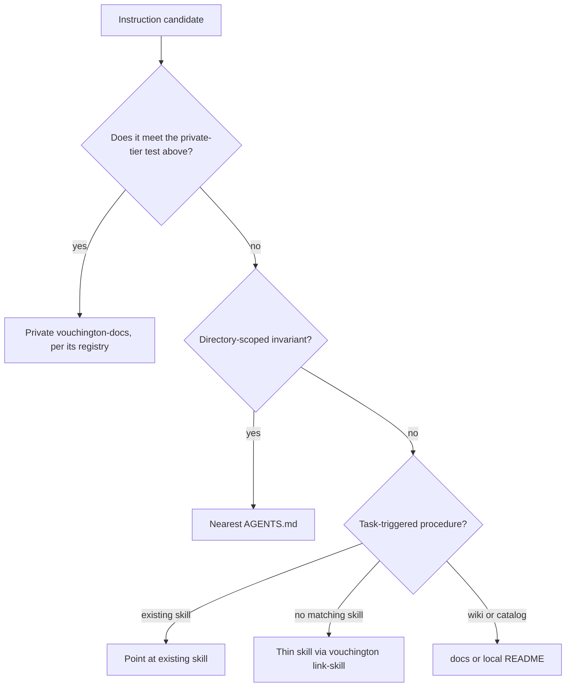

# Documentation

Use the [documentation index](README.md) and [documentation catalog](catalog/README.md) to locate
the page for a change. Keep durable documentation in its owning domain and update the catalog when
adding an agent-facing document.

## Public and private tiers

Documentation lives in two tiers. This repository is licensed for public distribution, so treat
every page here as readable by anyone. The private `vouchington/vouchington-docs` holds what cannot
be.

Apply the test before writing, not after. A page belongs in the private tier when its value comes
from real operational values rather than from how the system works: thresholds and parameters an
evader could tune against, real infrastructure topology, hostnames and identities, actual spend or
per-unit cost, and business projections. Everything else belongs here — architecture, contracts,
commands, catalogs, procedures, and the reasoning behind a design. When a page needs both, describe
the mechanism here and keep the numbers private.

[Documentation moved to vouchington-docs](development/docs-moved-to-vouchington-docs.md) registers
every page already held back and owns the procedure for moving one out. Read it before moving a
page, and check it when a path you expected to find is missing.

## Instruction placement

Classify each candidate before writing it:

- **Nearest `AGENTS.md`**: automatically scoped invariants for this directory tree. One-line
  pointers to owners, not restated bodies.
- **Existing skill**: task-triggered procedure whose description already matches the work.
- **Thin new skill**: only when no existing skill description triggers; create with
  `pnpm exec vouchington link-skill <name> --source-root .agents/skills --target-root .claude/skills`.
  Do not add a Codex adapter for a checklist skill.
- **`docs/**` or local `README.md`**: commands, catalogs, examples, architecture, how-it-works.

Do not duplicate a rule or a value another file owns. Point to its owner instead of restating it.
A hedged value in prose (`currently 32MB`, `as of July 2026`) is a tell that the value belongs
elsewhere — link to the owner instead. See
[Docs pinning policy](development/dependency-updates.md#docs-pinning-policy) for the
version/pin-specific case.

Examples: a directory-only guardrail stays in the nearest `AGENTS.md`; test-authoring checklists stay in the matching `*-test-authoring` skill; command catalogs and package inventories stay in `docs/**` or a local `README.md`. A directory whose `README.md` owns `reference-*.md` leaves needs a `AGENTS.md` that points at that README so those leaves stay within the markdown-reachability 2-hop budget.

## Relocated reference navigation

- [skill authoring](../.agents/skills/AGENTS.md)
- [Development](development/README.md)
- [CI](development/ci/README.md)
- [Harness setup](development/harnesses/README.md)
- [Local development](development/local-development/README.md)
- [Issue labels](development/local-development/agent-issue-labels/README.md)
- [PostgreSQL](development/postgresql/README.md)
- [Schema snapshots](development/postgresql/schema-snapshot/README.md)
- [Explain Analyze](development/postgresql/explain-analyze/README.md)
- [Valkey](development/valkey/README.md)
- [Static analysis](development/quality/static-code-analysis/README.md)
- [Integration tests](development/testing/integration-tests/README.md)
- [Playwright](development/testing/playwright/README.md)
- [Storybook](development/testing/storybook/README.md)
- [Overview](overview/README.md)
- [Architecture](overview/architecture/README.md)
- [Backend](overview/architecture/backend/README.md)
- [Backend package catalogs](overview/architecture/backend/catalogs/README.md)
- [AI agents](overview/architecture/ai-agents/README.md)
- [Agent tools](overview/architecture/agent-tools/README.md)
- [Queues](overview/architecture/queues/README.md)
- [Services](overview/architecture/services/README.md)
- [Shared TypeScript](overview/architecture/typescript-shared/README.md)
- [Web](overview/architecture/web/README.md)
- [Email templates](overview/architecture/email-templates/README.md)
- [Infrastructure](overview/infrastructure/README.md)
- [Cloudflare Worker](overview/infrastructure/cloudflare-worker/README.md)
- [Lambdas](overview/infrastructure/lambdas/README.md)
- [Requirements](requirements/README.md)
- [Admin](requirements/admin/README.md)
- [Entity anatomy](requirements/anatomy/README.md)
- [API](requirements/api/README.md)
- [ActivityPub](requirements/api/activitypub/README.md)
- [Bluesky](requirements/api/bluesky/README.md)
- [OAuth](requirements/api/oauth/README.md)
- [API catalog](requirements/api/catalog/README.md)
- [Community](requirements/community/README.md)
- [Content](requirements/content/README.md)
- [Articles](requirements/content/articles/README.md)
- [Moderation](requirements/moderation/README.md)
- [Navigation](requirements/navigation/README.md)
- [Platform](requirements/platform/README.md)
- [Security](requirements/security/README.md)
- [SEO](requirements/seo/README.md)
- [Trust and safety](requirements/trust-safety/README.md)
- [User flows](requirements/user-flows/README.md)
- [Users](requirements/users/README.md)
- [Operations](operations/README.md)
- [Runbooks](runbooks/README.md)
- [Checklists](checklists/README.md)
- [Prompts](prompts/README.md)
- [Scheduled prompts](prompts/SCHEDULED.md)
- [Strategy](strategy/README.md)

- [Membership feature limits](requirements/users/reference-memberships-feature-limits.md).
