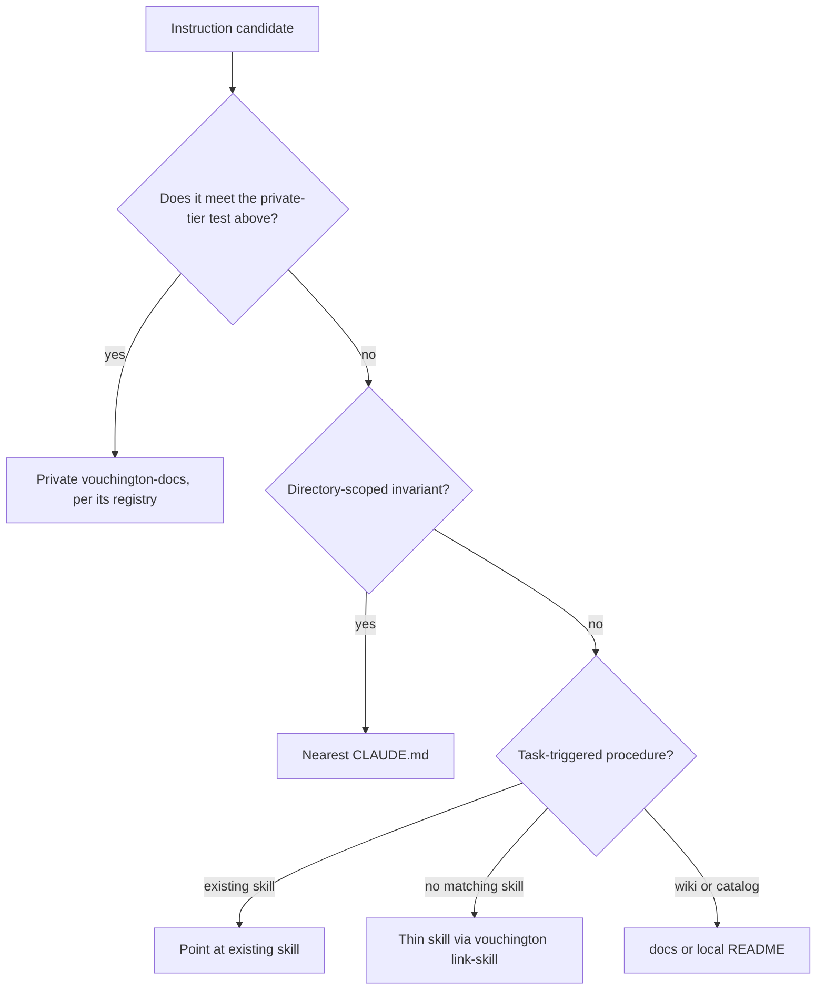

# Documentation

Use the [documentation index](README.md) and [documentation catalog](catalog/README.md) to locate
the page for a change. Keep durable documentation in its owning domain and update the catalog when
adding an agent-facing document.

## Public and private tiers

Documentation lives in two tiers. This repository is licensed for public distribution, so treat
every page here as readable by anyone. The private `vouchington/vouchington-docs` holds what cannot
be.

Apply the test before writing, not after. A page belongs in the private tier when its value comes
from real operational values rather than from how the system works: thresholds and parameters an
evader could tune against, real infrastructure topology, hostnames and identities, actual spend or
per-unit cost, and business projections. Everything else belongs here — architecture, contracts,
commands, catalogs, procedures, and the reasoning behind a design. When a page needs both, describe
the mechanism here and keep the numbers private.

[Documentation moved to vouchington-docs](development/docs-moved-to-vouchington-docs.md) registers
every page already held back and owns the procedure for moving one out. Read it before moving a
page, and check it when a path you expected to find is missing.

## Instruction placement

Classify each candidate before writing it:

- **Nearest `CLAUDE.md`**: automatically scoped invariants for this directory tree. One-line
  pointers to owners, not restated bodies.
- **Existing skill**: task-triggered procedure whose description already matches the work.
- **Thin new skill**: only when no existing skill description triggers; create with
  `pnpm exec vouchington link-skill <name> --source-root .agents/skills --target-root .claude/skills`.
  Do not add a Codex adapter for a checklist skill.
- **`docs/**` or local `README.md`**: commands, catalogs, examples, architecture, how-it-works.

Do not duplicate a rule or a value another file owns. Point to its owner instead of restating it.
A hedged value in prose (`currently 32MB`, `as of July 2026`) is a tell that the value belongs
elsewhere — link to the owner instead. See
[Docs pinning policy](development/dependency-updates.md#docs-pinning-policy) for the
version/pin-specific case.

Examples: a directory-only guardrail stays in the nearest `CLAUDE.md`; test-authoring checklists stay in the matching `*-test-authoring` skill; command catalogs and package inventories stay in `docs/**` or a local `README.md`. A directory whose `README.md` owns `reference-*.md` leaves needs a `CLAUDE.md` that points at that README so those leaves stay within the markdown-reachability 2-hop budget.

