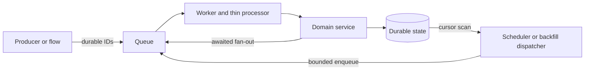

# Backend Queue Authoring Checklist

Use this checklist when adding or changing a Voucha GlideMQ queue, worker, processor, flow, job
payload, retry policy, scheduler, backfill, or worker placement. Generic GlideMQ API syntax belongs
in the installed `glide-mq` skill; this page owns Voucha's package, durability, and validation
contracts.

## Contents

- [Place each responsibility](reference-backend-queues-place-each-responsibility.md)
- [Define a replay-safe job](reference-backend-queues-define-a-replay-safe-job.md)
- [Durable transition matrix](reference-backend-queues-durable-transition-matrix.md)
- [Schedulers, flows, and backfills](reference-backend-queues-schedulers-flows-and-backfills.md)
- [Test and document](reference-backend-queues-test-and-document.md)
- [See also](reference-backend-queues-see-also.md)
