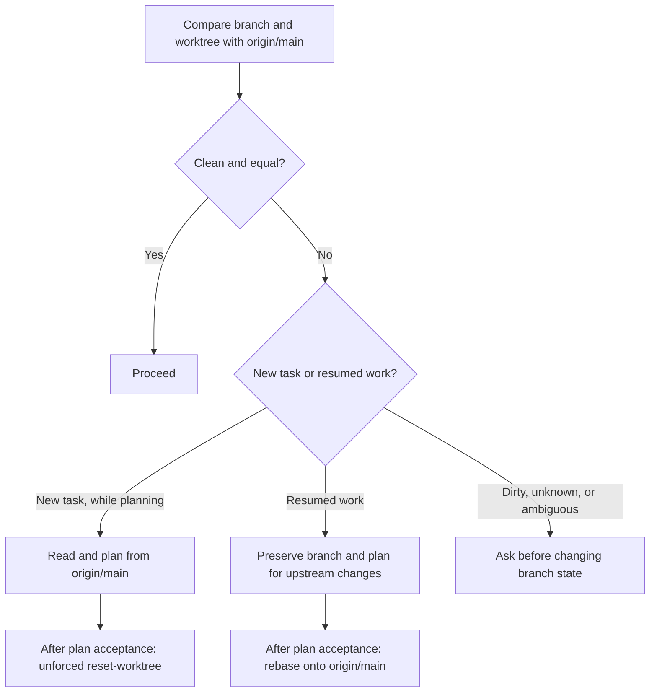

# Getting Started

How to run all services locally and load the site in a browser.

Agent-specific workflow policy lives in [CLAUDE.md](../../CLAUDE.md). The
[local-site-testing skill](../../.agents/skills/local-site-testing/SKILL.md) is the concise agent
guide for full-site startup, HTTPS Worker access, and local browser validation. This page focuses on
local setup and development commands.

Cross-repository issue mutations follow the
[public repository issue-routing decision](public-repository-issue-routing.md).

## Prerequisites

### All contributors (monorepo tools: lint, typecheck, unit tests)

- macOS, or glibc-based Linux on x64 or ARM64 (musl distributions such as Alpine are not supported)
- Node.js v26+ — for TypeScript stripping

### Full web stack (running the app, Playwright tests)

All of the above, plus:

- [Docker Desktop](https://docs.docker.com/desktop/) — for Valkey (with Bloom, JSON, Search modules)
- PostgreSQL 18+ — for UUIDv7
- tmux — for `./dev/tmux`
- Claude Code CLI (`claude`), Codex CLI (`codex`), Grok CLI (`grok`), Cursor CLI (`agent` / `cursor-agent`), and OpenCode CLI (`opencode`) are optional development tools. Run them from a separate terminal or an ad hoc tmux window when needed. See [agent-harness-parity.md](agent-harness-parity.md), [`.cursor/README.md`](../../.cursor/README.md), and [`.opencode/README.md`](../../.opencode/README.md).

Provision host dependencies with
[vouchington-machines](https://github.com/vouchington/vouchington-machines),
then use Voucha's initializer for checkout-owned dependencies and services. See
[system-dependencies.md](system-dependencies.md) for the ownership boundary and required host
capabilities.

## Quick Start

### Lint / unit tests only (no Docker or DB required)

```bash
git clone git@github.com:jonathanong/voucha.git
cd voucha
./dev/initialize monorepo  # installs deps and pinned tooling
```

See [development/tests.md](tests.md) for the full command matrix.

### DB/Valkey-backed backend tests (no full web stack)

```bash
git clone git@github.com:jonathanong/voucha.git
cd voucha
./dev/initialize backend    # monorepo + creates DB, starts Valkey container, runs migrations, writes .env
```

Use this when you need `DATABASE_URL`/Valkey against a real local instance but not the CF Worker,
Next.js, or HTTPS certs. See [development/tests.md](tests.md) for the full command matrix.

### Full web stack

```bash
# 1. Clone and initialize
git clone git@github.com:jonathanong/voucha.git
cd voucha
./dev/initialize            # full setup (alias for ./dev/initialize web)

# 2. Start all services
./dev/tmux                 # one managed session with five service windows

# 3. Open the site
open https://localhost:8787   # CF Worker is the entry point for browser-grade validation
```

If `./dev/tmux` prints `http://localhost:<WORKER_PORT>`, local mkcert certs are missing. Use that URL
only as a process liveness fallback, then install/regenerate certs before validating browser behavior.

`./dev/initialize web` is safe to re-run — it reuses saved ports and resources for the current
worktree identity.

### Initialization Capability Marker

The [initializer](../../dev/README.md#initialization-modes) writes `.initialized` as exactly
`monorepo`, `backend`, or `web` — a three-rung ladder (`monorepo` < `backend` < `web`). The value
records the strongest completed capability, not the latest requested mode:
`marker = max(requested, min(existing_marker, strongest_valid_on_disk))`. Because `backend` and `web`
both include monorepo setup, and `web` includes backend setup, a later `./dev/initialize monorepo` (or
`backend`) preserves a stronger existing capability only when its artifacts are still valid for the
current worktree (`.env`, `.valkey-port`, and the database and Valkey ownership metadata for `backend`;
additionally `.dev.vars` and consistent ports across `.env`/`web/.env.local` for `web`); otherwise it
records the lower requested mode. A valid refresh runs no Docker, database, cache-clearing, or other
higher-mode work; start a preserved web environment with `./dev/tmux`, or run DB/Valkey-backed tests
directly against a preserved backend environment.
`./dev/reset-worktree` is the intentional capability-invalidation boundary: it removes any stale
marker before initializing the reset worktree as `monorepo`. Between its hard reset and monorepo
initialization, it deletes worktree-local generated build, coverage, report, and tool-cache output
while preserving dependencies, environment port values, certificates, test authentication, and
host-level caches or service resources. Native build products and generated projects are owned by
[vouchington-clients](https://github.com/vouchington/vouchington-clients). See the [`dev/` cleanup
contract](../../dev/README.md#cleanup) for the complete boundary.

## Architecture (Local)

Traffic flows through the Cloudflare Worker, which proxies to Next.js and the backend API:

```
Browser → CF Worker (:8787) → Next.js (:3000)  — pages
                             → Backend (:2900)  — /api/*
                             → Lambdas (:3100)  — image resizing, browser crawl
```

## Shared Secrets

No shared secrets are required to start the local app. `~/voucha.env` is optional and should only
contain credentials for cloud-backed features you are actively testing, such as S3 uploads or real
OpenAI calls. See [local-env-vars.md](local-env-vars.md).

## Dev Commands

See the canonical [`dev/` command catalog](../../dev/README.md#command-catalog) for the complete
inventory, public versus internal boundaries, scope and destructiveness, and CLI argument-safety
contract. The setup and full-stack commands used in this getting-started guide are intentionally
repeated above; maintain all other command descriptions in that catalog.

## Running Tests

```bash
source .env
```

See [development/tests.md](tests.md) for the full command matrix.

## Working on a Parallel Branch

Use git worktrees to work on multiple branches simultaneously. Each worktree gets its own ports, database, and Valkey container:

```bash
git worktree add ../worktrees/my-feature -b feature/my-feature
cd ../worktrees/my-feature
./dev/initialize web
./dev/tmux                 # one managed session with five service windows
# Open the CF Worker URL printed by ./dev/tmux; use HTTPS for browser-grade validation
```

Non-main database and Valkey names use a hash of the canonical physical worktree root, not the
branch or directory name. Moving a checkout changes that identity: rerun `./dev/initialize web`,
then use `./dev/cleanup` to remove orphaned canonical hashed resources. Legacy-named resources are
retained for explicit removal after verifying every ordinary clone has migrated. See
[Resource Allocation](../../dev/reference-resource-allocation-web-mode.md) for the exact contract.

Agent-created temporary or subagent worktrees are not this path; they go under the OS tmpdir per [Start Of Work](../../.agents/skills/agent-workflow/start-of-work.md).

Run `./dev/tmux` from outside tmux. It creates one session per canonical worktree with windows in this order: `nextjs`, `backend`, `worker`, `cloudflare`, `lambdas`. The `worker` window runs every queue in the worker policy.

See [../../dev/CLAUDE.md](../../dev/CLAUDE.md) for full worktree documentation.
Agents should also follow [CLAUDE.md](../../CLAUDE.md) for initialization, validation, git, and PR completion rules.

### Fresh-base planning

The `./dev/check-fresh-base` session hook fetches `origin/main` and compares it with the current
branch before an agent plans or implements work. It reports the branch relation (equal, ahead,
behind, or diverged) and whether the worktree is clean. If the fetch fails or `origin/main` is
missing, freshness is unknown and the agent must retry the fetch before trusting the checkout.



Plan Mode is read-only with respect to branch history: inspect `origin/main` with `git diff` and
`git show` instead of resetting or rebasing during planning. Once the plan is accepted, use
unforced `./dev/reset-worktree` for a new task that was planned from `origin/main`, or preserve and
rebase the branch for resumed work. Never infer permission to discard changes or add `--force`.
The agent-specific procedure lives in [Start Of Work](../../.agents/skills/agent-workflow/start-of-work.md);
the hook interface is documented in the [`dev/` command catalog](../../dev/README.md#agent-session-hooks).

## Troubleshooting

**Migrations fail after rebase:**

```bash
source .env && pnpm run db:clean && pnpm run db:migrate
```

**Missing dependencies after rebase:**

```bash
pnpm install
pnpm run syncpack:lint && pnpm run no-mistakes
```

**Views can't be replaced with `CREATE OR REPLACE`:**

```bash
pnpm --dir backend db:migrate -- --forced
```

**`index.lock` / stuck rebase:**

See [git-worktree-locks.md](git-worktree-locks.md) — caused by git auto-maintenance racing with foreground git commands. Recovery: `git rebase --quit`.

**`another ./dev/reset-worktree is running`:**

Another `./dev/reset-worktree` in this worktree is still running. Wait for it to
finish; the kernel releases its lock automatically if the process exits. See
[git-worktree-locks.md](git-worktree-locks.md).

## Dependency Updates

Dependabot (npm/docker/github-actions) and Renovate (the root `package.json`
`packageManager` pnpm pin, `.nvmrc`, and regex-managed version literals) jointly keep dependencies
fresh. Pnpm toolchain updates wait two days and require manual review. See
[dependency-updates.md](dependency-updates.md) for the branch/PR delay, coverage matrix, and how to
add a new pinned binary.
