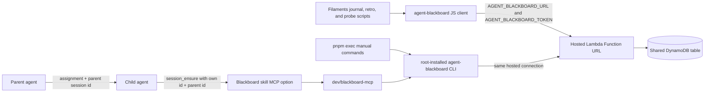

# Agent Blackboard — Hosted Session Store

Durable storage for
[`agent-blackboard`](https://github.com/jonathanong/agent-blackboard), the published client, CLI,
and MCP server that backs agent session journaling in Filaments. The root `package.json` installs
`agent-blackboard` as a development dependency. Filaments connects to a **hosted AWS
deployment** (Lambda Function URL + DynamoDB); there is no local server or database to run.

The package supplies the file-backed `snapshot_export`, `snapshot partition`, and `snapshot cleanup`
commands used by the snapshot-distillation workflow below. The export implementation landed in
[agent-blackboard PR #21](https://github.com/jonathanong/agent-blackboard/pull/21); bounded partitioning
and cleanup are owned upstream by
[agent-blackboard PR #25](https://github.com/jonathanong/agent-blackboard/pull/25), with
capability-bound cleanup and publication hardening in
[agent-blackboard PR #28](https://github.com/jonathanong/agent-blackboard/pull/28).

This document covers installing the package, connecting it to the hosted deployment, and the
Filaments integrations around its JS client, CLI, and MCP server. What gets written into sessions
belongs to the [`blackboard` skill](../../.agents/skills/blackboard/SKILL.md). That adapter composes
the portable Vouchington journaling workflow with the provider-owned skill shipped inside the
installed `agent-blackboard` package. Filaments does not enable the provider plugin because the
project registration below already supplies the hosted MCP connection.

## Architecture



Every process supplied with the hosted connection uses the same durable store. There is no
local/CI split and no local infrastructure to start, stop, or wipe. The Lambda function and
DynamoDB infrastructure live in the separate `agent-blackboard` repository, not Filaments or the
private `vouchington-infra` repository.

## Setup (local)

### 1. Install root dependencies

From the Filaments worktree root:

```bash
pnpm install
```

This installs the published JS client and the `agent-blackboard` binary under the root
`node_modules/.bin/`. No separate repository clone, source build, or `tsx` entrypoint is required.
Filaments' TypeScript integration imports the client directly; manual commands and the MCP server
use the installed binary.

### 2. Export the hosted connection

```bash
export AGENT_BLACKBOARD_URL=https://q365jix4mexb4pd5jaoegotmii0qcukx.lambda-url.us-west-2.on.aws/
export AGENT_BLACKBOARD_TOKEN=<your client credential>
```

Both values are required and hard-fail when absent. There is no token-file or local-server
fallback.

If you do not yet have a client credential, ask the deployment owner for the admin-token procedure
or follow the `agent-blackboard` repository's credential-management documentation. With an admin
token available, mint a client credential through the installed CLI:

```bash
AGENT_BLACKBOARD_URL=https://q365jix4mexb4pd5jaoegotmii0qcukx.lambda-url.us-west-2.on.aws/ \
  AGENT_BLACKBOARD_ADMIN_TOKEN=<admin token> \
  pnpm exec agent-blackboard credentials create --name <your-name>-local
```

`credentials create` prints the raw token exactly once. The server persists only its hash, so a
lost token cannot be recovered. Store it in a shell profile or secrets manager; Filaments never
persists it to disk.

### 3. Use the CLI

Run manual commands from the Filaments root with `pnpm exec` so they use the workspace-pinned
version:

```bash
pnpm exec agent-blackboard sessions create my-session-id --agent claude-code --version unknown
pnpm exec agent-blackboard append --session-id my-session-id '{"type":"journal","markdown":"...","timestamp":"2026-07-20T00:00:00Z"}'
pnpm exec agent-blackboard get --session-id my-session-id --format json
pnpm exec agent-blackboard sessions get my-session-id
```

Pass the explicit `{"type": ..., ...}` payload to `append`. The CLI's `--file foo.md` convenience
wraps Markdown as `{markdown: ...}` without the `type` field required by later pipeline stages.

## JS client, CLI, and MCP integration

The [`blackboard` skill](../../.agents/skills/blackboard/SKILL.md) supports two equivalent journal
paths. Agents with the MCP tools and explicit session metadata may call `session_ensure`,
`entry_append`, and `entry_get` directly. Agents may instead use `dev/blackboard-journal.mts`, which
provides file input, session-id defaults, and replayable errors through the published `Sessions`
and `Entries` JS clients via `vouchington-tooling/agent-blackboard`. The SessionStart probe
(`dev/check-blackboard.mts`) uses the same portable helper while retaining Filaments' stop-work
policy. These script paths avoid a CLI-to-JS subprocess round trip. Manual CLI use remains
available through `pnpm exec agent-blackboard`; direct JS imports make the dependency visible to
Knip.

The [`retrospective-distill` skill](../../.agents/skills/retrospective-distill/SKILL.md) uses the
CLI's MCP server for a typed `snapshot_export` bulk read and later `session_archive` calls.
Eligibility for distillation and archival is age-based, not retro-presence-based: a session becomes
eligible once its retrospective entry is older than `--retro-days` (default 1) or, regardless of
whether it has a retrospective, once the session itself is older than `--session-days` (default 7).
Both flags are validated as finite, non-negative numbers before any cutoff is computed. An entry
lacking a recognized `type` (the CLI's `--file` convenience omits it) is never treated as journal
evidence; the distill skill flags such a session as entry-type-unresolved and skips it — including
archival — for the run. See
[retrospective-distill's SKILL.md](../../.agents/skills/retrospective-distill/SKILL.md) and
[distilling.md](../../.agents/skills/retrospective-distill/distilling.md) for the full eligibility,
redaction, and archival-carve-out rules. The export always stays unfiltered — `snapshot_export`'s
`selection.inactiveForHours` never matches
a zero-entry session, so passing it would hide exactly the aborted sessions this age rule exists to
sweep up — and age is classified client-side from each record's `createdAt`/`lastEntryAt`. The root
agent first checks the returned terminal manifest, compact counts, and generated-export cleanup token,
then partitions the returned local JSONL snapshot with `pnpm exec agent-blackboard snapshot partition
--path <path> --cleanup-token <cleanupToken> --checksum <sha256> --sessions <count> --entries <count>
--records <count> --bytes <count>` before it delegates read-only
partitions to inspector subagents. When `snapshot_export` omits a path,
the client intentionally writes a private `agent-blackboard-snapshot-*.jsonl` directly under the system
temp directory. Cross-process partition and cleanup commands must receive that token through
`--cleanup-token`; explicit caller-owned export destinations receive no cleanup capability and are not
eligible for this managed workflow. Each partition holds no more than 25 whole contiguous session groups or 1 MiB, is stored
in a `0700` temporary directory as a `0400` file, and is cleaned by the root after it merges the inspector
summaries and completes archival. A group larger than 1 MiB is an explicit failure: the workflow never
splits a session or silently exceeds the inspection bound. If partitioning fails before a partition
directory exists, cleanup receives the validated snapshot path and cleanup token without a directory.

Claude enables the shared `.mcp.json` registration, while Codex, Cursor, Grok, and OpenCode each
have a native project registration. Every registration launches `dev/blackboard-mcp`; the wrapper
inherits or forwards `AGENT_BLACKBOARD_URL` and `AGENT_BLACKBOARD_TOKEN`. The configuration contract
locks every harness to the same eight tools: `entry_append`, `entry_get`, `session_archive`,
`session_create`, `session_ensure`, `session_patch`, `session_search`, and `snapshot_export`. It also
checks the native preauthorization syntax: Codex `approval_mode = "approve"`, Claude's MCP allowlist,
Cursor's CLI and auto-review allowlists, Grok's `MCPTool(...)` list, and OpenCode V1 `permission`
entries. Each registration discovers the worktree root before launching the wrapper, so clients may
start from any directory inside the worktree. The wrapper then resolves
`node_modules/.bin/agent-blackboard` relative to its own location and execs the `mcp` subcommand,
still using the root-pinned package.

Restart Codex after changing or first receiving the project registration so its native
`session_ensure`, `entry_append`, and `entry_get` tools are loaded. The Codex server is deliberately
not marked as required: a fresh worktree must be able to start Codex before `pnpm install` creates
the root binary. The SessionStart availability probe remains the hard gate after initialization.

Retrospective persistence deliberately remains script-only:
`dev/retrospective-save.mts` validates UTF-8, required sections, failure grammar, and front matter;
checks for an existing retrospective; appends typed provenance; and verifies the write by reading
it back. A raw MCP `entry_append` would bypass those repository-owned invariants.

## Child-agent identity

A spawned delegation child (as opposed to a hook child, which receives its identity via hook argv —
see [Automatic checkpoint journaling](#automatic-checkpoint-journaling)) resolves its own session id
from its runtime environment — Codex's `CODEX_THREAD_ID`, Claude Code's `CLAUDE_CODE_SESSION_ID`, and
so on — the same way any other Filaments blackboard consumer does
(`dev/agent-session-id/resolve.mts`). The resolver keeps one coherent harness, agent label, and
session selection: explicit Claude wins; Claude-compat recognizes live Grok and Codex-child signals;
ordinary direct sessions prefer Codex, Grok, then Cursor; persisted files are only the final fallback.
There is no
identity round-trip: the parent passes its own session id in the spawn assignment, and the child
calls `session_ensure` with its own resolved id, the parent id it was given, its agent name, and
its version before performing substantive or blackboard-aware work.

The [`blackboard` skill](../../.agents/skills/blackboard/SKILL.md#child-identity-for-spawned-agents)
owns the exact parent/child responsibilities. The child must never infer or synthesize an identity
when its runtime environment supplies none — it stops and reports the blocker instead. A Claude
Code Agent-tool subagent is the one exception: it shares its parent's `CLAUDE_CODE_SESSION_ID`
rather than resolving a distinct id, so this protocol does not apply to it — see the skill for the
fallback.

### Root Codex sessions

An interactive root Codex process always explicitly identifies itself to the journal, retrospective,
or session-friction scripts with `--root-codex`; it does not use the MCP procedure, whose calls
require an already-known explicit id. Once at the beginning of a new root session with no
`CODEX_THREAD_ID`, it also passes `--new-root-codex-session`, which ignores any old fallback and
persists a fresh URL-safe `codex-<UUID>` at the ignored `.local/codex-session-id`. Later root
invocations reuse that value with only `--root-codex`. A real `CODEX_THREAD_ID` always wins; on a
root-aware invocation it replaces the generated value. An explicit `--session-id` and
`--root-codex` are mutually exclusive.
Root-aware commands locate the enclosing worktree root, and read commands (`entries`, retrospective
`check`, and session-friction `report`) refresh and read back its persistence file before contacting
the server.
The flags are deliberately explicit: runtime hints, transcript paths, hooks,
detached processes, and children never generate a Codex id, and Codex never reads Cursor or Grok
persistence files. Root authority is self-attested rather than detectable; a child that violates
the workflow and passes either root flag inherits the root identity. Automatic hooks keep using
their explicit payload id and never write the root
file because hook metadata cannot distinguish a root from a spawned Codex child.
Consequently, an ID-less root session cannot join automatic hook checkpoint or friction evidence
recorded under a distinct hook payload id; that evidence is out of scope until the runtime supplies
a trustworthy root `CODEX_THREAD_ID`.
Children continue to stop when they lack their own identity. `./dev/reset-worktree` preserves the
file so a reset within the same root session does not rotate identity; the next absent-thread root
session explicitly rotates it once with `--new-root-codex-session`.
Without a runtime thread ID, this exactly-once boundary is necessarily caller-declared: omitting the
flag at a new session reuses stale identity, while passing it again mid-session fragments the
session. The root workflow must therefore perform one rotation before any other root-aware call.

## Automatic checkpoint journaling

`dev/journal-checkpoint.mts` (#9337) mechanically appends `type:"journal"` entries at three defined
checkpoints, instead of relying on an agent to remember to journal. Each entry also carries a
structural `checkpoint` field (`dev/journal-checkpoint/checkpoint-entry.mts`'s `CheckpointKind`:
`'compaction' | 'command-failure' | 'pr-create' | 'push'`), so `node dev/retrospective-distill.mts`
(#10978) can classify these as `checkpoint-only` sessions — distinct from hand-written journal
reflection — without depending on the rendered `## Auto-append: ` heading:

1. **Post-compaction** — a SessionStart hook gated to the `compact` restart source computes the same
   facts as `node dev/retrospective-transcript-facts.mts` from the pre-compaction transcript and
   journals them.
2. **Repeated command failure** — a PostToolUse hook tracks high-signal test/lint/CI command
   failures (`vitest`, `playwright`, `no-mistakes`, `tsgo`, `oxlint`, `gh run`, `pr-shepherd`) in a
   session+worktree-scoped counter and journals every 3rd one with the last 3 failures' command and
   truncated stderr.
3. **PR/push milestone** — the same PostToolUse hook journals a corroborated `gh pr create` (a PR URL
   in the output) or `git push` (a non-rejected ref-update line) as soon as it completes.

Checkpoint `sessions.ensure` must use the invoking runtime's agent identity. There is no
`claude-code` fallback: unknown identity skips the checkpoint (fail-open, no session create) and
hard-fails agent-initiated `append`/`save`. Codex hook children do not receive `CODEX_THREAD_ID`;
the session id comes from each hook payload and remains independent from the root-only
`.local/codex-session-id`. Agent identity comes from the hook command argv (`compact|tool codex` in
[`.codex/config.toml`](../../.codex/config.toml), `claude` in
[`.claude/settings.json`](../../.claude/settings.json)) and, for compact, from a resolved Codex
rollout or Claude project transcript path. Grok Claude-compat still wins via `GROK_SESSION_ID` /
`GROK_HOOK_EVENT`. `GROK_AGENT` remains the main-shell CLI marker and does not override an explicit
hook runtime argv. The hosted client's exact-field `ensure` (caller-provided `agent`, no rewrite of
`parentSessionId`/`agent`/`version`) is the identity contract, not a defect to work around. A
session already created with the wrong agent stays mismatched until a new session id is used.

These checkpoints are deliberately **fail-open**: `dev/journal-checkpoint/append.mts` swallows every
failure (missing credential, network error, sandboxed run, stale session) and never surfaces as hook
noise, a blocked tool call, or a nonzero exit — the opposite of the
[Stop-work gate](#stop-work-gate) below and of `dev/blackboard-journal.mts`'s agent-initiated
`append`, which hard-fails with a replayable command because a human is watching and can react. A
silently-skipped checkpoint is not a bug to chase; it means a credential, network, or session
precondition wasn't met for that one hook invocation. See
[reference-agent-session-hooks.md](../../dev/reference-agent-session-hooks.md) for the hook wiring
and [reference-command-catalog.md](../../dev/reference-command-catalog.md) for the entrypoint.
Automatic checkpoints are a safety net, not a substitute for an agent writing its own thoughtful
journal notes — see the [`blackboard` skill](../../.agents/skills/blackboard/SKILL.md).

## Stop-work gate

Agent Blackboard is a hard session prerequisite: journaling, retrospectives, and distillation all
depend on it, and every append/save hard-fails with no filesystem fallback.
`dev/check-blackboard.mts` is a SessionStart hook (Claude Code + Codex, alongside
`check-fresh-base`/`check-web-init`) that probes the connection with `sessions.list({ limit: 1 })`.
That bounded request validates the server, DynamoDB, and token without draining the sessions table.
Success exits silently; failure emits a stop-work directive asking the user to verify
`AGENT_BLACKBOARD_URL`/`AGENT_BLACKBOARD_TOKEN`. Set
`CHECK_BLACKBOARD_SKIP=1` only for tests. The append/save hard-fail remains the mid-session
backstop.

The hook must stay listed in the Claude Code sandbox's `sandbox.excludedCommands`
(`.claude/settings.json`), alongside `blackboard-journal.mts`, `retrospective-save.mts`, and
`retrospective-facts`. The sandbox denies `AGENT_BLACKBOARD_TOKEN` and blocks egress, so a
sandboxed probe cannot determine deployment health. `dev/check-blackboard.mts` detects
`SANDBOX_RUNTIME=1` and emits a "probe skipped" context note instead of a false stop-work
directive.

## Credential recovery

A stop-work directive means the hosted connection failed: `AGENT_BLACKBOARD_URL`/
`AGENT_BLACKBOARD_TOKEN` is missing or stale, or the deployment is unreachable even with valid
credentials. An append/save hard-fail (see [Stop-work gate](#stop-work-gate) above) can point to
the same cause, but not always — these commands also hard-fail for invalid UTF-8, retrospective
validation errors, missing session metadata, network failures, HTTP 500 responses, and failed
read-back verification, none of which involve the credential. Read the printed error before
acting: only when it actually identifies a missing/stale token, an authentication failure, or an
unreachable deployment does the recovery below apply. When it does, an agent must **stop and
report the blocker to the user** — it must never try to recover the value itself:

- Never grep shell profiles (`~/.zshrc`, `~/.zprofile`, `~/.bash_profile`, `~/.bashrc`), `env`, or
  `.env*` files for the token or any related secret name (including
  `AGENT_BLACKBOARD_ADMIN_TOKEN`/`AGENT_BLACKBOARD_ADMIN_CREDENTIALS`).
- Never inline, export, echo, or otherwise print a derived credential value — including inside a
  "safe-looking" presence check. `${VAR:+SET}${VAR:-UNSET}` is **not** safe: whenever `VAR` is set
  and non-empty, the second branch expands to its value, printing it in any shell — not only an
  interactive one. `[ -n "$VAR" ] && echo SET || echo UNSET` is **also not safe**: shell tracing (`set -x`/`bash -x`, or an inherited
  `SHELLOPTS`) prints every command with its expanded arguments, so `$VAR` still lands in the
  trace. Use `[ -n "${VAR+x}" ] && echo SET || echo UNSET` instead — the `${VAR+x}` form expands to
  the literal `x` (or nothing) without ever substituting the variable's actual value, so it stays
  safe even when tracing is on.
- A sandboxed run (`SANDBOX_RUNTIME=1`) deliberately denies the token, as described above — that is
  expected behavior, not a fix target, and needs no recovery action.
- Ask the user to set or refresh the credential (see
  [Export the hosted connection](#2-export-the-hosted-connection)). A newly exported value does not
  reach an already-running process: for the MCP path, ask the user to restart the agent/MCP client
  after they confirm the refreshed value is set; for the script path, run the export and the retry
  in the same shell invocation. Only then retry the failed call.

The [`blackboard` skill § Credential failures](../../.agents/skills/blackboard/SKILL.md#credential-failures)
carries the matching agent-facing rule for both its MCP and script paths; keep the two in sync.

## CI (Harness dispatch)

`.github/workflows/harness-dispatch.yml` invokes Auto Harness through a dependency-free client but
does not provision `AGENT_BLACKBOARD_URL` or `AGENT_BLACKBOARD_TOKEN`. Harness sessions therefore
report contemporaneous failures through their available parent-agent channel when runtime session
IDs are unavailable; they do not infer IDs or write unauthenticated blackboard records.

The sessions consumed by `retrospective-distill` remain local-development sessions unless a future
change explicitly provisions and documents a scoped CI blackboard credential.

## AWS deploy path

Filaments consumes a hosted deployment; it does not own or provision it. Canonical connection
values:

- `AGENT_BLACKBOARD_URL` — `https://q365jix4mexb4pd5jaoegotmii0qcukx.lambda-url.us-west-2.on.aws/`
- `AGENT_BLACKBOARD_TABLE_NAME` — `agent-blackboard-AgentBlackboardTable-X6ZCMJT3P4MU`
  (server-side only; the Filaments client never sets this)

The Lambda function, Function URL, and DynamoDB table are provisioned from the separate
`agent-blackboard` repository. Redeploying, scaling, or repairing that infrastructure is the
deployment owner's responsibility.

## Files

| File                         | Purpose                                                                                                                        |
| ---------------------------- | ------------------------------------------------------------------------------------------------------------------------------ |
| `package.json`               | Pins the published package as a root development dependency                                                                    |
| `.mcp.json`                  | Shared Agent Blackboard MCP launcher for Claude compatibility                                                                  |
| `.codex/config.toml`         | Non-required, worktree-root-resolving Codex launcher plus exact per-tool approvals                                             |
| `.cursor/mcp.json`           | Native Cursor launcher; `cli.json` and `permissions.json` own its exact tool allowlists                                        |
| `.grok/config.toml`          | Native Grok launcher and exact `MCPTool(...)` allowlist                                                                        |
| `opencode.json`              | Native OpenCode V1 launcher and exact `agent-blackboard_<tool>` permission entries                                             |
| `dev/blackboard/client.mts`  | Resolves the hosted URL/token and constructs the published JS clients                                                          |
| `dev/check-blackboard.mts`   | SessionStart stop-work gate that probes the hosted connection                                                                  |
| `dev/blackboard-journal.mts` | Supported file/replay-oriented journal path for the [`blackboard` skill](../../.agents/skills/blackboard/SKILL.md)             |
| `dev/journal-checkpoint.mts` | SessionStart(compact)/PostToolUse dispatcher for the [automatic checkpoint journaling](#automatic-checkpoint-journaling) below |
| `dev/blackboard-mcp`         | Cwd-independent wrapper that starts the installed CLI's `mcp` subcommand for both registrations                                |
