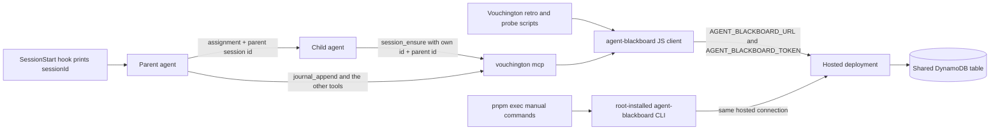

# Agent Blackboard — Hosted Session Store

Durable storage for
[`agent-blackboard`](https://github.com/jonathanong/agent-blackboard), the published client and CLI
that back agent session journaling in Vouchington. Agents reach it through the `vouchington-tooling`
MCP server (`vouchington mcp`), which the `vouchington-tooling` package ships on top of the JS
client. The root `package.json` installs `vouchington-tooling` and `agent-blackboard` as development
dependencies. Vouchington connects to a **hosted deployment**; there is no local server or database
to run.

The `agent-blackboard` package supplies the file-backed `snapshot partition` and `snapshot cleanup`
commands used by the snapshot-distillation workflow below, and the export behind the MCP
`snapshot_export` tool. The export implementation landed in
[agent-blackboard PR #21](https://github.com/jonathanong/agent-blackboard/pull/21); bounded partitioning
and cleanup are owned upstream by
[agent-blackboard PR #25](https://github.com/jonathanong/agent-blackboard/pull/25), with
capability-bound cleanup and publication hardening in
[agent-blackboard PR #28](https://github.com/jonathanong/agent-blackboard/pull/28).

This document covers installing the packages, connecting them to the hosted deployment, and the
Vouchington integrations around the MCP server, JS client, and CLI. What gets written into sessions
belongs to the [`blackboard` skill](../../.agents/skills/blackboard/SKILL.md). That adapter composes
the portable `vouchington-workflow:blackboard` procedure with repository policy. Vouchington does
not enable the `agent-blackboard` provider plugin: its raw tools skip the validated feedback
envelope, and the project registration below already supplies the MCP connection.

## Architecture


```mermaid
flowchart LR
  parent[Parent agent] -->|assignment + parent session id| child[Child agent]
  child -->|session_ensure with own id + parent id| mcp
  hook[SessionStart hook prints sessionId] --> parent
  parent -->|journal_append and the other tools| mcp[vouchington mcp]
  scripts[Vouchington retro and probe scripts] --> js[agent-blackboard JS client]
  manual[pnpm exec manual commands] --> cli[root-installed agent-blackboard CLI]
  mcp --> js
  js -->|AGENT_BLACKBOARD_URL and AGENT_BLACKBOARD_TOKEN| lambda[Hosted deployment]
  cli -->|same hosted connection| lambda
  lambda --> table[(Shared DynamoDB table)]
```

Every process supplied with the hosted connection uses the same durable store. There is no
local/CI split and no local infrastructure to start, stop, or wipe. The Lambda function and
DynamoDB infrastructure live in the separate `agent-blackboard` repository, not Vouchington or the
private `vouchington-infra` repository.

## Setup (local)

### 1. Install root dependencies

From the Vouchington worktree root:

```bash
pnpm install
```

This installs the published JS client, the `agent-blackboard` binary, and the `vouchington` binary
that starts the MCP server under the root `node_modules/.bin/`. No separate repository clone,
source build, or `tsx` entrypoint is required. Vouchington's TypeScript integration imports the
client directly; manual commands use the `agent-blackboard` binary and every harness launches the
`vouchington` binary. The server loads `@modelcontextprotocol/sdk`, an optional peer of
`vouchington-tooling`, when it starts.

### 2. Export the hosted connection

```bash
export AGENT_BLACKBOARD_URL=<hosted-blackboard-url>
export AGENT_BLACKBOARD_TOKEN=<your client credential>
```

Both values are required for hosted delivery. Missing values make hosted delivery fail and
leave interactive feedback visibly pending in the durable outbox. There is no token-file or local-server fallback.

If you do not yet have a client credential, ask the deployment owner for the admin-token procedure
or follow the `agent-blackboard` repository's credential-management documentation. With an admin
token available, mint a client credential through the installed CLI:

```bash
AGENT_BLACKBOARD_URL=<hosted-blackboard-url> \
  AGENT_BLACKBOARD_ADMIN_TOKEN=<admin token> \
  pnpm exec agent-blackboard credentials create --name <your-name>-local
```

`credentials create` prints the raw token exactly once. The server persists only its hash, so a
lost token cannot be recovered. Store it in a shell profile or secrets manager; Vouchington never
persists it to disk.

### 3. Use the CLI

Run manual commands from the Vouchington root with `pnpm exec` so they use the workspace-pinned
version:

```bash
pnpm exec agent-blackboard sessions create my-session-id --agent claude-code --version unknown
pnpm exec agent-blackboard append --session-id my-session-id '{"type":"journal","markdown":"...","timestamp":"2026-07-20T00:00:00Z"}'
pnpm exec agent-blackboard get --session-id my-session-id --format json
pnpm exec agent-blackboard sessions get my-session-id
```

Pass the explicit `{"type": ..., ...}` payload to `append`. The CLI's `--file foo.md` convenience
wraps Markdown as `{markdown: ...}` without the `type` field required by later pipeline stages.
These commands are for manual inspection; agents record journal entries with the MCP
`journal_append` tool described below.

## MCP server, JS client, and CLI integration

The [`blackboard` skill](../../.agents/skills/blackboard/SKILL.md) records feedback through the
`vouchington-tooling` MCP server, which exposes seven tools: `journal_append`, `journal_entries`,
`outbox_status`, `outbox_flush`, `session_ensure`, `snapshot_export`, and `session_archive`. One
`journal_append` call carries the note as `markdown` plus mode, source-event id, work outcome,
feedback coverage, repositories, and a caller-fixed `timestamp`; the server builds the validated
feedback envelope, so a retry is the same call with the same source-event id, content, and
timestamp. The provider plugin's raw `entry_append` never satisfies that delivery contract, and
the skill forbids calling it. Each entry's `data.repositories` lists the repositories it concerns
(`vouchington/vouchington` unless the caller lists others), and the session's `data.repositories`
keeps their cumulative union. Interactive mode retains a failed delivery in the worktree's
`.local/blackboard-outbox`, the same directory `dev/retrospective-save.mts` uses by default;
`outbox_status` and `outbox_flush` inspect and deliver it for the whole worktree. Autonomous mode
has no outbox. There is no CLI fallback: when the server is not connected, the agent stops and
reports it. Manual CLI use remains available through `pnpm exec agent-blackboard`; the retrospective
and probe scripts import the JS client directly, which keeps the dependency visible to Knip.

Every call takes an explicit `sessionId`, whose meaning depends on the tool: `journal_append` and
`session_ensure` name the session written or ensured, `journal_entries` and `session_archive` the
session read or archived, and `snapshot_export`, `outbox_status`, and `outbox_flush` only the
caller. Agents copy it from the `Blackboard sessionId:` line that the SessionStart hook prints; see
[SessionStart availability check](#sessionstart-availability-check).

The [`retrospective-distill` skill](../../.agents/skills/retrospective-distill/SKILL.md) uses the
server's `snapshot_export` for the bulk read and `session_archive` per session. `snapshot_export`
returns only the snapshot path, counts, checksum, and manifest; full records come from the exported
file, never from `journal_entries`, which reads one session at a time (every entry of every type,
oldest first, each with its full envelope) with no checksum or manifest.
Eligibility for distillation and archival is age-based, not retro-presence-based: a session becomes
eligible once its retrospective entry is older than `--retro-days` (default 1) or, regardless of
whether it has a retrospective, once the session itself is older than `--session-days` (default 7).
Both flags are validated as finite, non-negative numbers before any cutoff is computed. An entry
lacking a recognized `type` (the CLI's `--file` convenience omits it) is never treated as journal
evidence; the distill skill flags such a session as entry-type-unresolved and skips it — including
archival — for the run. See
[retrospective-distill's SKILL.md](../../.agents/skills/retrospective-distill/SKILL.md) and
[distilling.md](../../.agents/skills/retrospective-distill/distilling.md) for the full eligibility,
redaction, and archival-carve-out rules. Before the export, and again before any `session_archive`,
the root calls `outbox_flush` then `outbox_status` for every worktree that `git worktree list`
prints (each path as `worktree`) and stops if any reports pending records: an archived session
refuses later delivery, which would strand the retained record. A removed worktree or another
machine cannot be drained. The canonical skill covers that with `inactiveForHours` selection, but
the export never passes it here: the filter never matches a zero-entry session, so passing it would
hide exactly the aborted sessions this age rule exists to sweep up. The `--retro-days` and
`--session-days` cutoffs supply the delivery window instead, and effective activity is classified client-side from normalized entry
`createdAt` values, falling back to session `createdAt` when empty. The exported `lastEntryAt`
remains the archival race guard, compared with the newest `journal_entries` time immediately before
each `session_archive`, which has no guard of its own. The root agent first verifies the snapshot
against the returned checksum, compact counts, and terminal manifest and stops on any mismatch, then
checks the generated-export cleanup token,
then partitions the returned local JSONL snapshot with `pnpm exec agent-blackboard snapshot partition
--path <path> --cleanup-token <cleanupToken> --checksum <sha256> --sessions <count> --entries <count>
--records <count> --bytes <count>` before it delegates read-only
partitions to inspector subagents. When `snapshot_export` omits a path,
the client intentionally writes a private `agent-blackboard-snapshot-*.jsonl` directly under the system
temp directory. Cross-process partition and cleanup commands must receive that token through
`--cleanup-token`; explicit caller-owned export destinations receive no cleanup capability and are not
eligible for this managed workflow. Each partition holds no more than 25 whole contiguous session groups or 1 MiB, is stored
in a `0700` temporary directory as a `0400` file, and is cleaned by the root after it merges the inspector
summaries and completes archival. A group larger than 1 MiB is an explicit failure: the workflow never
splits a session or silently exceeds the inspection bound. If partitioning fails before a partition
directory exists, cleanup receives the validated snapshot path and cleanup token without a directory.

Claude enables the shared `.mcp.json` registration, while Codex, Cursor, Grok, and OpenCode each
have a native project registration. Every registration is named `vouchington-tooling`, discovers
the worktree root with `git rev-parse --show-toplevel`, and execs
`node_modules/.bin/vouchington mcp`, so clients may start from any directory inside the worktree and
use the root-pinned package. The server inherits or forwards `AGENT_BLACKBOARD_URL` and
`AGENT_BLACKBOARD_TOKEN`. No other MCP server registration is allowed, and the configuration
contract approves the server as a whole rather than tool by tool, using each harness's native syntax:

- **Claude**: `mcp__vouchington-tooling__*` in `permissions.allow`, with the server in
  `enabledMcpjsonServers`.
- **Codex**: `default_tools_approval_mode = "approve"` on `[mcp_servers.vouchington-tooling]`.
- **Cursor**: `Mcp(vouchington-tooling:*)` in `cli.json`; `vouchington-tooling:*` in
  `permissions.json` `mcpAllowlist`.
- **Grok**: `MCPTool(vouchington-tooling__*)` in `permissions.allow`.
- **OpenCode**: no documented wildcard, so `permission` lists all seven
  `vouchington-tooling_<tool>` names as `allow`.

The policy tests pin that no `PreToolUse` matcher can match an `mcp__` tool name, because the Bash
gates never see MCP calls, and that approval stays server-wide rather than per tool.

Restart Codex after changing or first receiving the project registration so its native
`vouchington-tooling` tools are loaded. The Codex server is deliberately not marked as required: a
fresh worktree must be able to start Codex before `pnpm install` creates the root binary. The
SessionStart check below reports that state.

Retrospective persistence deliberately remains script-only:
`dev/retrospective-save.mts` validates UTF-8, required sections, failure grammar, and front matter;
checks for an existing retrospective; appends typed provenance; and verifies the write by reading
it back. `journal_append` writes journal entries only and would bypass those repository-owned
invariants for a retrospective.

## Child-agent identity

A spawned delegation child (as opposed to a hook child, which receives its identity via hook argv —
see [Automatic checkpoint journaling](#automatic-checkpoint-journaling)) resolves its own session id
from its runtime environment — Codex's `CODEX_THREAD_ID`, Claude Code's `CLAUDE_CODE_SESSION_ID`, and
so on — the same way any other Vouchington blackboard consumer does
(`dev/agent-session-id/resolve.mts`). The resolver keeps one coherent harness, agent label, and
session selection: explicit Claude wins; Claude-compat recognizes live Grok and Codex-child signals;
ordinary direct sessions prefer Codex, Grok, then Cursor; persisted files are only the final fallback.
There is no
identity round-trip: the parent passes its own session id in the spawn assignment, and the child
calls `session_ensure` with its own resolved id, the parent id it was given, its agent name, and
its version before performing substantive or blackboard-aware work.

The [`blackboard` skill](../../.agents/skills/blackboard/SKILL.md#child-identity-for-spawned-agents)
owns the exact parent/child responsibilities. The child passes as `sessionId` the
`Blackboard sessionId:` line its own SessionStart hook printed or, without one, its runtime
environment id (for Codex, `CODEX_THREAD_ID`). It must never infer or synthesize an identity
when its runtime environment supplies none — it stops and reports the blocker instead. A Claude
Code Agent-tool subagent is the one exception: it shares its parent's `CLAUDE_CODE_SESSION_ID`
rather than resolving a distinct id, so this protocol does not apply to it — see the skill for the
fallback.

### Root Codex sessions

An interactive root Codex process explicitly identifies itself to the retrospective and
session-friction scripts with `--root-codex`. Its MCP calls carry an explicit `sessionId` instead:
the id the SessionStart check printed. For a Codex hook without `CODEX_THREAD_ID` in its
environment, that check treats the payload's thread id as the root id and persists it at the
ignored `.local/codex-session-id` through the same root resolver, so the printed id, the
persisted file, and every later `--root-codex` call agree and `--new-root-codex-session` is
unnecessary. A real `CODEX_THREAD_ID` always wins; on a root-aware invocation it replaces the
persisted value. An explicit `--session-id` and `--root-codex` are mutually exclusive.
Root-aware commands locate the enclosing worktree root, and read commands (retrospective
`check` and session-friction `report`) refresh and read back its persistence file before contacting
the server.
The flags are deliberately explicit: runtime hints, transcript paths, other hooks,
detached processes, and children never generate a Codex id, and Codex never reads Cursor or Grok
persistence files. Root authority is self-attested rather than detectable; a child that violates
the workflow and passes either root flag inherits the root identity. Hook metadata cannot
distinguish a root from a spawned Codex child, so if Codex runs SessionStart for a child thread in
the same worktree without `CODEX_THREAD_ID` in the hook environment, that child's id replaces the
persisted root id for later `--root-codex` script calls. Whether Codex does so is an open Phase 0
verification item; the root's own MCP calls keep the id printed in its context.
Children continue to stop when they lack their own identity. `./dev/reset-worktree` preserves the
file so a reset within the same root session does not rotate identity.
Only when the check prints `NOT RESOLVED` does an absent-thread root pass
`--new-root-codex-session` to the first script call to create a `codex-<UUID>` id; omitting the flag
then reuses stale identity, while passing it again mid-session fragments the session, so the root
workflow performs that one rotation before any other root-aware call.

## Automatic checkpoint journaling

`dev/journal-checkpoint.mts` (#9337) mechanically appends `type:"journal"` entries at three defined
checkpoints, instead of relying on an agent to remember to journal. Each entry also carries a
structural `checkpoint` field (`dev/journal-checkpoint/checkpoint-entry.mts`'s `CheckpointKind`:
`'compaction' | 'command-failure' | 'pr-create' | 'push'`), so `node dev/retrospective-distill.mts`
(#10978) can classify these as `checkpoint-only` sessions — distinct from hand-written journal
reflection — without depending on the rendered `## Auto-append: ` heading:

1. **Post-compaction** — a SessionStart hook gated to the `compact` restart source computes the same
   facts as `pnpm exec vouchington retrospective-transcript` from the pre-compaction transcript and
   journals them.
2. **Repeated command failure** — a PostToolUse hook tracks high-signal test/lint/CI command
   failures (`vitest`, `playwright`, `no-mistakes`, `tsgo`, `oxlint`, `gh run`, `pr-shepherd`) in a
   session+worktree-scoped counter and journals every 3rd one with the last 3 failures' command and
   truncated stderr.
3. **PR/push milestone** — the same PostToolUse hook journals a corroborated `gh pr create` (a PR URL
   in the output) or `git push` (a non-rejected ref-update line) as soon as it completes.

Checkpoint `sessions.ensure` must use the invoking runtime's agent identity. There is no
`claude-code` fallback: unknown identity skips the checkpoint (fail-open, no session create) and
hard-fails agent-initiated `append`/`save`. Codex hook children do not receive `CODEX_THREAD_ID`;
the session id comes from each hook payload and remains independent from the root-only
`.local/codex-session-id`. Agent identity comes from the hook command argv (`compact|tool codex` in
[`.codex/config.toml`](../../.codex/config.toml), `claude` in
[`.claude/settings.json`](../../.claude/settings.json)) and, for compact, from a resolved Codex
rollout or Claude project transcript path. Grok Claude-compat still wins via `GROK_SESSION_ID` /
`GROK_HOOK_EVENT`. `GROK_AGENT` remains the main-shell CLI marker and does not override an explicit
hook runtime argv. The hosted client's exact-field `ensure` (caller-provided `agent`, no rewrite of
`parentSessionId`/`agent`/`version`) is the identity contract, not a defect to work around. A
session already created with the wrong agent stays mismatched until a new session id is used.

These checkpoints are deliberately **fail-open**: `dev/journal-checkpoint/append.mts` swallows every
failure (missing credential, network error, sandboxed run, stale session) and never surfaces as hook
noise, a blocked tool call, or a nonzero exit. An agent-initiated
`journal_append` call instead preserves interactive outage feedback in its bounded
outbox and exposes pending delivery. A
silently-skipped checkpoint is not a bug to chase; it means a credential, network, or session
precondition wasn't met for that one hook invocation. See
[reference-agent-session-hooks.md](local-development/reference-agent-session-hooks.md) for the hook wiring
and [reference-command-catalog.md](local-development/reference-command-catalog.md) for the entrypoint.
Automatic checkpoints are a safety net, not a substitute for an agent writing its own thoughtful
journal notes — see the [`blackboard` skill](../../.agents/skills/blackboard/SKILL.md).

## SessionStart availability check

`dev/check-blackboard.mts` runs at every SessionStart (`claude` or `codex` argv token, including
after compaction) and emits three kinds of advisory context; emitting context cannot mechanically
stop an agent.

- **Session id.** A `Blackboard sessionId: <id>` line names the id to pass as `sessionId` to the
  `vouchington-tooling` tools. It is computed by the shared resolver
  (`dev/agent-session-id/resolve.mts`) from the hook payload, so it equals the id the repository
  scripts resolve for the same session, including a root Codex session. When no id resolves it
  prints `NOT RESOLVED` and tells the agent to stop journaling rather than guess. A child agent
  never reuses this id; it gets its own through `session_ensure`.
- **Launch health.** A static check confirms `node_modules/.bin/vouchington` exists and that
  `@modelcontextprotocol/sdk` resolves from the `vouchington-tooling` package, the way the launcher
  loads it. It never spawns the server, so it cannot prove the harness connected. A failure prints
  a `STOP WORK` line naming `./dev/initialize monorepo` and then `/mcp` reconnect in Claude Code or
  a Codex restart. The line is a workspace-setup diagnosis, not a deployment outage.
- **Deployment probe.** Unless the launch check failed, the run is a compaction restart, or
  `CHECK_BLACKBOARD_SKIP=1`, the hook makes a bounded `sessions.list({ limit: 1 })` request. A
  sandboxed probe reports unavailable assessment instead of a false deployment outage, because its
  credential and egress are deliberately withheld by Claude's
  [sandbox credential deny list](agent-sandbox.md#sandbox-credential-deny-list).

The check does not discard interactive pending feedback.

## Interactive pending delivery

The shared retrospective composer emits validated `work_outcome` and `feedback_coverage` front
matter. `dev/retrospective-save.mts save --mode interactive|autonomous --file <path>` preserves
these fields in the stored envelope and rejects contradictory explicit metadata flags. Delivery
mode remains a required trusted CLI option. See the [save contract](../../.agents/skills/retrospective/saving.md)
for staging and replay recipes, including manually prepared files. The Vouchington composer
also stages canonical `repositories`; save preserves the list and rejects conflicting
`--repository` flags. Manually staged files without repository metadata use explicit flags or
the current default.
The `compose --input <json-file>` adapter accepts serializable facts and transcript options, then
constructs its own friction collector from the same session's local log and hosted journal. Caller
JSON cannot supply a collector, credential environment, executable callback, or direct transcript
path; discovery is bound to the composition session ID.

`journal_append` and the retrospective writer take an explicit `mode` (`interactive` or
`autonomous`). Interactive delivery failures preserve the shared writer's sanitized feedback record
in a bounded, private worktree-local outbox and return visible `pending` state so work can
continue. Unsent records are never silently evicted. Saturation, persistence failure, malformed
input, and identity mismatch remain explicit failures. Use the `outbox_status` and `outbox_flush`
tools to inspect and retry pending delivery for the whole worktree; retries preserve source IDs and
verify read-back.

The versioned envelope records `schemaVersion`, `type`, `sourceEventId`, `timestamp`,
`repositories`, `markdown`, `workOutcome`, and `feedbackCoverage`. Retrospectives retain typed
`date`, `issues`, and `prs` provenance. The writer owns validation, sanitization, deduplication,
attribution, transport, and acknowledgment; repository adapters do not duplicate those mechanisms.

## Credential recovery

An availability or delivery diagnostic can mean the hosted connection failed: `AGENT_BLACKBOARD_URL`/
`AGENT_BLACKBOARD_TOKEN` is missing or stale, or the deployment is unreachable even with valid
credentials. A `journal_append` or save failure (see [Interactive pending delivery](#interactive-pending-delivery)
above) can point to the same cause, but not always — these writers also fail for invalid UTF-8, retrospective
validation errors, missing session metadata, network failures, HTTP 500 responses, and failed
read-back verification, none of which involve the credential. Read the printed error before
acting: only when it actually identifies a missing/stale token, an authentication failure, or an
unreachable deployment does the recovery below apply. When it does, an agent must **stop and
report the blocker to the user** — it must never try to recover the value itself:

- Never grep shell profiles (`~/.zshrc`, `~/.zprofile`, `~/.bash_profile`, `~/.bashrc`), `env`, or
  `.env*` files for the token or any related secret name (including
  `AGENT_BLACKBOARD_ADMIN_TOKEN`/`AGENT_BLACKBOARD_ADMIN_CREDENTIALS`).
- Never inline, export, echo, or otherwise print a derived credential value — including inside a
  "safe-looking" presence check. `${VAR:+SET}${VAR:-UNSET}` is **not** safe: whenever `VAR` is set
  and non-empty, the second branch expands to its value, printing it in any shell — not only an
  interactive one. `[ -n "$VAR" ] && echo SET || echo UNSET` is **also not safe**: shell tracing (`set -x`/`bash -x`, or an inherited
  `SHELLOPTS`) prints every command with its expanded arguments, so `$VAR` still lands in the
  trace. Use `[ -n "${VAR+x}" ] && echo SET || echo UNSET` instead — the `${VAR+x}` form expands to
  the literal `x` (or nothing) without ever substituting the variable's actual value, so it stays
  safe even when tracing is on.
- A sandboxed run (`SANDBOX_RUNTIME=1`) deliberately denies the token, as described above — that is
  expected behavior, not a fix target, and needs no recovery action.
- Ask the user to set or refresh the credential (see
  [Export the hosted connection](#2-export-the-hosted-connection)). A newly exported value does not
  reach an already-running process: for the MCP path, ask the user to restart the agent/MCP client
  after they confirm the refreshed value is set; for the script path, run the export and the retry
  in the same shell invocation. Only then retry the failed call.

Interactive writer delivery failures remain visible in the outbox. `--mode autonomous` still requires
a verified read-back and does not fall back to that outbox.

The [`blackboard` skill § Credential failures](../../.agents/skills/blackboard/SKILL.md#credential-failures)
carries the matching agent-facing rule; keep the two in sync.

## CI (Harness dispatch)

`.github/workflows/harness-dispatch.yml` invokes Auto Harness through a dependency-free client but
does not provision `AGENT_BLACKBOARD_URL` or `AGENT_BLACKBOARD_TOKEN`. Harness sessions therefore
report contemporaneous failures through their available parent-agent channel when runtime session
IDs are unavailable; they do not infer IDs or write unauthenticated blackboard records.

The runner holds no Blackboard credential and never reaches the hosted deployment. It cannot see
whether the host connected the project `vouchington-tooling` server either, so
`ci/harness-session-dispatch.mts` prepends an agent-side MCP preflight to every dispatched prompt
(new sessions and Shepherd resumes). The agent's first action is one `outbox_status` call; if the
tool is missing or errors, or the SessionStart output says `STOP WORK` or `NOT RESOLVED`, it makes
no change and ends with `PREFLIGHT FAILED: vouchington-tooling MCP server is not connected`. The
session then ends with no PR or comment instead of silently losing journal entries. Contract and
resume rationale:
[Auto Harness client contract](ci/workflows/reference-harness-automation.md#client-contract).
Whether Auto Harness hosts load the project MCP server is unverified (Phase 0 of
[#1154](https://github.com/vouchington/vouchington/issues/1154)).

## AWS deploy path

Vouchington consumes a hosted deployment; it does not own or provision it. Configure connection
values through the private operator runbook:

- `AGENT_BLACKBOARD_URL` — the hosted service URL
- `AGENT_BLACKBOARD_TABLE_NAME` — a server-side deployment identifier; the Vouchington client never
  sets it

The hosted service is provisioned from the separate `agent-blackboard` repository. Redeploying,
scaling, or repairing that infrastructure is the deployment owner's responsibility.

## Files

| File                         | Purpose                                                                                                                        |
| ---------------------------- | ------------------------------------------------------------------------------------------------------------------------------ |
| `package.json`               | Pins `vouchington-tooling` (the MCP server) and `agent-blackboard` (the CLI) as root development dependencies                  |
| `.mcp.json`                  | Shared `vouchington-tooling` MCP launcher for Claude compatibility                                                             |
| `.codex/config.toml`         | Non-required, worktree-root-resolving Codex launcher plus server-wide `default_tools_approval_mode`                            |
| `.cursor/mcp.json`           | Native Cursor launcher; `cli.json` and `permissions.json` own its server-wide allowlists                                       |
| `.grok/config.toml`          | Native Grok launcher and server-wide `MCPTool(vouchington-tooling__*)` allowlist                                               |
| `opencode.json`              | Native OpenCode V1 launcher and explicit `vouchington-tooling_<tool>` permission entries                                       |
| `dev/blackboard/client.mts`  | Resolves the hosted URL/token and constructs the published JS clients                                                          |
| `dev/check-blackboard.mts`   | SessionStart `sessionId`, launch-health, and deployment check                                                                  |
| `dev/journal-checkpoint.mts` | SessionStart(compact)/PostToolUse dispatcher for the [automatic checkpoint journaling](#automatic-checkpoint-journaling) below |
