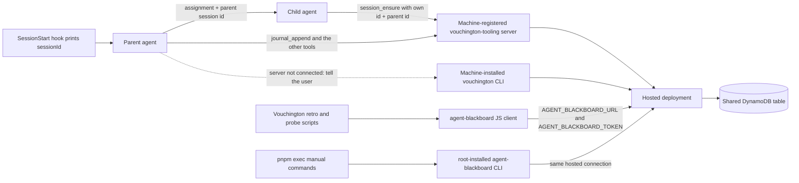

# Agent Blackboard — Hosted Session Store

Durable storage for
[`agent-blackboard`](https://github.com/jonathanong/agent-blackboard), the published client and CLI
that back agent session journaling in Vouchington. Agents reach it through the `vouchington-tooling`
MCP server, which
[vouchington-machines](https://github.com/vouchington/vouchington-machines/blob/main/docs/agent-config.md)
registers once per machine in every harness. No repository file registers an MCP server, plugin, or
marketplace. The root `package.json` installs `agent-blackboard` as a development dependency for the
retrospective scripts and the snapshot CLI. Vouchington connects to a **hosted deployment**; there
is no local server or database to run.

The package supplies the file-backed `snapshot_export`, `snapshot partition`, and `snapshot cleanup`
commands used by the snapshot-distillation workflow below. The export implementation landed in
[agent-blackboard PR #21](https://github.com/jonathanong/agent-blackboard/pull/21); bounded partitioning
and cleanup are owned upstream by
[agent-blackboard PR #25](https://github.com/jonathanong/agent-blackboard/pull/25), with
capability-bound cleanup and publication hardening in
[agent-blackboard PR #28](https://github.com/jonathanong/agent-blackboard/pull/28).

This document covers connecting to the hosted deployment and the Vouchington integrations around
the MCP server, JS client, and CLI. What gets written into sessions belongs to the
[`blackboard` skill](../../.agents/skills/blackboard/SKILL.md). That adapter composes the portable
`vouchington-workflow:blackboard` procedure, including its CLI fallback, with repository policy.

## Architecture


```mermaid
flowchart LR
  parent[Parent agent] -->|assignment + parent session id| child[Child agent]
  child -->|session_ensure with own id + parent id| mcp
  hook[SessionStart hook prints sessionId] --> parent
  parent -->|journal_append and the other tools| mcp[Machine-registered vouchington-tooling server]
  parent -.->|server not connected: tell the user| fallback[Machine-installed vouchington CLI]
  scripts[Vouchington retro and probe scripts] --> js[agent-blackboard JS client]
  manual[pnpm exec manual commands] --> cli[root-installed agent-blackboard CLI]
  mcp --> lambda[Hosted deployment]
  fallback --> lambda
  js -->|AGENT_BLACKBOARD_URL and AGENT_BLACKBOARD_TOKEN| lambda
  cli -->|same hosted connection| lambda
  lambda --> table[(Shared DynamoDB table)]
```

Every process supplied with the hosted connection uses the same durable store. There is no
local/CI split and no local infrastructure to start, stop, or wipe. The Lambda function and
DynamoDB infrastructure live in the separate `agent-blackboard` repository, not Vouchington or the
private `vouchington-infra` repository.

## Setup (local)

### 1. Configure the machine

Run vouchington-machines' `./configure-agents.sh` on each host, then `./diagnose-agents.sh --repo
<worktree>`, which also fails when a project registers a server again. That registers
`vouchington-tooling` in Claude, Codex, Cursor, Grok, and OpenCode and pre-approves its tools; see
[harness parity](agent-harness-parity.md#capability-matrix) and each harness's page for the
per-harness steps.

### 2. Install root dependencies

From the Vouchington worktree root:

```bash
pnpm install
```

This installs the published JS client and the `agent-blackboard` binary under the root
`node_modules/.bin/`. No separate repository clone, source build, or `tsx` entrypoint is required.
Vouchington's TypeScript integration imports the client directly; manual commands use the installed
binary. The MCP server does not depend on this install.

### 3. Export the hosted connection

```bash
export AGENT_BLACKBOARD_URL=<hosted-blackboard-url>
export AGENT_BLACKBOARD_TOKEN=<your client credential>
```

Both values are required for hosted delivery. Missing values make hosted delivery fail and
leave interactive feedback visibly pending in the durable outbox. There is no token-file or local-server fallback.

If you do not yet have a client credential, ask the deployment owner for the admin-token procedure
or follow the `agent-blackboard` repository's credential-management documentation. With an admin
token available, mint a client credential through the installed CLI:

```bash
AGENT_BLACKBOARD_URL=<hosted-blackboard-url> \
  AGENT_BLACKBOARD_ADMIN_TOKEN=<admin token> \
  pnpm exec agent-blackboard credentials create --name <your-name>-local
```

`credentials create` prints the raw token exactly once. The server persists only its hash, so a
lost token cannot be recovered. Store it in a shell profile or secrets manager; Vouchington never
persists it to disk.

### 4. Use the CLI

Run manual commands from the Vouchington root with `pnpm exec` so they use the workspace-pinned
version:

```bash
pnpm exec agent-blackboard sessions create my-session-id --agent claude-code --version unknown
pnpm exec agent-blackboard append --session-id my-session-id '{"type":"journal","markdown":"...","timestamp":"2026-07-20T00:00:00Z"}'
pnpm exec agent-blackboard get --session-id my-session-id --format json
pnpm exec agent-blackboard sessions get my-session-id
```

Pass the explicit `{"type": ..., ...}` payload to `append`. The CLI's `--file foo.md` convenience
wraps Markdown as `{markdown: ...}` without the `type` field required by later pipeline stages.
These commands are for manual inspection by a person. An agent records journal entries with the MCP
`journal_append` tool, or its machine-installed CLI fallback, never through the worktree's
`node_modules/.bin`.

## MCP server, JS client, and CLI integration

The [`blackboard` skill](../../.agents/skills/blackboard/SKILL.md) records feedback through the
machine-registered `vouchington-tooling` MCP server, which exposes seven tools: `journal_append`,
`journal_entries`, `outbox_status`, `outbox_flush`, `session_ensure`, `snapshot_export`, and
`session_archive`. One `journal_append` call carries the note as `markdown` plus mode, source-event
id, work outcome, feedback coverage, and repositories; the server builds the validated feedback
envelope and owns its `timestamp`. An event is its session, source-event id, and content, never its
timestamp, so a retry is the identical call and reports the stored timestamp, while different
content under the same source-event id is an `event-conflict`. Raw provider tools never satisfy
that delivery contract. Each entry's `data.repositories` lists the repositories it concerns
(`vouchington/vouchington` unless the caller lists others), and the session's `data.repositories`
keeps their cumulative union. Interactive mode retains a failed delivery in the worktree's
`.local/blackboard-outbox`, the same directory `dev/retrospective-save.mts` uses by default;
`outbox_flush` delivers every retained record in the worktree, and `journal_append`,
`outbox_status`, and `outbox_flush` report two counts: `pendingCount` is the calling session's
unsent records and `worktreePendingCount` is every session's. Autonomous mode has no outbox.

Every call takes an explicit `sessionId`, whose meaning depends on the tool: `journal_append` and
`session_ensure` name the session written or ensured, `journal_entries` and `session_archive` the
session read or archived, and `snapshot_export`, `outbox_status`, and `outbox_flush` only the
caller. Agents copy it from the `Blackboard sessionId:` line that the SessionStart check prints.

The tools carry a harness-specific name: `mcp__vouchington-tooling__<tool>` in Claude,
`mcp__vouchington_tooling__<tool>` in Codex, `vouchington-tooling__<tool>` through `search_tool`
and `use_tool` in Grok, and the `vouchington-tooling` namespace through `GetDynamicTools` and
`CallDynamicTool` in Cursor. Search for `journal_append` by bare name before concluding the server
is unavailable.

### CLI fallback

When the server is not registered or connected, the `blackboard` skill uses the canonical CLI
fallback: a machine-installed `vouchington` at a verified absolute path outside the worktree,
never the worktree's `node_modules/.bin` or `pnpm exec`. An interactive agent tells the user it is
falling back when it happens, and an automated session says so in its final report. Claude's and
Codex's machine sandboxes hide `AGENT_BLACKBOARD_TOKEN` from shell commands, so a fallback append
runs unsandboxed through the harness's normal one-command approval path; a denied approval leaves
the record pending in the outbox, reported with its `pendingCount`.

### Automated sessions

An automated session may have neither the server nor a trusted CLI: no repository registers
either, and a host has them only when its own user configuration was run through
`./configure-agents.sh` (each Auto Harness profile has its own home, so it needs
`--home <profile home>`). Nothing in this repository checks for that: there is no dispatch or
prompt preflight, and a missing server does not stop a run. The run continues its primary work and
states in its final report that journaling was unavailable and why, any pending outbox state, and
the findings it would have journaled, as the [`blackboard` skill](../../.agents/skills/blackboard/SKILL.md)
requires.

### Retrospectives and distillation

The [`retrospective-distill` skill](../../.agents/skills/retrospective-distill/SKILL.md) uses the
server's `snapshot_export` for the bulk read and `session_archive` per session. `snapshot_export`
returns only the snapshot path, counts, checksum, and manifest; full records come from the exported
file, never from `journal_entries`, which reads one session at a time (every entry of every type,
oldest first, each with its full envelope) with no checksum or manifest.
Eligibility for distillation and archival is age-based, not retro-presence-based: a session becomes
eligible once its retrospective entry is older than `--retro-days` (default 1) or, regardless of
whether it has a retrospective, once the session itself is older than `--session-days` (default 7).
Both flags are validated as finite, non-negative numbers before any cutoff is computed. An entry
lacking a recognized `type` (the CLI's `--file` convenience omits it) is never treated as journal
evidence; the distill skill flags such a session as entry-type-unresolved and skips it — including
archival — for the run. See
[retrospective-distill's SKILL.md](../../.agents/skills/retrospective-distill/SKILL.md) and
[distilling.md](../../.agents/skills/retrospective-distill/distilling.md) for the full eligibility,
redaction, and archival-carve-out rules. Before the export, and again before any `session_archive`,
the root calls `outbox_flush` then `outbox_status` for every worktree that `git worktree list`
prints (each path as `worktree`) and stops if any reports a `worktreePendingCount` above 0 (not
`pendingCount`, which covers only the root's own session, while the sessions being distilled belong
to other agents): an archived session refuses later delivery, which would strand the retained
record. A removed worktree or another machine cannot be drained. The export never passes
`selection.inactiveForHours`: the filter never matches a zero-entry session, so passing it would
hide exactly the aborted sessions this age rule exists to sweep up. The `--retro-days` and
`--session-days` cutoffs supply the delivery window instead, and effective activity is classified
client-side from normalized entry `createdAt` values, falling back to session `createdAt` when
empty. Immediately before each `session_archive`, which has no guard of its own, the root reads that
session with `journal_entries` and archives it only if its entries match the verified snapshot's by
source identity (`sourceEventId`, or `createdAt` for a legacy entry without one; two empty entry
sets match); otherwise it leaves the session for the next pass. The root agent first verifies the
snapshot against the returned checksum, compact counts, and terminal manifest, and stops on any
mismatch, then checks the generated-export cleanup token,
then partitions the returned local JSONL snapshot with `pnpm exec agent-blackboard snapshot partition
--path <path> --cleanup-token <cleanupToken> --checksum <sha256> --sessions <count> --entries <count>
--records <count> --bytes <count>` before it delegates read-only
partitions to inspector subagents. When `snapshot_export` omits a path,
the client intentionally writes a private `agent-blackboard-snapshot-*.jsonl` directly under the system
temp directory. Cross-process partition and cleanup commands must receive that token through
`--cleanup-token`; explicit caller-owned export destinations receive no cleanup capability and are not
eligible for this managed workflow. Each partition holds no more than 25 whole contiguous session groups or 1 MiB, is stored
in a `0700` temporary directory as a `0400` file, and is cleaned by the root after it merges the inspector
summaries and completes archival. A group larger than 1 MiB is an explicit failure: the workflow never
splits a session or silently exceeds the inspection bound. If partitioning fails before a partition
directory exists, cleanup receives the validated snapshot path and cleanup token without a directory.

Retrospective persistence deliberately remains script-only:
`dev/retrospective-save.mts` validates UTF-8, required sections, failure grammar, and front matter;
checks for an existing retrospective; appends typed provenance; and verifies the write by reading
it back. `journal_append` writes journal entries only and would bypass those repository-owned
invariants for a retrospective.

The repository's policy tests pin that no `PreToolUse` matcher can match an `mcp__` tool name,
because the Bash gates never see MCP calls, and that no repository file registers a server or
approves a retired `agent-blackboard` tool.

## Child-agent identity

A spawned delegation child resolves its own session id
from its runtime environment — Codex's `CODEX_THREAD_ID`, Claude Code's `CLAUDE_CODE_SESSION_ID`, and
so on — the same way any other Vouchington blackboard consumer does
(`dev/agent-session-id/resolve.mts`). The resolver keeps one coherent harness, agent label, and
session selection: explicit Claude wins; Claude-compat recognizes live Grok and Codex-child signals;
ordinary direct sessions prefer Codex, Grok, then Cursor; persisted files are only the final fallback.
There is no
identity round-trip: the parent passes its own session id in the spawn assignment, and the child
calls `session_ensure` with its own resolved id, the parent id it was given, its agent name, and
its version before performing substantive or blackboard-aware work.

The [`blackboard` skill](../../.agents/skills/blackboard/SKILL.md#child-identity-for-spawned-agents)
owns the exact parent/child responsibilities. The child must never infer or synthesize an identity
when its runtime environment supplies none — it stops and reports the blocker instead. A Claude
Code Agent-tool subagent is the one exception: it shares its parent's `CLAUDE_CODE_SESSION_ID`
rather than resolving a distinct id, so this protocol does not apply to it — see the skill for the
fallback.

### Root Codex sessions

An interactive root Codex process explicitly identifies itself to the retrospective scripts with
`--root-codex`; its MCP calls instead carry the explicit `sessionId` the SessionStart check
printed. Once at the beginning of a new root session with no
`CODEX_THREAD_ID`, it also passes `--new-root-codex-session`, which ignores any old fallback and
persists a fresh URL-safe `codex-<UUID>` at the ignored `.local/codex-session-id`. Later root
invocations reuse that value with only `--root-codex`. A real `CODEX_THREAD_ID` always wins; on a
root-aware invocation it replaces the generated value. An explicit `--session-id` and
`--root-codex` are mutually exclusive.
Root-aware commands locate the enclosing worktree root, and read commands (retrospective `check`)
refresh and read back its persistence file before contacting the server.
The flags are deliberately explicit: runtime hints, transcript paths, hooks,
detached processes, and children never generate a Codex id, and Codex never reads Cursor or Grok
persistence files. Root authority is self-attested rather than detectable; a child that violates
the workflow and passes either root flag inherits the root identity. Automatic hooks keep using
their explicit payload id and never write the root
file because hook metadata cannot distinguish a root from a spawned Codex child.
Children continue to stop when they lack their own identity. `./dev/reset-worktree` preserves the
file so a reset within the same root session does not rotate identity; the next absent-thread root
session explicitly rotates it once with `--new-root-codex-session`.
Without a runtime thread ID, this exactly-once boundary is necessarily caller-declared: omitting the
flag at a new session reuses stale identity, while passing it again mid-session fragments the
session. The root workflow must therefore perform one rotation before any other root-aware call.

## Agent-written journal entries

Agents write their own journal entries, following the triggers in the
[`blackboard` skill](../../.agents/skills/blackboard/SKILL.md). Those include one `GitHub Actions`
block per CI failure root cause, the only source of the retrospective's `## CI Failures`. Hooks do
not append journal entries: the SessionStart `compact` hook and the PostToolUse checkpoint
pipeline that once journaled post-compaction facts, repeated command failures, and PR/push
milestones (#9337) were removed in #1201. Mechanical detail comes from the transcript readers
instead, for example `pnpm exec vouchington retrospective-transcript`.

Entries those hooks already appended keep their structural `checkpoint` field and stay in Blackboard
until archived, so `node dev/retrospective-distill.mts` still classifies a session made only of them
as `checkpoint-only` (`dev/retrospective-distill/checkpoint-entry.mts`).

## SessionStart availability check

`dev/check-blackboard.mts` runs at every SessionStart, including after compaction. It emits
advisory context; emitting context cannot mechanically stop an agent.

- **Session id.** A `Blackboard sessionId: <id>` line names the id to pass as `sessionId` to the
  `vouchington-tooling` tools. It is the id in the hook's own payload (`session_id`, or Cursor's
  `conversation_id`), accepted only when it is a plain token, so no inherited environment or
  persisted file can leak in. A payload with no id prints no line; the
  [`blackboard` skill](../../.agents/skills/blackboard/SKILL.md) then names the harness's own
  environment id as the only fallback. A child agent never reuses this id; it gets its own through
  `session_ensure`.
- **Deployment probe.** Unless the run is a compaction restart or `CHECK_BLACKBOARD_SKIP=1`, the
  hook makes a bounded `sessions.list({ limit: 1 })` request and says loudly when the hosted
  deployment cannot be reached or the credential is missing, naming the CLI fallback and the duty
  to tell the user. A sandboxed probe reports an unavailable assessment instead of a false
  deployment outage, because its credential and egress are deliberately withheld by the machine's
  [sandbox credential deny list](agent-sandbox.md#sandbox-credential-deny-list). A worktree
  without the root install gets a workspace-setup message naming the install command; journaling
  does not depend on it.

The hook cannot see whether a harness connected the machine-registered server: it never spawns or
queries it. An agent finds out by searching for `journal_append`. The check does not discard
interactive pending feedback.

## Interactive pending delivery

The shared retrospective composer emits validated `work_outcome` and `feedback_coverage` front
matter. `dev/retrospective-save.mts save --mode interactive|autonomous --file <path>` preserves
these fields in the stored envelope and rejects contradictory explicit metadata flags. Delivery
mode remains a required trusted CLI option. See the [save contract](../../.agents/skills/retrospective/saving.md)
for staging and replay recipes, including manually prepared files. The Vouchington composer
also stages canonical `repositories`; save preserves the list and rejects conflicting
`--repository` flags. Manually staged files without repository metadata use explicit flags or
the current default.
The `compose --input <json-file>` adapter accepts serializable facts and transcript options, then
constructs its own journal collector from the same session's hosted journal and builds
`## CI Failures` and `## Sandbox & Permission Audit` from the journal entries alone. A session
unknown to the hosted blackboard reports both as unavailable. Caller
JSON cannot supply a collector, credential environment, executable callback, or direct transcript
path; discovery is bound to the composition session ID.

`journal_append` and the retrospective writer take an explicit mode (`interactive` or
`autonomous`). Interactive delivery failures preserve the shared writer's sanitized feedback record
in a bounded, private worktree-local outbox and return visible `pending` state so work can
continue. Unsent records are never silently evicted. Saturation, persistence failure, malformed
input, and identity mismatch remain explicit failures. Use the `outbox_status` and `outbox_flush`
tools to inspect pending delivery (the calling session's `pendingCount` and the worktree's
`worktreePendingCount`) and to retry it for the whole worktree; retries preserve source IDs and
verify read-back.

The versioned envelope records `schemaVersion`, `type`, `sourceEventId`, `timestamp`,
`repositories`, `markdown`, `workOutcome`, and `feedbackCoverage`. Retrospectives retain typed
`date`, `issues`, and `prs` provenance. The writer owns validation, sanitization, deduplication,
attribution, transport, and acknowledgment; repository adapters do not duplicate those mechanisms.

## Credential recovery

An availability or delivery diagnostic can mean the hosted connection failed: `AGENT_BLACKBOARD_URL`/
`AGENT_BLACKBOARD_TOKEN` is missing or stale, or the deployment is unreachable even with valid
credentials. An append/save hard-fail (see [Interactive pending delivery](#interactive-pending-delivery)
above) can point to the same cause, but not always — these commands also hard-fail for invalid UTF-8, retrospective
validation errors, missing session metadata, network failures, HTTP 500 responses, and failed
read-back verification, none of which involve the credential. Read the printed error before
acting: only when it actually identifies a missing/stale token, an authentication failure, or an
unreachable deployment does the recovery below apply. When it does, an agent must **stop and
report the blocker to the user** — it must never try to recover the value itself:

- Never grep shell profiles (`~/.zshrc`, `~/.zprofile`, `~/.bash_profile`, `~/.bashrc`), `env`, or
  `.env*` files for the token or any related secret name (including
  `AGENT_BLACKBOARD_ADMIN_TOKEN`/`AGENT_BLACKBOARD_ADMIN_CREDENTIALS`).
- Never inline, export, echo, or otherwise print a derived credential value — including inside a
  "safe-looking" presence check. `${VAR:+SET}${VAR:-UNSET}` is **not** safe: whenever `VAR` is set
  and non-empty, the second branch expands to its value, printing it in any shell — not only an
  interactive one. `[ -n "$VAR" ] && echo SET || echo UNSET` is **also not safe**: shell tracing (`set -x`/`bash -x`, or an inherited
  `SHELLOPTS`) prints every command with its expanded arguments, so `$VAR` still lands in the
  trace. Use `[ -n "${VAR+x}" ] && echo SET || echo UNSET` instead — the `${VAR+x}` form expands to
  the literal `x` (or nothing) without ever substituting the variable's actual value, so it stays
  safe even when tracing is on.
- A sandboxed run (`SANDBOX_RUNTIME=1`) deliberately denies the token, as described above — that is
  expected behavior, not a fix target, and needs no recovery action.
- Ask the user to set or refresh the credential (see
  [Export the hosted connection](#3-export-the-hosted-connection)). A newly exported value does not
  reach an already-running process: for the MCP path, ask the user to restart the agent/MCP client
  after they confirm the refreshed value is set; for the script path, run the export and the retry
  in the same shell invocation. Only then retry the failed call.

Interactive writer delivery failures remain visible in the outbox. `--mode autonomous` still requires
a verified read-back and does not fall back to that outbox.

The [`blackboard` skill § Credential failures](../../.agents/skills/blackboard/SKILL.md#credential-failures)
carries the matching agent-facing rule for both its MCP and CLI paths; keep the two in sync.

## CI (Harness dispatch)

`.github/workflows/harness-dispatch.yml` invokes Auto Harness through a dependency-free client but
does not provision `AGENT_BLACKBOARD_URL` or `AGENT_BLACKBOARD_TOKEN`. Harness sessions therefore
report contemporaneous failures through their available parent-agent channel when runtime session
IDs are unavailable; they do not infer IDs or write unauthenticated blackboard records.

agent-blackboard is orthogonal to auto-harness. Dispatch does not check a Blackboard protocol, and
this repository does not give the runner a Blackboard credential. See
[Automated sessions](#automated-sessions) for what a run does without the server.

## AWS deploy path

Vouchington consumes a hosted deployment; it does not own or provision it. Configure connection
values through the private operator runbook:

- `AGENT_BLACKBOARD_URL` — the hosted service URL
- `AGENT_BLACKBOARD_TABLE_NAME` — a server-side deployment identifier; the Vouchington client never
  sets it

The hosted service is provisioned from the separate `agent-blackboard` repository. Redeploying,
scaling, or repairing that infrastructure is the deployment owner's responsibility.

## Files

| File                         | Purpose                                                                              |
| ---------------------------- | ------------------------------------------------------------------------------------ |
| `package.json`               | Pins the published package as a root development dependency                          |
| `dev/blackboard/client.mts`  | Resolves the hosted URL/token and constructs the published JS clients                |
| `dev/check-blackboard.mts`   | SessionStart check: prints the hook's session id and probes the hosted connection    |
| `dev/retrospective-save.mts` | Validated retrospective writer and precheck; the only retrospective persistence path |
