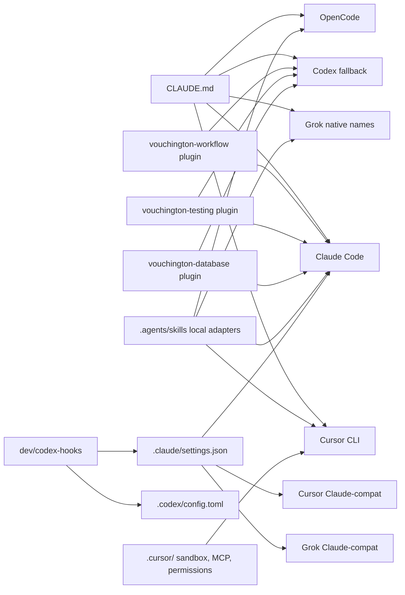

# Agent Harness Parity — Claude, Codex, Grok, Cursor, and OpenCode

Local coding agents in this repository share one instruction source and one
policy runner. `.claude/settings.json` is the only hook source for Claude, Cursor,
and Grok; `.codex/config.toml` is Codex's. Grok does not get a copied `.grok/hooks`,
`.grok/skills`, or permission allowlist, and Cursor does not get a `.cursor/hooks.json`:
both run the Claude hooks through Claude-compat. Cursor keeps native `.cursor/` config
for its sandbox, MCP, permissions, and worktrees. See [`.grok/README.md`](../../.grok/README.md),
[`.cursor/README.md`](../../.cursor/README.md),
[`.opencode/README.md`](../../.opencode/README.md), and
[agent-workflow](../../.agents/skills/agent-workflow/SKILL.md).

## Reusable domain skills

The following local adapters are overlays, not standalone workflows:
`agent-workflow`, `blackboard`, `git-commit-checklist`, `github-actions-checklist`,
`github-issue`, `organize-github-issues`, `package-json-checklist`, `planning`,
`pr-description`, `retrospective`, `retrospective-distill`, `review-ci-logs`,
`review-github-issue-taxonomy`, `revisit-followups`, `stacked-prs`, and
`static-analysis-checklist`. The testing adapters are `vitest-test-authoring`,
`backend-vitest-test-authoring`, `web-vitest-test-authoring`, `playwright-authoring`,
`storybook-authoring`. The database adapters are `postgres-node-performance-tuning` and
`postgres-partitioning-uuid-v7`. The bijection between these adapters and
`.claude/skills` is enforced by `finite-set-consistency` (`.no-mistakes.yml`), not by a count
here — see [`.agents/catalog/README.md`](../../.agents/catalog/README.md) for the current list.

Claude Code and Codex load each canonical source from the `vouchington-workflow`,
`vouchington-testing`, or `vouchington-database` plugin. The local
`web-vitest-test-authoring` adapter maps to upstream `nextjs-vitest-test-authoring`; other adapter
names match their canonical skill. Grok, Cursor, and OpenCode load the same sources from
`node_modules/vouchington-tooling/skills/<name>/SKILL.md` and resolve its supporting resources
relative to that directory. Every adapter stops if its harness-specific canonical source cannot be
read; it must never apply its Vouchington overlay alone.
`blackboard` additionally reads the provider-owned skill from
`node_modules/agent-blackboard/dist/plugin/skills/agent-blackboard/SKILL.md` in every harness.
Vouchington keeps its existing project MCP registration and does not enable that provider plugin,
which would register a duplicate server.
The package also exposes upstream-only `dotnet-test-authoring`, `swift-test-authoring`,
`github-actions-authoring`, `npm-publishing`, and `test-authoring` skills. Native-client owners use
the first two in `vouchington/vouchington-clients`; Vouchington deliberately does not install local
adapters for them. Do not restate the package's or Vouchington's skill counts here — both drift with
every new skill; the reusable-domain-skills list above and `.agents/catalog/README.md` are the
sources of truth for what Vouchington has adapted.

## Capability matrix

| Capability    | Claude                                                                                                                       | Codex                                                                                                                                                                          | Grok                                                                                                                                                                                                                             |
| ------------- | ---------------------------------------------------------------------------------------------------------------------------- | ------------------------------------------------------------------------------------------------------------------------------------------------------------------------------ | -------------------------------------------------------------------------------------------------------------------------------------------------------------------------------------------------------------------------------- |
| Instructions  | Nested `CLAUDE.md`                                                                                                           | `project_doc_fallback_filenames = ["CLAUDE.md"]`                                                                                                                               | Native `CLAUDE.md` / `Claude.md`. Do not add tracked `AGENTS.md`                                                                                                                                                                 |
| Skills        | Vouchington domain plugin + `.claude/skills` → `.agents/skills` overlays; blackboard also reads its installed provider skill | Vouchington domain plugin + Skill tool / local overlays; blackboard also reads its installed provider skill                                                                    | `.agents/skills` overlays load installed Vouchington and agent-blackboard provider skills                                                                                                                                        |
| Custom agents | `.claude/agents/github-issue-agent.md`                                                                                       | `.codex/agents/*.toml`                                                                                                                                                         | Reuses the Claude agent via compat. Codex agents are not loaded                                                                                                                                                                  |
| Hooks         | `.claude/settings.json`                                                                                                      | `.codex/config.toml`                                                                                                                                                           | Reuses Claude hooks via compat; the PreToolUse command sets `timeout: 30`                                                                                                                                                        |
| Hook block    | Exit 2; stderr reason shown                                                                                                  | Exit 2; stderr reason                                                                                                                                                          | Exit 2; shows `Hook denied: <reason>`                                                                                                                                                                                            |
| Permissions   | `.claude/settings.json` allow/deny                                                                                           | `.codex/rules/default.rules`                                                                                                                                                   | Reuses Claude permission strings via compat                                                                                                                                                                                      |
| Sandbox       | On; `excludedCommands` bypass it independently of permission allows                                                          | `workspace-write` by default; allow prefixes run outside it without a prompt and must fit within Claude exclusions; extra roots include pnpm cache/state and no-mistakes cache | Custom process-wide `workspace-write` in [`.grok/sandbox.toml`](../../.grok/sandbox.toml). Launch `--sandbox workspace-write`. Permission prefixes stay sandboxed; extra roots match Codex (pnpm cache/state, no-mistakes cache) |
| MCP           | `.mcp.json` enabled in `.claude/settings.json`                                                                               | `.codex/config.toml` `[mcp_servers]` with per-tool approvals                                                                                                                   | Native `.grok/config.toml` with the exact `MCPTool(...)` allowlist                                                                                                                                                               |
| Plugins / LSP | `enabledPlugins` marketplace                                                                                                 | Codex plugins                                                                                                                                                                  | Separate Grok plugin model. Claude marketplace plugins do not load                                                                                                                                                               |
| Session id    | `CLAUDE_CODE_SESSION_ID`                                                                                                     | `CODEX_THREAD_ID`                                                                                                                                                              | Hook `GROK_SESSION_ID` plus `.local/grok-session-id`. Main shell uses `GROK_AGENT` to select that persist file; pass `--session-id` for transcripts                                                                              |
| Merge confirm | Silent `permissionDecision: allow` for one plain merge when attended; empty otherwise                                        | Empty hook output (best-effort)                                                                                                                                                | Empty confirm (best-effort, not guaranteed)                                                                                                                                                                                      |
| Folder trust  | Always loads project settings                                                                                                | Loads project hooks                                                                                                                                                            | Project Claude hooks need `/hooks-trust`                                                                                                                                                                                         |
| CI            | Local agent only                                                                                                             | Scheduled / dispatch / shepherd                                                                                                                                                | Out of scope while CI is being redone                                                                                                                                                                                            |

Cursor and OpenCode use the same instruction and skill ownership model through their native
project surfaces:

Ambient Blackboard identity is owned by
[`dev/agent-session-id/resolve.mts`](../../dev/agent-session-id/resolve.mts). It consumes the
policy-neutral environment inspection from `vouchington-tooling`; transcript discovery deliberately
keeps its separate caller-owned order in `dev/retrospective-transcript-facts/resolve.mts`.

### Cursor capability surface

- Instructions: checked-in `CLAUDE.md`; do not add tracked `AGENTS.md`.
- Hooks: Claude-compat runs `.claude/settings.json`; see
  [Cursor through Claude-compat](#cursor-through-claude-compat).
- Sandbox: native [`.cursor/sandbox.json`](../../.cursor/sandbox.json), with documented
  localhost/private-network gaps.
- CI: local agent only.

### OpenCode capability surface

- Instructions: checked-in `CLAUDE.md` unless `OPENCODE_DISABLE_CLAUDE_CODE` is set; do not add
  tracked `AGENTS.md`.
- Hooks: no copied hook or skill tree.
- Sandbox: provider/client-managed local execution; the repository does not add a second sandbox
  policy.

## How Grok reuses Claude rules

Grok's Claude-compat loader already reads this repo's `.claude/settings.json`
hooks and permissions. Do not copy those files into `.grok/`. A second hook
source would double-fire.

Claude `permissions.deny` strings are also prefix-matched by Grok with no word
boundary. A deny must not be a prefix of a sanctioned command:
`Bash(git push --force)` matches the documented
`git push --force-with-lease` rebase push. Use a space-terminated pattern such
as `Bash(git push --force *)` for raw force-push with arguments, and a
leading-glob `Bash(*git push --force)` for the no-arg form. Leave
`--force-with-lease` itself un-denied so the PreToolUse hook can allow it.
`dev/claude-settings-grok-bash-deny.test.mts` locks this.

The shared runner still has to read Grok's hook dialect:

- stdin uses `toolInput`, `toolName`, `sessionId`, and `toolResult`
- PreToolUse blocks by exiting 2, and Grok shows `Hook denied: <reason>`. Its
  stdout dialect blocks only on `{decision: deny}` (`{decision: block}` fails
  open), so the block JSON every runtime gets says `deny`
- default hook timeout is 5 seconds and fail-opens; the Claude PreToolUse
  command sets `timeout: 30`
- `GROK_SESSION_ID` / `GROK_HOOK_EVENT` override argv `claude`, so Grok never
  gets the attended Claude merge allow and persists `.local/grok-session-id`.
  `GROK_AGENT` is a main-shell marker only; hooks do not read it
- PreToolUse matcher lists both Claude names (`Bash|Write|Edit`) and Grok
  names (`run_terminal_command|search_replace`) so the policy hook fires
  even if Claude-compat name aliases are off

The Codex gate was verified end to end with `codex-cli 0.157.1`: a fresh `codex exec` invocation
attempting `HUSKY=0 true` reported `PreToolUse Blocked`, did not run the command, and surfaced the
hook's HUSKY reason. This verifies Codex honors the shared exit-2 contract rather than merely
exercising the Node entrypoint in isolation.

## Cursor through Claude-compat

Cursor CLI runs the `.claude/settings.json` hooks through its Claude-compat loader, like Grok. Do
not add `.cursor/hooks.json`: Cursor loads it as well, so every hook would double-fire.
`dev/agent-workspace-sandbox-config.test.mts` fails if it (or `.grok/hooks/`) comes back. Checked with
`cursor-agent` `2026.09.23-86fc751`:

- Tool names: Cursor's shell tool is `Shell`, and the Claude `Bash` matchers fire for it; its file
  tools fire the `Edit|Write` PostToolUse group with `file_path`. `readHookPayload` maps `Shell` to
  `Bash` and lifts the `tool_output` JSON string `{exitCode, output}` onto `tool_response`
  `{exit_code, stdout}`, so the tmux reminder, journal checkpoints, and friction recorder see
  Cursor shell calls.
- Runtime: `CURSOR_VERSION` / `CURSOR_PROJECT_DIR`, or the payload `cursor_version`, override argv
  `claude`. Cursor inherits `CLAUDE_CODE_SESSION_ATTENDED=1` from a Claude parent shell; resolved
  as `cursor`, a lone merge still gets no hook opinion.
- Blocks: exit 2. Cursor shows the stdout JSON, `Rejected: {"decision":"deny","reason":…}`.
- Session id: Cursor injects no session-id env into the agent Shell. Claude-compat SessionStart and
  PreToolUse persist the payload `session_id` (else `conversation_id`) to
  `.local/cursor-session-id`, the no-flag journal path. Pass `--session-id` for transcripts.
- Fails open on a hook crash or timeout. Claude-compat has no `failClosed`, which the old native
  `beforeShellExecution` hook set. Accepted: the hook is a mistake guardrail, not a security
  boundary.
- Not run: without `.cursor/hooks.json`, Cursor never fires the Claude-compat `UserPromptSubmit`
  hook, so it gets no tmux nudge on prompt submit. SessionStart context and the PostToolUse
  reminders still run.

Native files under [`.cursor/`](../../.cursor/README.md) own everything else:

- `sandbox.json` — Codex-equivalent `workspace_readwrite` extra roots and `networkPolicy.default: allow`
- `mcp.json` — Agent Blackboard local wrapper; `cli.json` / `permissions.json` own its exact tool allowlists
- `worktrees.json` — `./dev/initialize monorepo` on Agents Window / `agent --worktree`
  via the generic `setup-worktree` command array. Do not use `setup-worktree-unix` with an
  array: Cursor CLI (`2026.08.11-e8db854`) treats that key as a script path and crashes.

Do not add tracked `AGENTS.md` or a second `.cursor/skills/` tree. Cursor already reads
`CLAUDE.md` and `.agents/skills`; reusable workflow overlays load their canonical skill from the
installed `vouchington-tooling` package.

## OpenCode local harness

OpenCode is a first-class local assistant. It already reads `CLAUDE.md` and
`.claude/skills` unless `OPENCODE_DISABLE_CLAUDE_CODE` is set. Do not copy
hooks, skills, or `AGENTS.md` into [`.opencode/`](../../.opencode/README.md).

- Config: [`opencode.json`](../../opencode.json) (`autoupdate: false`) uses its V1 `mcp` object for
  Agent Blackboard and exact `agent-blackboard_<tool>` allow permissions. Leave the local model unset;
  users `/connect`.

## Privacy

Grok is allowed only with `/privacy` coding-data and training opt-out enabled,
the same privacy-mode rule as Cursor, Codex, and Claude Code.

## Related

- [Agent Sandbox](agent-sandbox.md)
- [Agent Blackboard](agent-blackboard.md)
- [Merge Authority](merge-authority.md)
- [`.claude/README.md`](../../.claude/README.md)
- [`.cursor/README.md`](../../.cursor/README.md)
- [`.opencode/README.md`](../../.opencode/README.md)
- [`.codex/README.md`](../../.codex/README.md)
- [`.codex/config.toml`](../../.codex/config.toml)
- Project Grok workflows: [`.grok/workflows/`](../../.grok/workflows/) (orchestrators, not copied skills)
