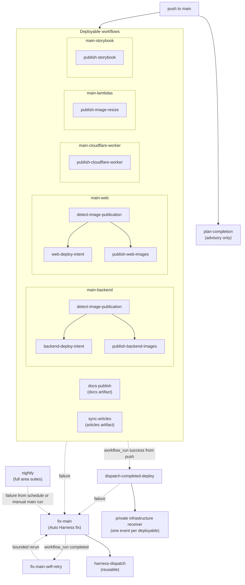

# Workflow automation: Main

[Back to Workflow automation map](reference-workflow-automation-map.md) · [Back to Workflow Reference](../../../../.github/workflows/README.md)

Each deployable workflow publishes its artifact independently after queue validation. When one succeeds from a push,
`dispatch-completed-deploy` sends its event to the private infrastructure receiver, which owns
deploy ordering; the event names are in the
[deployment CI/CD flow](../../../overview/infrastructure/reference-deployment-ci-cd-flow.md).
`fix-main` subscribes to the main publication workflows and to scheduled or manually dispatched
`Nightly` failures on the trusted main branch, then hands failures to Auto Harness. The
[Always run](reference-workflow-automation-always-run.md) checks validate PRs and merge groups,
not main pushes.

