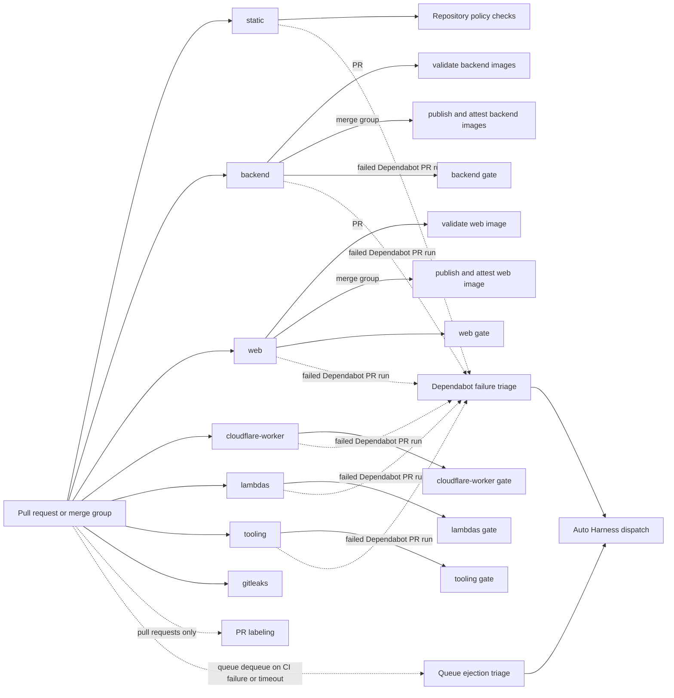

# Pull-request workflow automation

[Back to Workflow automation map](reference-workflow-automation-map.md) · [Back to Workflow Reference](WORKFLOWS.md)

Pull requests and merge groups start independent required checks: `static`, `backend`, `web`,
`cloudflare-worker`, `lambdas`, `tooling`, and `gitleaks`. Each area workflow uses
[`ci-detect-changes.yml`](../../../../.github/workflows/ci-detect-changes.yml) to select its own area. Selected areas run their
static checks, full owned suites, and final area gate; on pull requests only, the full-LCOV
patch-coverage check also runs, because a merge group's diff is the pull request's diff. A skipped
area reports success. Codecov uploads full LCOV only as informational evidence, in merge groups too.

The `static` check is its own required check. The area gates and `gitleaks` are likewise
independent required checks; there is no monolithic CI workflow or cross-area report fan-in.
Successful main workflows remain separate from this pull-request topology. See
[CI](../../ci.md) for the area contract.
