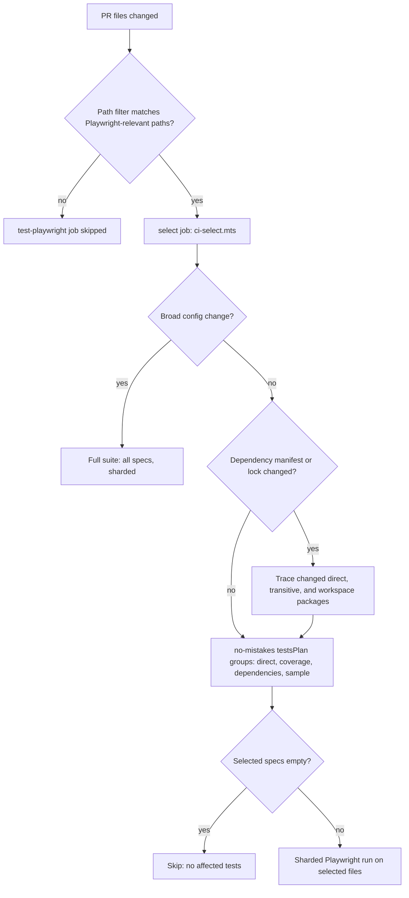

# Playwright CI Selection

[Back to CI Reference](ci.md#playwright-ci-selection)

`test-playwright` runs on every pull request, draft or ready, and on `workflow_dispatch`. See
[CI Job Conditions](reference-ci-ci-job-conditions.md).

On every triggering pull request, `tests-playwright.yml` runs a `select` job (`ci/playwright/ci-select.mts`)
that calls `no-mistakes`' `planTests` with the `.no-mistakes.yml`
`test_plan.playwright.environments.pullRequest` environment. The planner disables its execution
and machine-wide lock-wait deadlines, so concurrent CI invocations serialize. It resolves the
owning tsconfig for each traversed file, so workspace-specific aliases participate without
forcing every import through one workspace's configuration. The selector job runs on
`ubuntu-latest`; the five-minute timeout remains the global safety backstop.

The coarse `ci.yml` path-filter gate decides whether the `select` job runs at all; once it runs,
dependency-only changes in tracked workspace `package.json` files and `pnpm-lock.yaml` are traced
through the dependency import graph rather than forcing a full suite:

1. **Configured full-suite triggers** — `.no-mistakes.yml` project dependency rules force
   the full suite for high-risk changes such as Playwright config, the Playwright-owning
   GitHub Actions workflows/actions, Playwright CI runtime tooling, Cloudflare Worker production
   source, Next.js config/proxy, Wrangler config, and `ci/setup-web-integration.mts`. Selector
   tests, `__tests__` trees, Cloudflare test helpers, `dev/initialize*`, API fixtures, and ordinary
   web modules are traced or filtered instead of being blanket full-suite triggers. The
   Per-workspace tsconfig regression coverage protects the alias-based tracing that made it safe
   to remove the old hard-coded sidebar/navigation trigger list.
   Dependency-only `package.json` and `pnpm-lock.yaml` changes are classified before those broad
   path triggers. Dependency-map changes are traced through the import graph, including transitive
   resolutions walked back to their importing workspace and workspace `link:` changes (see
   [no-mistakes#314](https://github.com/jonathanong/no-mistakes/pull/314)). A manifest change that
   also modifies scripts, engines, exports, package-manager settings, or other build configuration
   remains broad; `pnpm-workspace.yaml` is also deliberately broad. Only the affected specs are
   selected. Untraceable packages (e.g. dev tools like `typescript`, `eslint`) add no causal specs
   rather than triggering a full-suite fallback, while the configured safety sample remains. A
   missing comparison baseline or unsupported dependency syntax emits a typed warning and follows
   the environment policy. In this pull-request environment, `globalConfigFallback: false` means
   warning plus sample, not a full fallback. The setting also disables fallback for other global
   configs like `tsconfig.json`.
2. **Configured test-plan groups** — direct specs, Playwright coverage-related specs,
   dependency-related specs, and a 1% sample group that still samples when the selected
   set is otherwise limited.
3. **Empty result** → `skip=true`, job short-circuits.

For targeted PRs, shard count is
`max(1, ceil(selected runnable spec count × 8.6 seconds / 313 seconds))`. Full-suite selections,
planner fail-open fallbacks, and manual runs use the same formula with the complete runnable
Playwright spec count. The 8.6 seconds per spec and 313-second execution budget are allocation
heuristics, not a per-spec SLA. The first public full-suite baseline retained this formula: the
roughly 318-spec suite resolves to nine shards and meets the job KPI with three Playwright workers.
The execution budget leaves room for fixed per-shard build/startup overhead
inside the sub-ten-minute job target. There is no repository policy cap, although the selector
rejects totals outside GitHub's 1–256 matrix range.

Matching main runs remain complete-suite backstops and use the same formula. Per-shard builds,
runner labels, Sentry, and OTel remain unchanged; Playwright uses three workers on public runners.

The Playwright selection job uploads `playwright-test-plan.json` and
`playwright-test-plan.md` artifacts with one-day retention on successful targeted/full plans and
on fail-open fallbacks, so reviewers can inspect every selection decision without rerunning the
planner.
The Playwright reusable workflow serializes runs per PR/ref so two suites for the same PR or branch
do not execute at once; the shard matrix within a single run remains parallel.

On matching `main` pushes (non-PR), the selector always emits the full suite. The `ci.yml`
orchestrator skips `test-playwright` on `main` when the refined Playwright path filter does not
match.

The current roughly 318-spec full suite resolves to nine shards. Trusted PRs may add the credentialed
suite, and uncapped dynamic matrices may increase queueing further. The runtime audit excludes queue
delay, so inspect it separately; every Playwright shard's median execution should stay below 480
seconds, matching the runtime audit's eight-minute median threshold.

The credentialed suite (`playwright/credentialed/`) uses a separate `playwright.credentialed.config.mts`
config and runs as the `test-playwright-credentialed` job. It is **not** part of the selection/sharding
logic above — it always runs all specs in `playwright/credentialed/` when triggered. Individual specs
skip themselves at runtime when the required credential (`AWS_ACCESS_KEY_ID` or `OPENAI_API_KEY`) is
absent, so the job succeeds gracefully in partial-credential environments. Run locally with:
`source .env && pnpm exec playwright test --config playwright.credentialed.config.mts`.

The selector asks `no-mistakes` to compare `origin/<GITHUB_BASE_REF>...HEAD`. Version 0.34+ streams
that revision diff directly into the planner, preserving full hunks, rename/delete facts, and
Playwright coverage hints without a fixed in-memory patch buffer or filename-only degradation.
The `select` job refreshes the base remote-tracking ref via `clean-workspace` with `deepen: 'true'`,
which unshallows once and wraps the authenticated fetch in a 3-attempt retry. If the revision
cannot be resolved, `no-mistakes` returns a stable Git diagnostic and the selector fails open to
the full suite. Do **not** replace this with a bare `git fetch origin main` step — that updates only
`FETCH_HEAD`, bypasses retry, and skips the hardened authenticated fetch path in `clean-workspace`.

### Selected-file transport contract

Both selection paths (Playwright above and Vitest below) carry lists of selected test file paths
across roughly five serialization boundaries — planner output → `$GITHUB_OUTPUT` → job outputs →
reusable-workflow `with:` inputs → `$GITHUB_ENV`/step `env:` → the runner's shell — before a step
ever sees them. `vouchington-tooling/gha-selected-files` is the single
typed encode/decode contract every producer and consumer goes through: `encodeSelectedFiles` joins
paths with `\n` (never trailing-newline-terminated), and `writeSelectedFilesOutput` writes them via
GitHub Actions' heredoc (`<<DELIMITER`) multiline output syntax with a collision-free delimiter, so
a selected path containing a space or a shell glob metacharacter (`*`, `?`, `[`) survives
byte-for-byte instead of being silently word-split or glob-expanded by an unquoted `$VAR`. Every
shell consumer (`tests-web.yml`, `tests-backend-unit.yml`, `tests-playwright.yml`, and the
remaining Vitest reusable workflows) decodes with a quoted read loop —
`while IFS= read -r file; do FILES+=("$file"); done <<< "$VAR"` — rather than unquoted `$VAR`
word-splitting. This intentionally avoids bash 4.0+'s `mapfile` builtin: local `bash` on macOS is
still 3.2, so a `mapfile`-based
decode would silently no-op (leaving an empty selection) anywhere it isn't bash 4+. In-process
(non-shell) consumers such as `ci/storybook-browser-runner-env.mts`'s `vitestArgs` decode with
`decodeSelectedFiles` instead, reading the `with:`-forwarded job output straight out of
`process.env`. Two sentinels survive every boundary unchanged: an empty payload always means "run
the full project" (never "run nothing"), and `NO_TESTS_MATCHING_SELECTION` is the one selected
"file" a narrowed run passes when the planner selected zero files, so `--passWithNoTests` still
exits 0 instead of the step falling through to an unfiltered run.
