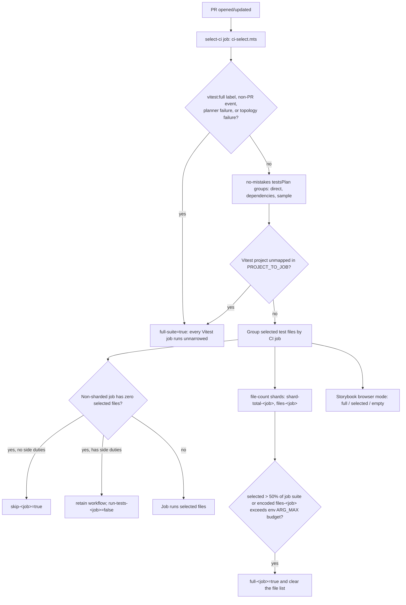

# Vitest CI Selection

[Back to CI Reference](ci.md#vitest-ci-selection)

On pull requests, `ci.yml` runs a single centralized `select-ci` job
(`ci/vitest/ci-select.mts`) that calls `no-mistakes`' `planTests` once for the whole PR and fans
the result out to every Vitest CI job, instead of each job selecting independently. This mirrors
[Playwright CI Selection](reference-ci-playwright-ci-selection.md#playwright-ci-selection) above, but one planner run drives many jobs:
a per-job **skip/run/full signal and selected-file list** for the non-sharded jobs, a dynamic shard
total + selected-file list for the file-count sharded jobs (`test-web`, `test-web-api`, and
`test-backend-unit`), a manually overridable one-shard `test-web-integration` matrix, and an
explicit full/selected/empty mode for the Storybook browser test step.
The planner disables its execution and machine-wide lock-wait deadlines; the selector job's
five-minute timeout remains the global safety backstop.

Topology selection also exposes separate `run-static-backend`, `run-static-web`,
`run-static-lambdas`, and `run-static-cloudflare-worker` outputs. Each root caller invokes only its
area of `checks-static.yml`, so a static failure blocks related application tests without coupling
unrelated areas. Test-to-test `needs` edges are scheduling order, not success gates: downstream
application tests accept upstream success, failure, or skip and stop only on workflow cancellation.

Jobs with no non-Vitest side duties gate on `skip-<job> != 'true'`. Jobs that also own dependency,
type, schema, bundle, or smoke checks stay retained and receive `run-tests-<job>` so only their
Vitest and report steps skip on an empty selection. This is deliberately fail-**open**: if
`select-ci` fails or doesn't run (for example, on non-`pull_request` events), missing skip/run
outputs make every job selected by its coarse area and trust gates run its full configured suite.
A cancelled run remains cancelled: the jobs' leading `!cancelled()` gate prevents them from
starting. The same fail-open discipline applies inside `ci-select.mts` itself — a `vitest:full` PR
label, an unmapped Vitest project, or a `no-mistakes` planner failure/fallback all short-circuit to
`full-suite=true` via a single `fullOut()` helper that clears Vitest narrowing outputs. The reusable
workflows then count their checked-out file-count suites before building matrices. Topology routing runs before every early full-suite exit once the planner
has supplied its changed-file inventory; if the planner fails before that inventory exists, the
selector emits `full-ci=true`. No downstream consumer can read a half-written selection as
"nothing to run." The same `testsPlan()` result supplies both selected tests and its complete changed-file
inventory, including both sides of renames and copies plus deleted paths. The selector does not run
a second Git diff, so the safety routing and test selection cannot disagree about revision scope.

1. **Project → job routing** — `ci/vitest/ci-select.mts`'s `PROJECT_TO_JOB` map routes every
   Vitest project name (`target.project`, falling back to parsing `--project` out of
   `runnerArgs`) to exactly one CI job. `PROJECT_TO_JOB` is _derived_, not hand-maintained: it
   comes from `ci/vitest/project-ownership.mts`'s `VITEST_OWNERSHIP` — the single canonical
   ownership model — via `ci/vitest/project-ownership-registry.mts`. That same model also
   renders the project → workflow/job table in [VITEST.md](../../.github/workflows/VITEST.md)
   (via `node ci/vitest/generate-ownership-table.mts`) and is checked against the real
   `--project` commands in `.github/workflows/tests-*.yml`/`storybook.yml`
   (`.github/workflows/vitest-project-ownership.test.mts`). To add, move, rename, or remove a
   project: edit `project-ownership.mts`, then run the generator — the model, the workflow
   commands, and VITEST.md cannot drift apart because all three are enforced against it. A
   project with no entry in `PROJECT_TO_JOB` triggers full-suite fail-open at runtime, and
   `ci/vitest/project-ownership.test.mts` / `ci/vitest/ci-select.test.mts` assert the model
   stays total against every project registered in `vitest.config.mts` — a newly-added project
   with no mapping fails those tests at PR time too, not just silently in prod.
2. **Per-workspace import graphs** — the selector deliberately omits the `tsconfig` override.
   `no-mistakes` 0.34+ resolves each import with the config that owns the importing file, so web's
   `@/*` alias and aliases in other workspaces can coexist without one global configuration
   shadowing another.
3. **`vitest:full` PR label** — set this label when creating the PR to force the full Vitest suite
   on its initial CI attempt, mirroring `playwright:full`. Adding it later does not trigger or rerun
   CI; push a new commit only when another CI attempt is otherwise required. `ready-dedupe` reads
   live labels through the pull-request API and passes `pr-labels-json` to the selector's label
   guard. An API failure supplies both full labels instead of narrowing.
4. **`.no-mistakes.yml` `pullRequest` environment** — `test_plan.vitest.environments.pullRequest`
   defines `direct`, `dependencies`, and a 1% `sample` group (`sampleWhenLimited: true`), plus
   broad `fullSuiteTriggers` only for high-risk root configuration. Every current Vitest trigger
   ignores changed discovered Vitest files: the direct group still selects that changed test, but
   it does not activate configured projects. This is safe because `root-config` is production test
   configuration, `api-contracts` is dynamically consumed contract input, `workspace-package-boundaries`
   excludes tests in its underlying boundary rule, `postgres-resources` is SQL resource input, and
   `agent-tools-docs` is dynamically read documentation. A future trigger that consumes test files
   must revisit this framework-wide policy; the safer per-trigger/default API is tracked in
   [no-mistakes#811](https://github.com/jonathanong/no-mistakes/issues/811). SQL
   migration/config-driven resources and the dynamically consumed API contract inputs use 0.34+'s
   target-scoped triggers, selecting only their named Vitest projects. Agent-tools markdown under
   `docs/overview/architecture/agent-tools/**` uses the same shape (`agent-tools-docs` →
   `backend-docs-freshness`) because `catalog.md` is read with `readFileSync`, not an import.
   Semantic
   `.no-mistakes.yml` comparison invalidates only a framework whose effective test-plan
   configuration changed; formatting-only changes select nothing. Other API fixture JSON is
   statically imported and therefore stays on the graph-traced path.
   Dependency-only changes in any tracked workspace `package.json` are classified before the
   root `package.json` trigger and traced to tests that import the changed package. The same path
   handles `pnpm-lock.yaml`, walking transitive resolution changes back to direct workspace
   importers and following workspace `link:` changes. Mixed manifest changes that also alter
   scripts, exports, engines, package-manager settings, or other build configuration remain broad;
   `pnpm-workspace.yaml` remains deliberately broad. Untraceable packages add no causal tests but
   retain the 1% sample. Missing baselines and unsupported dependency syntax emit typed warnings
   and follow the environment policy, so this pull-request environment warns and samples without
   setting fallback.
   `globalConfigFallback` is `false`, matching the Playwright environment's reasoning.
5. **Cold-job sample scoping** — the global 1% safety sample is dropped for any job that has no
   `direct`/`dependencies` files of its own (`VITEST_SAMPLE_COLD_JOBS=false` restores unscoped
   sampling). A cold job never gets woken up just to run one incidentally-sampled file; `main`
   CI's full run remains the backstop for cold-job regressions. Storybook is explicitly exempt
   from this scoping (`ci-select.mts` special-cases `STORYBOOK_JOB`) because it is never
   whole-skipped in the first place.
6. **Targeted non-sharded workflows** — each non-sharded reusable workflow accepts
   `full_suite` and `selected_test_files` (see
   [Selected-file transport contract](reference-ci-playwright-ci-selection.md#selected-file-transport-contract) above for the
   newline-delimited wire format and its bash-3.2-safe decode). A targeted PR passes only the
   planner-selected files;
   full/fallback/main runs omit positional filters. `test-postgres-schema` is the only job left that also accepts
   `run_tests` for a non-Vitest duty: an empty test selection retains that workflow for its
   squawk/migrate/schema-snapshot checks while skipping only Vitest and its blob/coverage
   reporting. `test-backend-modules`, `test-cloudflare-worker`, and `test-lambdas` no longer own
   any pre-Vitest checks — their `run_tests` input is a plain skip-the-test-run toggle, kept only
   for `workflow_dispatch` no-op runs, since [checks-static.yml](../../.github/workflows/checks-static.yml)
   now owns their dependency/type/smoke/dry-run gates on a separate, non-Vitest-selection-gated
   path.
7. **Dynamic shard sizing and zero-test work** — for `test-web`, `test-web-api`, and `test-backend-unit`,
   `shardTotalFor(fileCount, filesPerShard) = min(256, max(1, ceil(fileCount / filesPerShard)))`.
   A non-empty selection always runs at least 1 shard. Backend API/worker smoke runs independently
   in `checks-backend-smoke.yml`; `test-web` has no shard-1-only duties left since its former
   build/typecheck/depcruise/smoke sequence moved to `checks-static.yml`'s `static-web` job.
   An empty `test-web` selection therefore emits `skip-test-web=true` when
   `jobsRunningTests.get('test-web') === false`, and the job does not start. A missing map entry
   stays fail-open (no skip output).
   `test-backend-unit` emits `skip-test-backend-unit=true` for an explicit empty selection; the
   standalone smoke job still runs for backend-area PRs. Docs-only PRs skip `select-ci` and `test-coverage` unless the PR carries
   `vitest:full`. `TEST_FIXTURE_DOCS` in
   [`ci-detect-changes.yml`](../../.github/workflows/ci-detect-changes.yml) is only that skip gate:
   it keeps a pull request touching a test-fixture doc from being misclassified `docs-only` and
   having `select-ci`/`test-coverage` skipped outright. For the two whole trees where every
   markdown file is a Vitest fixture — `docs/prompts/**` and `.agents/skills/**` — the pattern
   covers the entire tree (`docs/prompts/.+\.mdx?` and `\.agents/skills/.+\.mdx?`), not a
   maintained list of named files; a new file added under either tree is covered with no change
   to this pattern. `.github/workflows/ci-fixture-doc-classifier.test.mts` enumerates both trees
   from disk and fails naming any uncovered path if that ever regresses. It is **not**
   test-selection coverage on its own. Coverage for Vitest tests that read `docs/prompts/**` or
   `.agents/skills/**` markdown at runtime — regardless of how they read the file (`readFileSync`
   with a literal path, a wrapped helper, or a template-literal/`resolve()`-built path) — comes
   from `.no-mistakes.yml`'s `automation-prompt-docs` and `agent-skill-docs` named
   `fullSuiteTriggers` (`test_plan.vitest.fullSuiteTriggers.triggers`), which force-select their
   `targets:` Vitest projects whenever a matching path changes, independent of the test's own read
   mechanism. A literal-path `readFileSync` call can still narrow `no-mistakes`'s single-file
   dependency-graph planning locally, but does not by itself guarantee CI coverage.
   For every full-suite path, including a selected set promoted to full, the reusable prep job
   counts the checked-out live file-count suite and resolves the same capped formula; a missing or
   nonpositive count fails closed. Selector overrides are reserved for narrowed selected-file runs,
   where they describe the selected set rather than the full suite. The file-count thresholds are 520 backend files, 800 web files,
   and 64 API files per shard — fewer, longer-running shards, sized so each targets around
   eight minutes, leaving room below the ten-minute Vitest command watchdog for setup and artifact
   transport. Integration is intentionally not
   auto-sized: its Worker/Next build and full-stack setup dominate the current Vitest duration, so
   automatic fan-out would duplicate that fixed cost. It accepts a validated manual override and
   retains distinct `web-integration-shard-N` report identities. The backend-unit matrix alone
   caps `max-parallel` at five, preserving its prior simultaneous Tests-pool demand while its six
   shards queue in the same run; other matrices use normal GitHub runner queueing. PR #9522 run
   `32120944162` selected 2151 backend-unit files (131653 encoded
   bytes) and failed to spawn `/usr/bin/bash` with `E2BIG` because that list stayed in
   `SELECTED_TEST_FILES`. `resolveJobSelection()` now promotes a job to `full-<job>=true` and
   clears the list when the selected files are strictly greater than 50% of that job's live suite
   or when the encoded list exceeds the Linux `MAX_ARG_STRLEN` budget
   (`SELECTED_FILES_ENV_MAX_BYTES`, 120 KiB) used when GitHub Actions interpolates
   `SELECTED_TEST_FILES=...` into a step `env:` block. See `SELECTED_FILES_ENV_MAX_BYTES` in
   [`vouchington-tooling/gha-selected-files`](https://github.com/vouchington/vouchington-tooling).
   When `test-backend-unit` has no selected tests, its caller is skipped. The separate
   `backend-smoke` job still runs for backend-area or
   forced-full CI. Sharded `vitest run` invocations add `--passWithNoTests` so a non-empty plan whose
   partition is empty still exits 0.
8. **Storybook browser narrowing** — the Storybook preview build always builds every story (a
   subset build would break its cross-link sidebar), so `select-ci`'s
   `storybook-browser-files` output narrows only the "Run Storybook browser tests" step's
   `vitest run --project web-storybook-browser` invocation via positional file args
   (`ci/storybook-browser-runner-env.mts`'s `vitestArgs`). An explicit `empty` mode skips browser
   installation and browser tests, while `full` deliberately omits positional filters. The
   `storybook` job itself is never whole-skipped by
   `select-ci` because its `web-storybook`/`web-storybook-component-coverage` projects run a
   whole-repo coverage ratchet.
9. **Coverage and report completeness** — each sharded reusable workflow exposes its resolved
   shard total, and `ci-test-coverage.yml` consumes those exact producer outputs
   for every sharded producer. `ci/prepare-coverage-artifacts.mts` receives the resulting exact
   report expectations, so a reduced-shard selection run is not flagged as missing artifacts for
   shards it never scheduled. A running sharded producer without a positive exact total fails
   closed. Before checking producer failures, the
   `test-coverage` fan-in writes the exact Vitest report expectation context for every producer
   that was scheduled to run tests, including failed or cancelled producers. The context expands
   the selected backend/web/API/integration shard totals, Storybook's browser mode, and each selected non-sharded
   suite. The `tests` fan-in adds `postgres-schema` when that workflow ran Vitest, then requires
   exactly those suite reports for the current run attempt. On a failed-only rerun, GitHub can
   preserve the successful `test-coverage` output from an earlier attempt; the merge step accepts
   a valid non-future context and rebinds it to the current attempt before report validation.
   Missing, malformed, unexpected-current-attempt, or conflicting reports fail closed, rather
   than inferring report presence from coarse path filters or producer success alone.
10. **Dynamic setupFiles/globalSetup edges** — `no-mistakes` 0.35+ traces Vitest `setupFiles`/
    `globalSetup` entries (a literal string or a per-project array of them) as real dependency-graph
    edges, scoping selection to the owning project instead of requiring a hand-maintained trigger.
    This only works when the entry is a **plain literal relative path** — never
    `resolve(process.cwd(), ...)` or any other `CallExpression`. An unresolvable entry sets
    `fallback_triggered: true` for **every project sharing that `vitest.config.mts` file**, not
    just the project that declared it, and does so even for changes that touch no project's own
    files at all. A literal string bound to an
    `Identifier` — imported from a sibling module (`test-helpers/vitest-config/tooling-projects.mts`'s
    `setupFiles: [isolatedSetupFile]`, sourced from `tooling-project-policies.mts`) or spread from a
    same-file object (`backend-data-projects.mts`'s `...backendDataStoreTestDefaults`) — is **not**
    the same failure mode: `no-mistakes` resolves the binding back to its literal value and traces
    the edge normally (`fallback_triggered: false`, no warnings, selection scoped to the one project
    whose setup changed). Only a `CallExpression` in the entry position defeats resolution. This repo hit exactly that blast
    radius twice — before the graph existed to explain _why_ — because two `setupFiles` entries
    used `resolve(process.cwd(), ...)` to satisfy Vitest's own per-project `root:` resolution: the
    root `vitest.config.mts`'s fake-timer guard, and `storybookBrowserProject`'s Storybook setup
    file. Both forced a full-suite Vitest fallback on effectively every PR, not merely
    under-covered their own project. Both are now literal relative paths pointing at a **redirect
    shim** — a one-line re-export with no logic of its own — because `no-mistakes` always resolves
    a `setupFiles` literal relative to the repo root regardless of which file declares it, while
    Vitest resolves the same literal relative to the _project's own_ `root:` override; a project
    with a non-default `root:` (`web-storybook-browser` overrides `root: 'web'`) therefore needs a
    second shim at the Vitest-resolved path that re-imports the real implementation. See
    `test-helpers/vitest.setup.fake-timer-guard.mts`,
    `test-helpers/vitest.setup.storybook-browser-guard.mts`, and
    `web/test-helpers/vitest.setup.storybook-browser-guard.mts` for the concrete shims and their
    resolution-order comments.

    This made most of `ci/vitest/ci-select.mts`'s former hand-maintained safety maps redundant.
    CI orchestration is now graph-routed too: `.no-mistakes.yml` registers `.github/actions` in
    `ci.actionDirs`, `ciTopology()` loads the workflow/action call graph, and
    `createWorkflowTopologyIndex()` resolves reusable-workflow callers. An exact changed workflow
    descriptor routes its direct `ci.yml` caller jobs; an exact changed local-action descriptor
    routes direct `ci.yml` users and the `ci.yml` callers of reusable workflows that use it, plus
    `test-tooling` for action contract tests that read descriptors directly. The result is
    intersected with the registered Vitest jobs, while any known unrelated workflow remains
    tooling-only. `.github/workflows/ci.yml` itself still forces every Vitest job.
    A bounded `ciTopologyImpact()` result promotes only its affected Vitest roots through
    `resolveJobSelection()`, not a job-start flag. Every workflow YAML and every path under
    `.github/actions/` enters topology routing. Tests, docs, and helpers under `.github/workflows/` are not
    unresolvable workflows: the `tooling` path filter starts `test-tooling` (unless the PR is
    docs-only), and the planner selects the github-actions files. Unknown, deleted, or otherwise
    unresolvable **workflow YAML**, deleted or unresolvable local action descriptors,
    non-descriptor files under a local action directory (including `.github/actions/**/*.test.mts`),
    global topology diagnostics, and topology query errors all fail open to every Vitest job.
    Localized diagnostics add only their named uncertain roots to the bounded affected set. A deleted
    descriptor with a complete bounded-empty result remains tooling-only: it has no discovered
    caller to promote.
    `vitest.config.mts` and `test-helpers/vitest-config/` remain covered, and reached first (before
    topology impact routing runs), by `.no-mistakes.yml`'s
    `test_plan.vitest.fullSuiteTriggers.triggers` named `root-config` (item 4 above).
    - The non-topology residual map retains dynamically read policy inputs: shell sources select
      `test-tooling`. Because a deleted or de-executable extensionless script cannot be inspected in
      the working tree, every extensionless changed path conservatively selects that job too. CI
      control workflows, control actions, and filter documents set `full-ci=true`, selecting
      every CI root and every Vitest job.
    - `JOB_CONFIGURATION_PREFIXES` retains two further non-topology residuals:
      `test-web-integration` → `integration-tests/web/helpers/` because that directory backs both
      the `web-api` and `web-integration` Vitest projects while only `web-integration` declares it
      as a setupFiles/globalSetup dependency; and `test-tooling` → `.trivyignore.yaml` because the
      Trivy exception registry is policy input rather than an import-graph dependency.

The top-level `ci.yml` centralizes selection in `select-ci`. Its coarse and runtime-refinement
filter documents live in [`ci-path-filters.yml`](../../.github/ci-path-filters.yml) and
[`ci-runtime-path-filters.yml`](../../.github/ci-runtime-path-filters.yml), respectively. Changes
to the dispatcher, an extracted `ci-*.yml` control workflow, either filter document, or one of the
exact-check local actions are topology-wide inputs and preserve the same full-fanout safety behavior
as a direct `ci.yml` change.

On matching `main` pushes (non-PR), `select-ci`'s `if:` doesn't run at all
(`github.event_name == 'pull_request'` gate), so every Vitest job's skip check sees an absent
output and runs unnarrowed — `main` CI is always the full-suite safety net of each job that
starts. `main-checks.yml` path-gates which of tooling, ts-shared, and explain-analyze start;
a started job still runs its full configured suite.

For ordinary PR selection, `select-ci` uses live suite counts only to decide when a selected set
should promote to a full suite. It never supplies a stale numeric fallback: if counting is
unavailable, it omits a full-suite override and the reusable workflow counts its checked-out suite
before building the matrix.

| Job / setting             | Value   | Purpose                                                              |
| ------------------------- | ------- | -------------------------------------------------------------------- |
| `test-backend-unit`       | 520     | Files per shard for selected and checked-out full suites             |
| `test-web`                | 800     | Files per shard for selected and checked-out full suites             |
| `test-web-api`            | 64      | Files per shard for selected and checked-out full suites             |
| `test-web-integration`    | 1       | Fixed shard count; explicit validated override may expand the matrix |
| `VITEST_SAMPLE_COLD_JOBS` | (unset) | Set to `false` to restore unscoped (non-warm-job-only) sampling      |

The selector uploads `vitest-test-plan.*` plus `ci-topology-impact.*` artifacts with one-day
retention. The topology artifact records the exact revisions, upstream result, and any fail-open
reason for a bounded or global routing decision.
