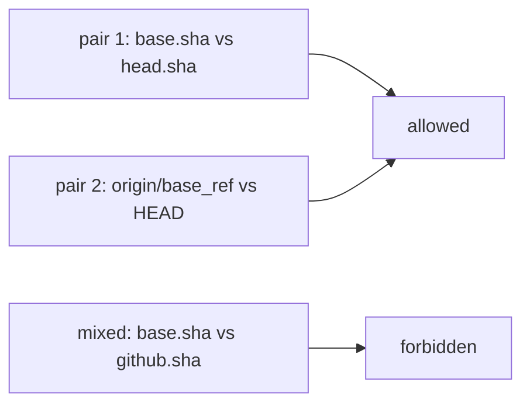

# Workflow Topology Contracts

[Back to CI Reference](ci.md#workflow-topology-contracts)

Workflow YAML remains the source of truth for triggers, jobs, dependencies, reusable calls, and
concurrency. The graph itself is built and owned upstream by [`no-mistakes`](https://github.com/jonathanong/no-mistakes)
(first-party — see [first-party-dependencies.md](first-party-dependencies.md)); this repo has no
local copy of the topology engine. `pnpm run ci:topology --format json` emits the stable versioned
graph; `--format mermaid` renders the same graph, and repeatable `--workflow <path>` filters retain
local transitive callees. Schema version 1 represents callable workflows with a sorted `workflowCall`
contract: inputs retain their declared Boolean, number, or string type plus `required`, scalar
default, and description metadata; secrets retain `required` and description; and outputs retain
their value and description. Every call edge, including unresolved remote calls, has sorted input
bindings and either explicit sorted secret bindings or an `inherit` marker. Original identifier
spelling is preserved in JSON while job, input, secret, and output resolution follows GitHub's
case-insensitive semantics. Consumers that need graph traversal should import `ciTopology` and
`createWorkflowTopologyIndex` from `'no-mistakes'`. Vitest tests must not call `ciTopology()` or [`loadRepoTopology()`](../../ci/repo-topology.mts).
Live topology audits run from [`ci/check-live-workflow-topology.mts`](../../ci/check-live-workflow-topology.mts)
in static-code-analysis after `no-mistakes check`. Vitest tests must not spawn the `no-mistakes`
CLI or call `testsPlan()`. New topology call sites and live analysis invocations are pinned by
exact-set assertions in
[`ci/no-mistakes-ci-contention.test.mts`](../../ci/no-mistakes-ci-contention.test.mts). The runtime
index exposes path/ID lookups; sorted, de-duplicated direct and transitive upstream/downstream job
queries; and sorted local caller/callee workflow queries. Unknown query nodes throw, while known
disconnected nodes return empty results. `directCallerJobIds()` provides the exact jobs that call a
reusable workflow without adding caller data to the public JSON. The index also exposes frozen,
sorted `incomingWorkflowRunEdges()` / `outgoingWorkflowRunEdges()` plus direct and transitive
workflow-run source/subscriber path queries. It is restricted to the loaded workflow filter and
retained callee closure, and is never included in schema-version-1 JSON.

For PR producer routing, `ci/vitest/ci-select.mts` calls the versioned
`ciTopologyImpact()` API with **pair 2** revisions: `origin/${GITHUB_BASE_REF}` and `HEAD` after
checking out GitHub's `refs/pull/N/merge`. That is the merge parent versus the merge commit, so
already-merged `main` files are on both sides and cancel out. Do not pass
`pull_request.base.sha` as `base` while `head` is `github.sha`: the recorded base SHA can lag the
merge parent and the changed-path set then includes commits that already landed on main
(formerly filed as jonathanong/filaments#11711). Pair 1
(`pull_request.base.sha` vs `pull_request.head.sha`) remains valid for consumers that are not
looking at the merge checkout, such as gitleaks PR scans and patch coverage.

The topology impact report is
accepted only when schema, revisions, changed-path set, root-job identities, and diagnostic scopes
are complete and internally consistent. A bounded report emits `full-ci=false` plus fixed
`run-<root-job>` outputs; consumers OR those PR-only terms with their existing path predicate.
`ci.yml` edits, unknown or deleted workflow YAML, every unresolved local-action path, malformed or
global diagnostic, API failure, and an absent selector output instead fail open: every otherwise
eligible producer runs and every Vitest job receives its existing full-suite contract. PR producer
filters therefore omit workflow and local-action paths: `select-ci` owns those revision-aware
routes. `workflow-action-changes` is the sole broad fallback and is restricted to non-PR/manual
dispatch behavior. Stable
`tests` and `build` fan-ins remain outside this routing layer.

Schema version 1 also models same-run `actions/upload-artifact` and `actions/download-artifact`
handoffs as `artifact` edges. Each edge records producer and consumer job IDs, step indexes, the
resolved artifact name, and whether the match was exact, pattern-based, all-artifact fan-in, or only
statically possible. Resolution crosses local reusable-workflow calls because they execute in the
caller's run, but it never crosses `workflow_run`, unrelated root workflows, or remote reusable
workflows. Static matrix values are expanded with their instance multiplicity, including matrices
on local reusable-workflow call jobs, so an exact download diagnoses multiple matrix instances that
can upload the same name. Dynamic names and patterns are connected only when a sound symbolic
wildcard match can be proved; glob syntax in surrounding literal segments is rejected rather than
treated as literal containment. With `archive: false`, the configured upload name is ignored just as
it is by the action: the topology records a path-derived name, excludes it from named/pattern
matching, and uses an explicit path-derived label only for all-artifact fan-in. A preceding
path-derived upload suppresses a missing exact-producer diagnostic because its eventual filename
could match, but it never creates an invented exact edge. Conditional producers emit `possible`
edges instead of claiming a definite match, and conditional multiplicity or unordered candidates do
not create a proven ambiguity. Independent jobs remain potential dataflow candidates, but their
exact, pattern, and all-artifact edges are `possible`; only a prior same-job upload or transitive
`needs` path establishes guaranteed-before certainty. Dynamic, path-derived, or opaque possible
producers also downgrade statically matched name groups to `possible`. When they can supply a missing
name from a finite selector, already matched static groups remain visible instead of being discarded.
An `overwrite: true` upload supersedes an earlier same-name producer only when the overwrite is also
guaranteed before that consumer; sibling overwrites that race the consumer leave both candidates
visible as `possible`.
A statically named download with no viable unresolved producer emits `missing-artifact-producer`,
while multiple unordered unconditional exact producers emit
`ambiguous-artifact-producer`; known matrix collisions include their instance count in the message.
Pattern and all-artifact downloads may legitimately match zero or many producers.

Concrete pattern matching rejects patterns longer than 1,024 characters before parsing and limits
brace expansion to 256 alternatives, matching the static matrix combination cap. Patterns that
exceed either cap, or that make brace/glob parsing throw, are conservative non-matches: they create
no edge or artifact diagnostic. Local reusable-workflow expansion is capped at 4,096 job occurrences
per root run to bound branching call DAGs. Exceeding that cap emits
`artifact-resolution-limit` once for that root and suppresses partial artifact edges and producer diagnostics for the
topology load.

JSON includes these typed edges and diagnostics directly. Mermaid renders artifact handoffs as
labeled dotted job-to-job edges. The runtime index keeps control flow separate from dataflow:
`directUpstreamJobIds()` and `directDownstreamJobIds()` remain `needs`-only, while
`artifactProducersForConsumerJob()` and `artifactConsumersForProducerJob()` return frozen, sorted
artifact-edge snapshots. Add durable artifact contracts to the central workflow topology policy
rather than scattering graph assertions across workflow-specific tests. Authoring and rerun
safety requirements are in
[Artifact Rerun Safety](../../.github/workflows/reference-artifact-rerun-safety.md).

`on.workflow_run.workflows` entries resolve case-insensitively against workflow display names after
all workflow files are parsed. The schema-version-1 `workflow-run` edge points from the source
workflow path to the subscriber workflow path and preserves declared `types`, `branches`, and
`branches-ignore` metadata. Repeated source/subscriber pairs collapse to one edge. Missing and
ambiguous display names fail closed without an edge; cycles and chains beyond GitHub's three-edge
`workflow_run` nesting limit are also diagnostics. Workflow filters do not expand across these
subscriptions, so an edge survives filtering only when both endpoints were already selected.
Chain traversal excludes cyclic components to avoid redundant or unbounded witnesses. A chain-limit
path that would cross an excluded component is deferred until the cycle is fixed; unrelated acyclic
over-limit chains are still diagnosed.
Manual `gh workflow run` and API polling are runtime orchestration rather than triggers and are
intentionally outside this graph.

Loading also fails closed on missing direct `needs` dependencies (including static dot or quoted
bracket references in modeled job and step conditions), job dependency strongly connected components,
duplicate step IDs, unknown or non-prior static step references in modeled job and step conditions, and
case-insensitive duplicate workflow names. Local reusable calls are additionally checked for missing
or unknown inputs and secrets, literal input type mismatches, and unknown statically referenced
outputs. Expressions and inherited secrets remain opaque; contract checks are skipped when a callee
is remote, missing, non-callable, or ambiguous, and output checks recognize only complete static
`needs.<call-job>.outputs.<name>` dot or quoted-bracket chains. This conservative boundary avoids
speculative or cascading diagnostics while actionlint continues to own malformed YAML declarations.
The table-driven policy exercised by
[`ci/check-live-workflow-topology.mts`](../../ci/check-live-workflow-topology.mts) loads that
graph once and fails closed on workflow/job inventory drift, missing lock intent or unlocked-workflow
rationale, exact lock-group collisions (including expression templates), incomplete shared-lock
families, reusable caller drift, required or forbidden routes, exact aggregate fan-ins, and
eligibility ordering. Workflow-specific tests retain conditions, inputs,
outputs, secrets, permissions, runners, scripts, and runtime mechanics instead of duplicating graph
assertions. See
[GitHub Actions Concurrency Locks](../../.github/workflows/reference-github-actions-concurrency-locks.md)
for authoring guidance.
